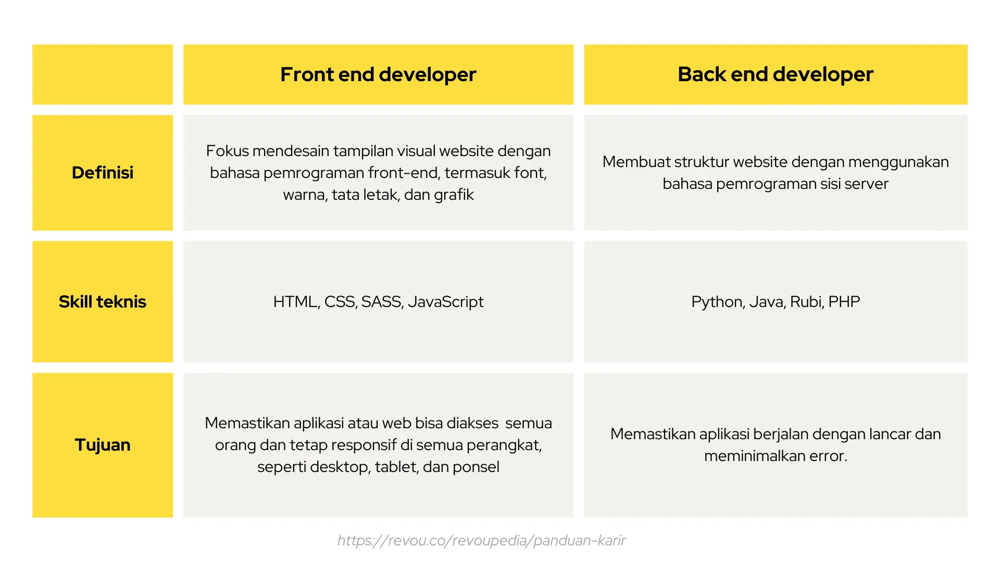

# Backend vs Frontend

Frontend dan backend adalah dua aspek penting dari aplikasi apa pun. Frontend adalah apa yang pengguna lihat dan
termasuk elemen visual, seperti tombol, kotak centang, grafik, dan pesan teks. Hal ini memungkinkan pengguna untuk
berinteraksi dengan aplikasi. Backend adalah data dan infrastruktur yang membuat aplikasi Anda berfungsi. Backend
menyimpan dan memproses data aplikasi untuk pengguna.
 

 

## Frontend

Frontend adalah bagian dari situs web yang berinteraksi langsung dengan pengguna. Ini termasuk desain, menu, teks,
gambar, video, dan tata letak keseluruhan. Bahasa utama yang digunakan untuk pengembangan frontend adalah HTML, CSS, dan
JavaScript. Responsivitas dan kinerja adalah dua tujuan utama Front End. Pengembang harus memastikan bahwa situs
tersebut responsif, yaitu situs tersebut muncul dengan benar di perangkat dengan berbagai ukuran, tidak ada bagian dari
situs web yang berperilaku tidak normal terlepas dari ukuran layar.

## Backend

Backend adalah sisi server situs web. Backend mengelola data dan memastikan semua hal di frontend berfungsi dengan baik.
Pengguna tidak melihat atau berinteraksi langsung dengan backend; backend adalah fungsi di balik layar. Bagian dan
karakteristik yang dikembangkan oleh desainer backend diakses secara tidak langsung oleh pengguna melalui aplikasi
front-end. Aktivitas, seperti menulis API, membuat pustaka, dan bekerja dengan komponen sistem tanpa antarmuka pengguna
atau bahkan sistem pemrograman ilmiah, juga termasuk dalam backend.
 
