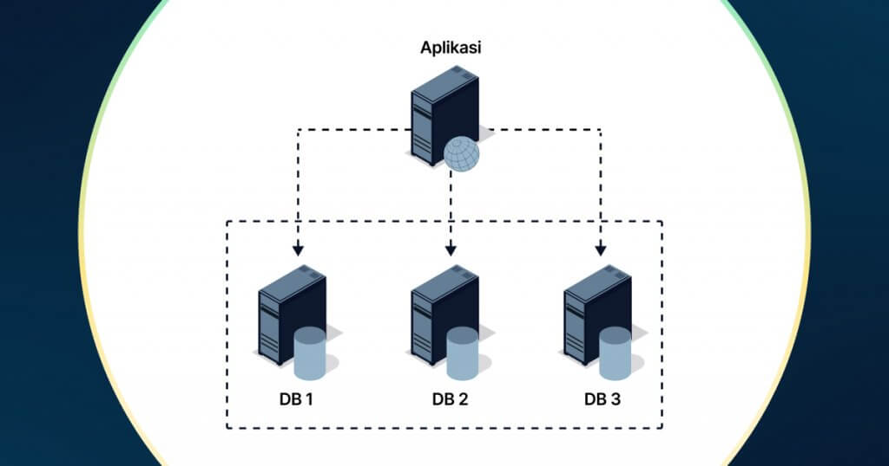
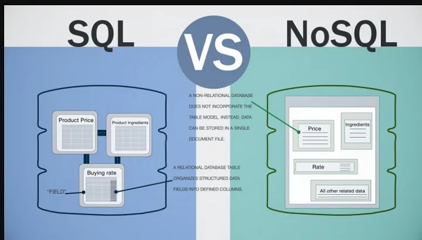
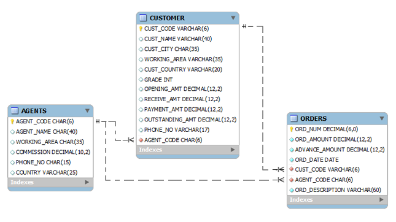
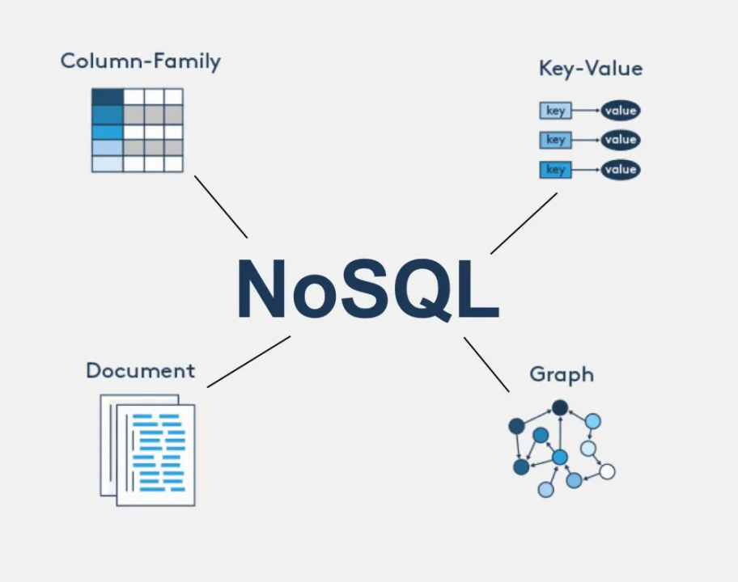

# Pengenalan Database

Database atau basis data adalah kumpulan data yang dikelola sedemikian rupa berdasarkan ketentuan tertentu yang saling
berhubungan sehingga mudah dalam pengelolaannya. Melalui pengelolaan tersebut pengguna dapat memperoleh kemudahan dalam
mencari informasi, menyimpan informasi dan membuang informasi.  
Adapun pengertian lain dari database adalah sistem yang berfungsi sebagai mengumpulkan file, tabel, atau arsip yang
terhubung dan disimpan dalam berbagai media elektronik.

## Jenis-jenis Database

1. Relational Database
   
   Database relasional adalah database yang menggunakan model data relasional. Model data ini menggunakan tabel untuk
   menyimpan data dan relasi antar tabel untuk menghubungkan data. Contoh database relasional adalah MySQL, PostgreSQL,
   dan Oracle.
2. NoSQL Database
   
   NoSQL adalah database yang tidak menggunakan model data relasional. NoSQL menggunakan model data yang lebih fleksibel
   seperti dokumen, grafik, key-value, dan lainnya. Contoh database NoSQL adalah MongoDB, CouchDB, dan Cassandra.

## Perbedaan sintaks

Gambar ini menunjukkan perbandingan sintaks untuk melakukan operasi pada basis data dalam SQL dan NoSQL (MongoDB).
Berikut adalah penjelasan untuk tiap bagian:

- Insert a New Book Record:

    - SQL: Perintah INSERT INTO digunakan untuk memasukkan data baru ke tabel book. Kolom yang diisi adalah ISBN, title,
      dan
      author. NoSQL (MongoDB): Fungsi db.book.insert digunakan untuk menambahkan dokumen baru ke dalam koleksi book.
      Kolom yang
      diisi sama seperti di SQL, yaitu ISBN, title, dan author. Update a Book Record:

    - SQL: Perintah UPDATE digunakan untuk memperbarui data dalam tabel book. Dalam contoh ini, kolom price diubah
      menjadi
      19.99 untuk buku dengan ISBN tertentu.
      NoSQL (MongoDB): Fungsi db.book.update digunakan untuk memperbarui dokumen dalam koleksi book. Pada
      MongoDB, `$set` digunakan untuk menentukan perubahan nilai pada kolom tertentu, dalam hal ini price diubah menjadi
      19.99.
      Return All Book Titles Over $10:

    - SQL: Perintah SELECT digunakan untuk mengambil judul buku dengan harga di atas 10 dari tabel book.
      NoSQL (MongoDB): Fungsi db.book.find digunakan untuk mengambil dokumen dari koleksi book yang memiliki price lebih
      dari Opsi `{ _id: 0, title: 1 }` digunakan untuk hanya menampilkan kolom title tanpa menampilkan _id.
