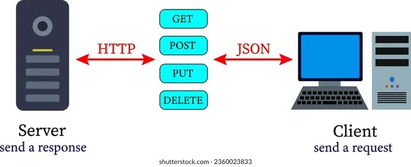

# Fondasi RESTful API

Sebelum kita mulai ngoding API di Laravel, kita perlu nyamain frekuensi dulu nih tentang apa itu REST API. Ibaratnya, kalau kita mau buka restoran, kita harus tahu dulu bahasa apa yang dipakai pelayan buat ngobrol ke dapur.

## Apa itu REST API?

</img>

**API (Application Programming Interface)** itu seperti pelayan di restoran. Kamu (sebagai *Client* / Aplikasi Frontend) pesan makanan lewat pelayan, lalu pelayan itu pergi ke dapur (*Server* / Backend) buat nganterin pesanan kamu. Setelah makanan jadi, si pelayan balik lagi ke meja kamu bawa pesanannya.

Nah, **REST (Representational State Transfer)** itu adalah *aturan main* atau *standar* komunikasi si pelayan ini. Dalam REST API, Client dan Server saling bertukar data, biasanya dalam format **JSON** (*JavaScript Object Notation*).

Contoh bentuk JSON:
```json
{
  "id": 1,
  "nama_menu": "Es Teh Manis",
  "kategori": "Minuman",
  "harga": 5000
}
```

## HTTP Methods (Kata Kerja)

Saat Client *request* sesuatu ke Server, mereka harus pakai "kata kerja" biar server paham apa yang harus dilakukan. Di REST API, kita pakai standar **HTTP Methods**:

1. **`GET`**: Minta data (Read). *Contoh: "Tolong ambilin daftar menu dong."*
2. **`POST`**: Bikin data baru (Create). *Contoh: "Aku mau nambahin menu baru nih."*
3. **`PUT` / `PATCH`**: Update data (Update). *Contoh: "Harga es teh naik jadi 6000 ya."*
   * *Bedanya:* `PUT` biasanya menimpa keseluruhan data, `PATCH` update sebagian saja.
4. **`DELETE`**: Hapus data (Delete). *Contoh: "Menu ini udah nggak dijual, hapus aja."*

## HTTP Status Codes (Respon Server)

Setelah ngirim request, Server pasti ngasih jawaban. Jawaban ini selalu disertai dengan angka 3 digit yang kita sebut **Status Code**. 

Kalian wajib tahu kelompok angka ini biar gampang *debugging*:

*   🟢 **20x (Sukses)**
    *   `200 OK`: Request berhasil (Biasanya buat `GET`, `PUT`, `DELETE`).
    *   `201 Created`: Data baru berhasil dibuat (Pasti dipakai untuk `POST`).
*   🟡 **40x (Error dari Client / Kita yang salah)**
    *   `400 Bad Request`: Format request kita berantakan.
    *   `404 Not Found`: Data atau URL yang dicari nggak ada.
    *   `422 Unprocessable Entity`: Validasi gagal (Misal: kolom nama belum diisi tapi maksa di-submit).
*   🔴 **50x (Error dari Server / Backend yang salah)**
    *   `500 Internal Server Error`: Ada *bug* di kodingan backend kita, atau database mati.

## Tools: API Client (Postman / ThunderClient)

Biasanya, kalau kita ngoding backend biasa (Monolith), kita tes hasilnya lewat browser (Google Chrome/Edge). Tapi **Browser secara default cuma bisa ngirim request `GET`**. Gimana dong cara ngetes request `POST`, `PUT`, atau `DELETE`?

Di sinilah kita butuh tools seperti **Postman** atau **ThunderClient** (ekstensi VS Code).

Tools ini ibarat "browser khusus developer" yang bisa kita atur untuk ngirim request pakai method apapun, nambahin header tertentu (seperti token Auth), dan melihat balikan data berupa format JSON dengan rapi.

Udah siap? Di chapter selanjutnya, kita akan mulai setup Laravel untuk bikin API!
