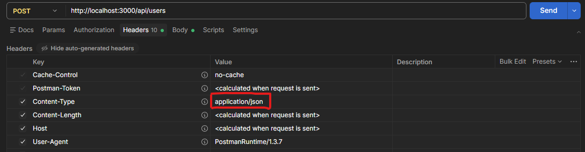

# Setup API di Laravel

Sekarang kita masuk ke bagian serunya. Kalau di Studi Kasus 1 kita main di `routes/web.php` untuk menampilkan file HTML (Blade), sekarang kita akan belajar cara bikin *backend* murni yang cuma nge-return data.

## Mengaktifkan Rute API

Mulai dari versi Laravel 11, file routing untuk API (`routes/api.php`) sengaja disembunyikan secara *default* biar struktur folder nggak terlalu ramai buat orang yang cuma bikin web biasa. 

Jadi, langkah pertama yang wajib banget kita lakuin kalau mau bikin REST API adalah mengaktifkannya. Buka terminal kamu dan ketik:

```bash
php artisan install:api
```

Saat muncul pertanyaan tentang migrasi database untuk tabel token, pilih `yes` aja. 

**Apa yang terjadi setelah command ini dijalankan?**
1. File `routes/api.php` berhasil dibuat.
2. Laravel otomatis memasang `api.php` ke sistem utama (kamu bisa cek di file `bootstrap/app.php`).

## `api.php` vs `web.php`

Ini pertanyaan klasik: *"Kenapa harus dipisah rutenya? Bukannya sama-sama routing?"*

Memang sama-sama buat ngatur URL, tapi perlakuannya beda:

| Fitur | `routes/web.php` | `routes/api.php` |
| :--- | :--- | :--- |
| **Fokus** | Tampilan Web (Browser) | Pertukaran Data (Mobile App / Web App via Fetch/Axios) |
| **State** | Menggunakan Session & Cookies | Stateless (Tidak pakai Session, biasanya pakai Token) |
| **Prefix URL** | `/` (contoh: `localhost:8000/posts`) | Otomatis ditambah `/api` (contoh: `localhost:8000/api/posts`) |
| **Proteksi** | Punya perlindungan CSRF | Tanpa CSRF (karena stateless) |

> [!WARNING]
> Hati-hati! Kalau kamu naruh rute di dalam file `routes/api.php`, **kamu nggak perlu nulis `/api/...` lagi di kodenya.** Laravel akan menambahkannya secara otomatis. 

## Header Wajib: `Accept: application/json`

Satu *gotcha* (jebakan batman) yang sering banget dialami pemula: 

*"Kok pas ada error validasi atau data nggak ketemu, Laravelnya malah redirect ke halaman login/HTML kosong? Padahal aku maunya response JSON!"*

Ini terjadi karena Laravel itu pinter. Dia bakal ngasih HTML kalau yang minta (client) terdeteksi sebagai browser. Biar Laravel tahu kalau kita ini lagi butuh balasan berupa JSON, kita **wajib** menyisipkan ini di bagian `Headers` pada Postman/ThunderClient kita:

- **Key**: `Accept`
- **Value**: `application/json`

</img>

## Route Model Binding (Keajaiban Laravel)

Nanti saat kita bikin rute pencarian data spesifik (misal: `/api/categories/1`), kita akan sering pakai fitur bawaan Laravel yang namanya **Route Model Binding**.

Kalau di framework lain, biasanya kamu harus nyari manual ID-nya ke database:

```php
// Cara Kuno (Bisa, tapi panjang)
public function show($id) {
    // Nyari manual ke database, kalau ga ketemu throw 404
    $category = Category::findOrFail($id); 
    return response()->json($category);
}
```

Di Laravel, kita cukup lakukan ini:

```php
// Cara Laravel (Route Model Binding)
public function show(Category $category) {
    // Laravel otomatis nyari data category berdasarkan ID yang ada di URL.
    // Kalau nggak ketemu? Otomatis melempar error 404 Not Found!
    return response()->json($category);
}
```

Sihir ini sangat menghemat waktu dan bikin kode kita jadi bersih banget. Di materi berikutnya, kita akan langsung terjun ngerjain studi kasus!
