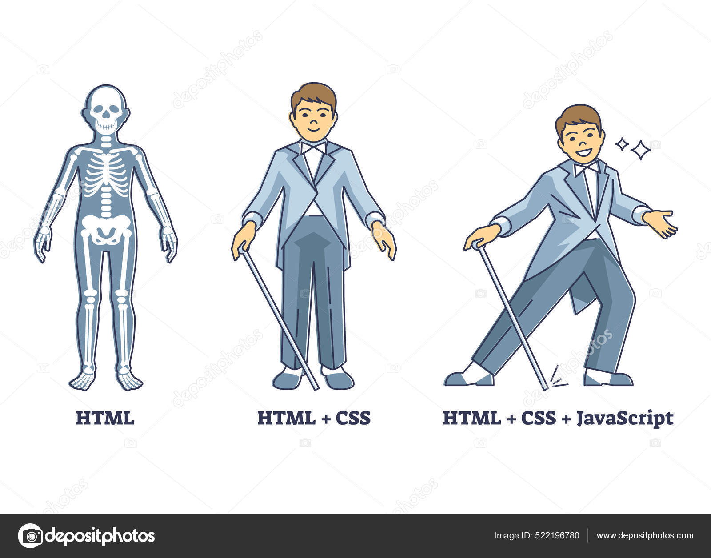

# Pendahuluan

Web Programming atau Pemrograman Web merupakan istilah yang erat kaitannya dengan internet dan website. Memang benar,
karena pemrograman web merupakan suatu proses pembuatan website untuk keperluan internet. Orang banyak mengenal web
dengan istilah WWW atau World Wide Web.
  
World Wide Web adalah halaman-halaman website yang terkoneksi satu dengan lainnya atau disebut juga dengan hyperlink
yang membentuk samudera informasi yang berjalan dengan protokol HyperText Transfer Protocol (HTTP).

## Bahasa Pemrograman

Dalam semua ilmu tentang pemrograman baik itu desktop, mobile, game maupun software atau aplikasi lainnya pasti selalu
ada bahasa-bahasa pemrograman yang digunakan untuk membuat aplikasi tersebut yang berisi statement-statement, perintah,
atau pun fungsi agar aplikasi yang dibuat sesuai dengan apa yang telah didesain oleh si programmer. Oleh karena itu
pemrograman web pun memiliki banyak bahasa yang digunakan, di antaranya:

1. HyperText Markup Language (HTML)
   HTML sebenarnya bukan sebuah bahasa pemrograman, melainkan markup language atau bahasa penandaan yang terdiri dari
   kumpulan tag. Pada dasarnya HTML hanya mendeskripsikan bahwa bagian tertentu dalam sebuah halaman web adalah isi yang
   harus ditampilkan oleh browser dengan cara tertentu.
    
2. Cascading Style Sheet (CSS)
   CSS merupakan bahasa stylesheet yang digunakan untuk mengatur tampilan suatu dokumen yang ditulis dengan HTML. CSS
   juga memiliki css framework dan digunakan untuk menambah desain-desain tertentu pada halaman web agar desain halaman
   menarik untuk dilihat.
    
3. JavaScript
   JavaScript adalah bahasa scripting yang berjalan pada sisi client. Maksudnya adalah pemrosesan script dilakukan
   sendiri pada komputer user. Biasanya JavaScript digunakan untuk membuat animasi-animasi dan bentuk interaktif lain
   pada halaman web. Terbukti dari banyaknya library-library JavaScript yang dapat digunakan oleh programmer untuk
   membuat halaman web yang dibuat menjadi lebih interaktif
    
4. PHP
   PHP (Hypertext Preprocessor) adalah bahasa pemrograman open-source yang umumnya digunakan untuk membangun aplikasi
   web dinamis dan interaktif. PHP dapat dijalankan pada server web dan dikombinasikan dengan HTML, CSS, dan JavaScript
   untuk membuat halaman web yang dinamis.
    
5. Structured Query Language (SQL)
   SQL merupakan domain-spesific language yang digunakan untuk mengolah data dalam Relational Database Management
   System (RDBMS). Aplikasi RDBMS yang banyak digunakan oleh para programmer aplikasi web untuk mengolah basis data
   mereka adalah MySQL. Biasanya digunakan fungsi-fungsi dalam bahasa pemrograman PHP untuk membuat, membaca, mengubah
   atau pun menghapus data dalam SQL yang kemudian dapat ditampilkan pada halaman web.
        
   
