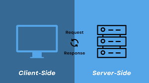
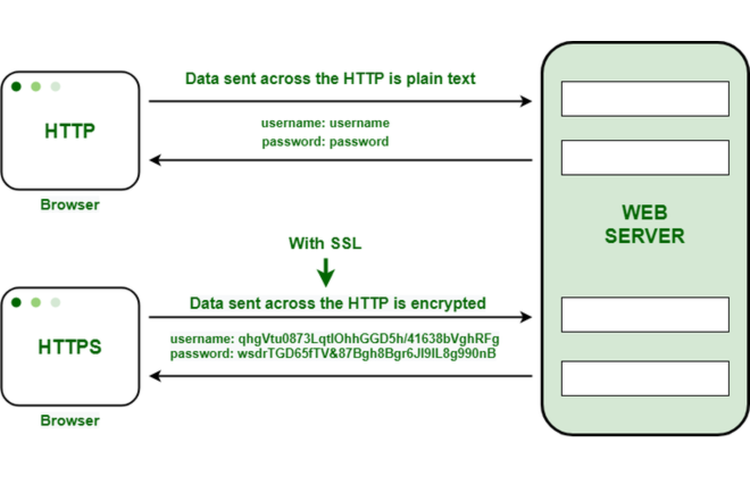

# Pengenalan Server Side Programming

Server side programming atau pemrograman sisi server adalah suatu program yang berjalan di server yang menangani
pembuatan konten halaman website. Perlu diketahui bahwa server side programming memiliki fungsi yang berbeda dengan
client side.
  
Server side merupakan sistem yang berjalan di server, sedang client side merupakan sistem yang berjalan di web browser
pengguna. Pada dasarnya server side programming ini memiliki arti yang sama dengan backend scripting.
  
Para pengembang sisi server akan merancang, membangun, dan memelihara kode agar sistem dapat berjalan dengan semestinya
di server aplikasi. Server side programming akan memproses user input, berinteraksi dengan database, dan mengontrol
konten apa yang akan disajikan sebagai respon dari permintaan user.

## HTTP & HTTPS

- HTTP (Hypertext Transfer Protocol)
  HTTP adalah protokol jaringan yang digunakan untuk mentransfer data di web. Saat kita mengunjungi sebuah situs, HTTP
  memungkinkan browser kita berkomunikasi dengan server untuk meminta data, seperti teks, gambar, atau video. Namun,
  HTTP bersifat stateless (tidak menyimpan informasi tentang interaksi sebelumnya) dan insecure (tidak dienkripsi),
  sehingga data yang dikirim atau diterima bisa dilihat oleh pihak ketiga yang tidak diinginkan jika terjadi penyadapan.
    
- HTTPS (Hypertext Transfer Protocol Secure)
  HTTPS adalah versi aman dari HTTP. HTTPS menggunakan SSL (Secure Sockets Layer) atau TLS (Transport Layer Security)
  untuk mengenkripsi data, sehingga informasi yang dikirim dan diterima tidak bisa diakses oleh pihak ketiga. Dengan
  HTTPS, data menjadi lebih terlindungi, terutama untuk transaksi yang membutuhkan keamanan ekstra seperti login,
  pembayaran, atau data pribadi.