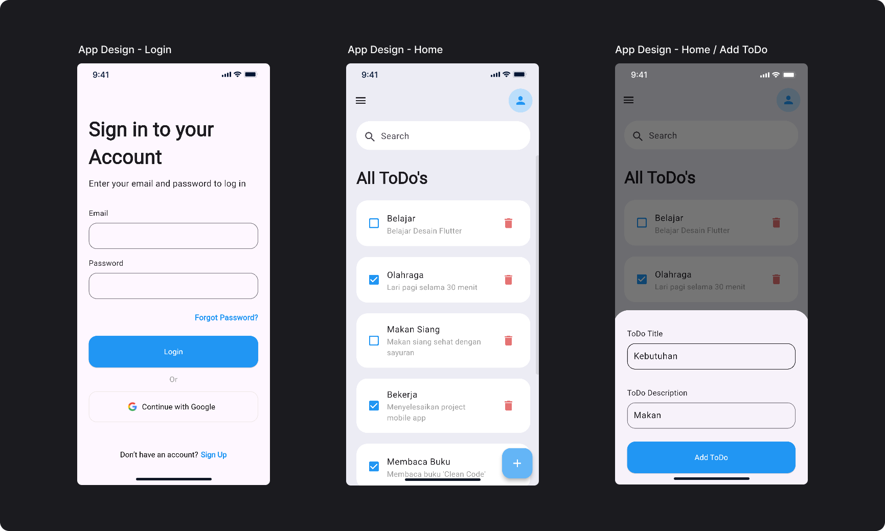

# 📱 Pengenalan Project  

Di bagian ini, kita akan membangun sebuah aplikasi sederhana menggunakan Flutter! 🚀  

## 🎯 Apa yang Akan Kita Pelajari?  
- **UI Styling** – Menerapkan desain UI aplikasi To-Do List ke dalam Flutter.  
- **State Management** – Mengelola state untuk **Create, Read, Update,** dan **Delete (CRUD)**, serta menyimpannya secara sementara menggunakan state management.  
- **Menggunakan Assets Eksternal** – Menambahkan dan mengelola asset seperti gambar atau ikon kustom ke dalam aplikasi Flutter.  

## 📌 Topik Project  

 

**Aplikasi To-Do List Sederhana** ✨  
Di sini, kita akan membangun aplikasi To-Do List sederhana menggunakan Flutter.  

Yuk, kita mulai! 🔥  

## Referensi:
- [20 Screen Login & Register Mobile App](https://www.figma.com/community/file/1370757927948360864/20-screen-login-register-mobile-app)
- [Flutter ToDo App Tutorial for Beginners](https://youtu.be/K4P5DZ9TRns?si=FW5akLBsI5uYjaDP)

