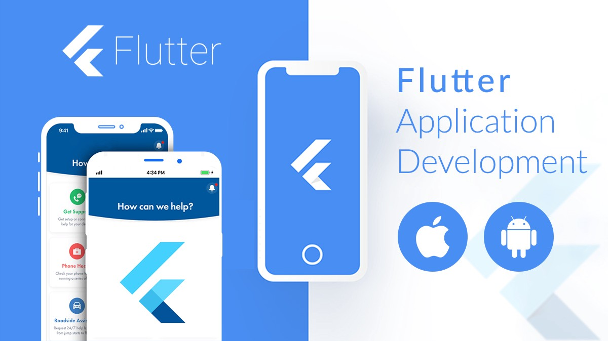

# 📱 Miniclass Mobile Development

## 👋 Selamat Datang di Miniclass Mobile!

Miniclass Mobile ini merupakan salah satu dari 4 Miniclass di Workshop & Riset Informatika (WRI) Politeknik Negeri Malang, yang berfokus pada pengembangan aplikasi mobile menggunakan bahasa Dart dan Flutter. Pengembangan mobile sedang menjadi tren utama dalam industri teknologi saat ini. Semakin banyak perusahaan dan pengembang yang beralih untuk fokus pada pembuatan aplikasi mobile, terutama dengan meningkatnya penggunaan perangkat seluler di seluruh dunia.

Materi pada Gitbook ini membahas berbagai metode dan langkah-langkah dalam disiplin ilmu yang terkait dengan pengembangan aplikasi mobile dengan menggunakan bahasa Dart dan framework Flutter. Diharapkan bahwa materi ini dapat menjadi referensi tambahan bagi para pembaca yang sedang mempelajari aspek pengembangan aplikasi mobile, khususnya dengan menggunakan Dart dan Flutter.

## Silabus

Silabus miniclass mobile terbagi menjadi tiga tingkat yaitu basic, intermediate, dan advance. Berikut adalah materi yang akan dipelajari di miniclass mobile. 

1. Basic
    * Dart Basic
    * Dart Function and Object-Oriented Programming
    * Introduction to Flutter
    * Flutter Widgets: Stateless and Stateful Widgets
    * Slicing UI (Mini Project)
2. Intermediate
    * Layout Constraint
    * Slicing UI (Mini Project)
    * Navigation and Routing
    * State Management in Flutter
    * Networking in Flutter
    * Storage in Flutter
3. Advance
    * Mini Project
    * Deployment

## Sumber Materi:

* [flutter.dev](https://docs.flutter.dev/)
* [youtube: @flutterdev](https://www.youtube.com/@flutterdev)
* [youtube: @ericodarmawan](https://www.youtube.com/@ericodarmawan)
* [medium](https://medium.com/)
