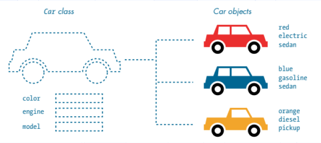
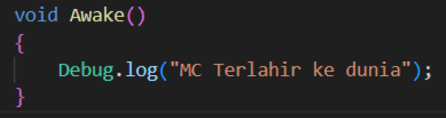
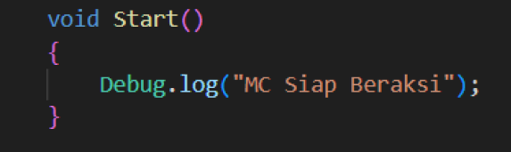
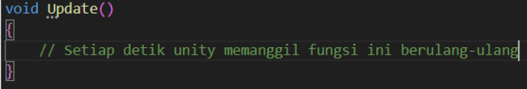
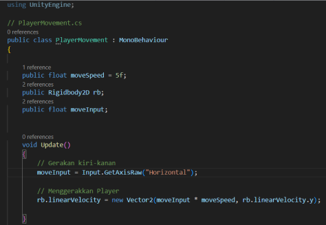
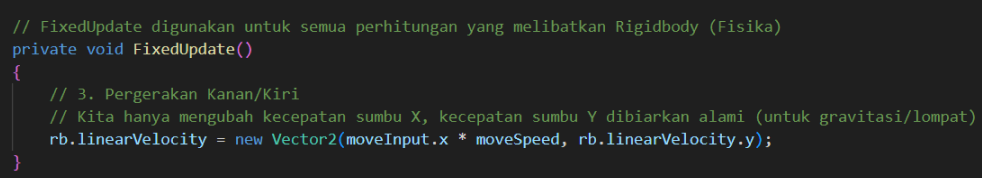
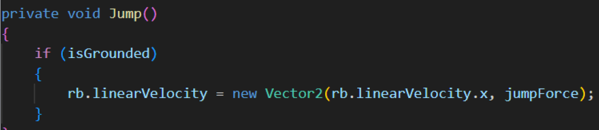
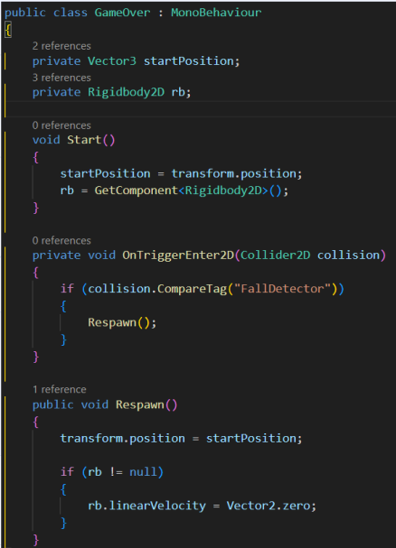

**Kode dan Hidup Seorang MC**

1. **Membangun Game dengan Kode**

Dalam Game Development, programming berperan penting untuk menghidupkan setiap elemen di dalamnya. Melalui bahasa C#, kita memberikan perilaku dan interaksi pada karakter serta dunia yang mereka tempati.

2. **Mengenal OOP**

Object-Oriented Programming (OOP) adalah cara pemrograman yang menyusun program menggunakan objek, yaitu representasi dari benda atau konsep di dunia nyata yang memiliki data (attribute) dan perilaku (method), sehingga kode menjadi lebih terstruktur dan mudah dipahami.

- Class: Blueprint Mobil

Class adalah blueprint atau template dalam OOP yang digunakan untuk membuat objek, di mana di dalamnya terdapat attribute atau karakteristik objek dan function (method) sebagai perilaku atau aksi yang dapat dilakukan oleh objek.

- Object = mobil yang sudah jadi

Object adalah hasil instansiasi dari class yang merepresentasikan suatu entitas dan dapat memiliki nilai atribut serta menjalankan method yang telah didefinisikan.

- **Fondasi Pemrograman Untuk MC**

1. MonoBehaviour adalah kelas dasar bawaan Unity yang harus diwarisi oleh setiap script agar Unity dapat mengenalinya dan menjalankannya dalam game.

2. Fungsi

Fungsi adalah perilaku atau aksi yang dapat dijalankan oleh sebuah GameObject, sehingga GameObject tersebut mampu berinteraksi dan merespons keberadaan maupun tindakan dari GameObject lainnya.

- Awake()

Fungsi Awake() merupakan sebuah fungsi yang dipanggil atau dijalankan pertama kali bahkan sebelum game itu sendiri dimulai

- Start()

Fungsi start adalah fungsi yang dipanggil satu kali saja tepat setelah game dimulai dan setelah fungsi awake dijalankan

- Update()

Fungsi update merupakan fungsi yang akan dijalankan sekali setiap frame. Jika game berjalan pada 60 FPS (Frame per Second), fungsi ini dipanggil 60 kali per detik.

- **Mengatur Pergerakan MC**

- Atribut:

- moveSpeed : merupakan atribut untuk menentukan kecepatan yang nantinya dimiliki oleh MC

- rb : adalah komponen Rigidbody2d yang dimiliki oleh GameObject

- moveInput : moveInput digunakan untuk menyimpan input player

- Cara Kerja:

Memberikan nilai pada variabel moveInput menggunakan perintah Input.GetAxisRaw("Horizontal") untuk membaca input pemain. Nilai ini kemudian digunakan untuk mengubah kecepatan arah X pada Rigidbody2D, sehingga karakter dapat bergerak secara horizontal di dalam game.

- **Tragedi MC Jatuh ke Jurang**

Kode diatas adalah kode untuk melakukan game over ketika player jatuh dari platform,cara kerjanya sangat sederhana.ketika player melewati area yang dihitung sebagai game over function untuk melakukan respawn akan langsung berjalan.
