# Membangun Pijakan dalam Game Art
>Aturan dan Batasan dalam 2D Art

## 1. Format export

**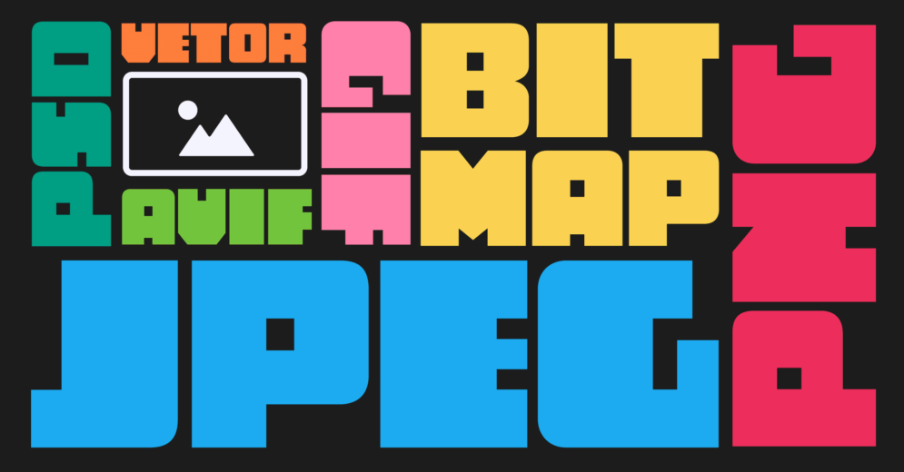**

Hari ini kita bakal bahas sesuatu yang keliatannya remeh, tapi kalau salah bisa bikin game kalian kelihatan aneh atau bahkan berat pas dijalankan. Namanya Format Export.
### 1.1. Kenapa Penting?

Bayangin gini: kalian punya karya seni keren, tapi kalian simpan dalam kotak yang salah. Hasilnya? Entah kotaknya bolong, isinya rusak, atau orang lain nggak bisa buka.  
Nah, di game development, format file itu kotaknya. Dia nentuin:
- **Ukuran file** → seberapa besar dan cepat di-load.
- **Kualitas gambar** → tajem atau blur.
- **Transparansi** → ada kotak background atau enggak.
- **Performa** → bikin game ngacir atau malah ngelag.

### 1.2.  Format Umum di Game 2D
- **PNG** → Raja dunia sprite!  Bisa transparan, kualitas bagus, dipakai hampir di semua game.
- **JPG** → Nggak bisa transparan, lebih cocok buat background yang gede kayak langit atau gunung.
- **GIF** → Jarang dipakai di engine modern, lebih buat stiker meme di WA (insert foto mas gatot).
- **Sprite Sheet (PNG Atlas)** → kumpulan frame animasi dalam satu gambar → hemat RAM & lebih cepat.

Jadi, kalau bikin sprite: **PNG-24 bit adalah sahabat terbaik kalian!**

### 1.3. Kenapa Harus PNG-24 Bit?

**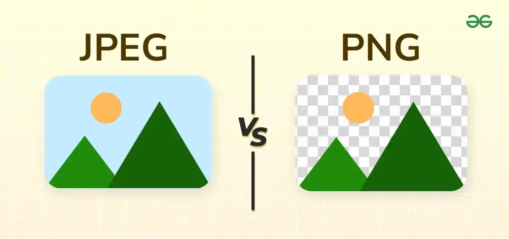**

#### 1.3.1. Mendukung Transparansi (Alpha Channel)  

Bayangin karakter kalian berbentuk bulat lucu, tapi pas di-export malah ada kotak putih di belakangnya… jelek kan? Nah, PNG-24 itu bisa nyimpen info alpha channel → bagian transparan, semi-transparan, atau full solid. Alpha Channel itu kayak lapisan "invisible cloak" di gambar.

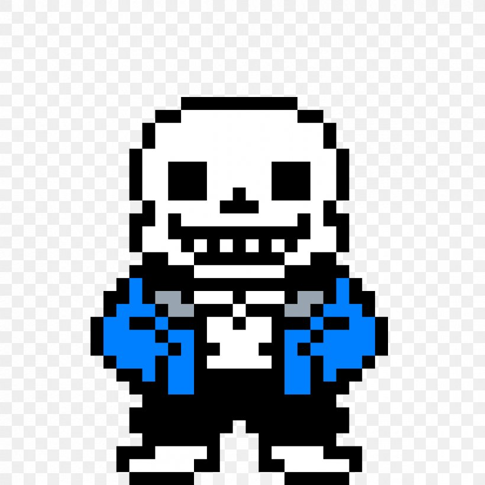

Channel dalam gambar = lapisan informasi warna. Gambar digital biasanya punya 3 channel warna utama: 
- R (Red / Merah) 
- G (Green / Hijau) 
- B (Blue / Biru) 
Kalau digabung → menghasilkan RGB Color. 

Nah, Alpha Channel adalah channel ke-4 yang menyimpan informasi transparansi (opacity).

#### 1.3.2. Kualitas Tinggi (Lossless)  
PNG itu lossless → pixel yang kalian gambar, sama persis masuk ke game. JPG itu lossy → hasilnya bisa ada bercak kayak foto lama di-print ulang 10 kali.
#### 1.3.3. Konsistensi Warna  
PNG-24 support jutaan warna → cocok buat efek gradasi, cahaya, bayangan.  
Kalau pixel-art, detail kecil bisa hilang kalau pakai format salah.
## 2. Pixel per Unit (PPU)

Oke guys, sekarang kita masuk ke topik yang sering bikin bingung pas pertama kali mainan Unity:  
>"Kenapa sprite-ku jadi segede gaban pas di-import?"

Nah, jawabannya ada di satu hal penting banget yang sering dilupain yaitu **Pixel Per Unit** atau disingkat **PPU**.

### 2.1. Apa Itu Pixel Per Unit?

Coba bayangin gini…  
Kalian punya gambar karakter ukuran 32x32 pixel.  
Terus kalian masukin ke dunia game yang pakai ukuran 1 unit = 1 meter.  
Pertanyaannya:

>“Satu unit itu harusnya berapa pixel, sih?”

Nah, di situlah PPU berperan! 
**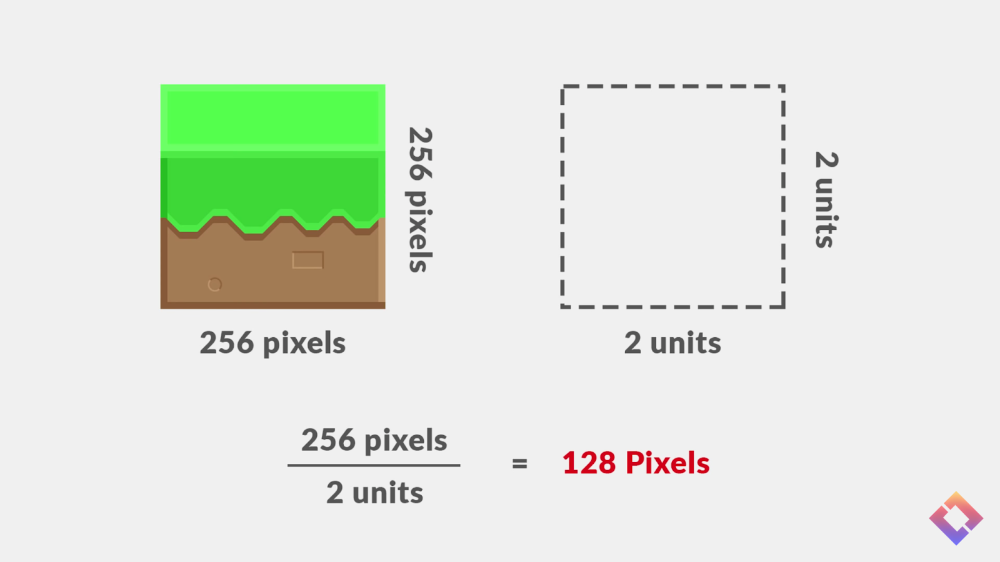**
- Kalau PPU = 32, artinya 32 pixel = 1 unit di dunia game.
- Kalau PPU = 16, artinya 16 pixel = 1 unit (sprite-nya jadi 2x lebih besar).
- Kalau PPU = 64, artinya sprite-nya jadi setengah lebih kecil.

PPU itu ibarat penggaris ajaib buat dunia game kamu 

Bayangin kamu lagi nyusun dunia LEGO:
- Kalau semua LEGO ukurannya sama → dunia kamu rapi.
- Tapi kalau satu ukurannya 2x lipat → tiba-tiba temboknya jebol ke langit 

Nah, PPU itu memastikan semua aset punya “skala” yang sama.  Kalau PPU-nya beda-beda, nanti sprite-nya bisa:
- Terlalu kecil kayak semut 
- Atau segede titan 

### 2.2. Kenapa PPU Harus Konsisten?

Karena game engine itu bukan dukun, dia gak bisa nebak ukuran aslinya sprite kamu  
Jadi kalau satu tile rumput kamu PPU-nya 32 tapi karakter kamu 100, hasilnya:
- Tilemap jadi kayak mainan,
- Karakter-nya malah nginjak satu dunia rumput cuma buat satu langkah 

Makanya, samain PPU untuk semua aset biar:
- Dunia kamu proporsional.
- Kamera pixel-perfect bisa tampil mulus.
- Gak pusing pas desain level.

## 3. Slice (9 Patch)

Oke guys, sekarang kita bahas sesuatu yang kelihatannya simpel tapi super berguna, apalagi kalau kalian udah mulai bikin UI game tombol, panel, atau popup.

Namanya adalah…

9-Slice Sprite atau kadang disebut juga 9-Patch!

### 3.1. Apa Itu 9-Slice?

**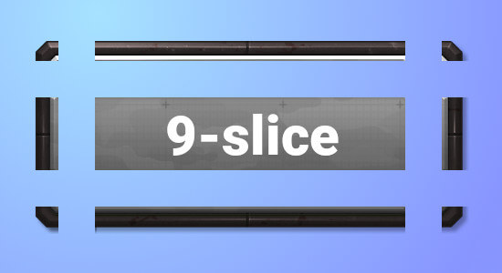**

Coba bayangin kalian punya gambar kotak UI yang pinggirnya ada hiasan melengkung cantik  
Nah, terus kalian pengen kotak itu jadi lebih lebar atau tinggi.  
Kalau kalian stretch biasa hasilnya:

Pinggirnya malah gepeng! 

Makanya, kita pakai 9-Slice:  
teknik untuk stretch gambar tanpa merusak pinggirnya.

### 3.2. Cara Kerjanya

Bayangin sprite kotak kalian dibagi jadi 9 bagian kayak gini:

```txt
╔═══╦═══╦═══╗

║ 1 ║ 2 ║ 3 ║

╠═══╬═══╬═══╣

║ 4 ║ 5 ║ 6 ║

╠═══╬═══╬═══╣

║ 7 ║ 8 ║ 9 ║

╚═══╩═══╩═══╝
```

- Bagian pojok (1,3,7,9) → tidak boleh diubah ukurannya (biar bentuk pinggir tetap mulus).
- Bagian tengah (5) → boleh di-stretch ke semua arah.
- Bagian sisi (2,4,6,8) → bisa memanjang satu arah aja.  


Jadi pas kalian ubah ukuran panel, pinggir tetap cantik, tengahnya aja yang melebar.

Bayangin kalian punya bingkai foto mahal. Kalau kalian tarik biar jadi panjang, yang melebar cuma kacanya, bukan ukiran pinggirnya.  Nah, 9-Slice itu bikin hal yang sama biar “bingkai UI” kalian tetap elegan meskipun ukurannya berubah-ubah.

### 3.3. Di Mana Biasanya Dipakai?

Hampir semua game punya elemen UI yang butuh 9-slice:
- Tombol “Start Game” 
    
- Panel inventori 
    **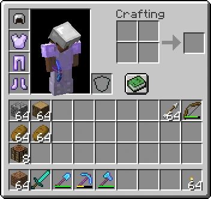**
- Kotak dialog / popup 
    **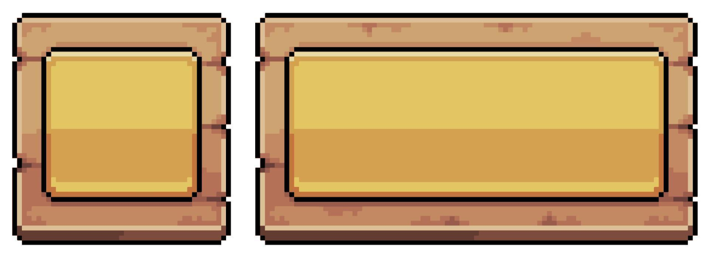**

Dengan 9-Slice, kalian bisa pakai satu sprite aja untuk semua ukuran UI itu!  
Gak perlu export 10 versi tombol cuma buat ukuran beda-beda.

## 4. Pixel Perfect Camera

Pernah gak sih kalian udah gambar pixel art susah payah tiap, pixel rapi, warna pas, grid-nya halus tapi pas dijalankan di game, malah jadi blur, geser, atau nanggung satu pixel? 

Yup, selamat datang di dunia yang namanya Pixel Perfect Camera!

### 4.1. Masalah yang Sering Terjadi

Bayangin kalian bikin karakter 32x32 pixel, udah cakep banget. Terus waktu jalan di game…

Wah, kok garis pinggirnya goyang? Kok matanya kayak kabur satu pixel ke kanan?

Itu terjadi karena kamera kalian gak sejajar dengan grid pixel.  
Game engine ngerender sprite di posisi “setengah pixel”, jadi hasilnya gak presisi.

### 4.2. Jadi, Apa Itu Pixel Perfect Camera?

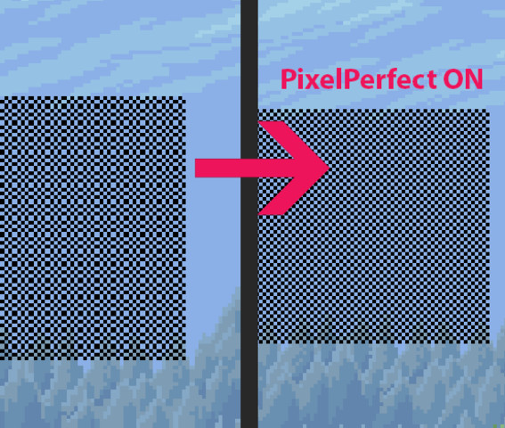

Simpelnya:

Pixel Perfect Camera memastikan setiap pixel di sprite pas banget dengan pixel di layar.

Artinya, 1 pixel di gambar = 1 pixel di layar.  
Gak lebih, gak kurang, gak nyerong.

Hasilnya:
- Gambar tetap tajam 
- Gerakan halus & sejajar grid 
- Gak blur meskipun resolusi monitor beda

Bayangin kamu nyusun LEGO di atas meja grid.  
Kalau meja kamu miring sedikit aja, semua LEGO bakal geser setengah kotak


Nah, Pixel Perfect Camera itu kayak “pengunci grid” supaya semua pixel duduk di tempatnya gak miring, gak geser, gak ngambang! 

### 4.3. Kenapa Penting untuk Game 2D (Apalagi Pixel Art)
1. Game retro / pixel-art itu bergantung pada ketajaman visual.
2. Tanpa pixel-perfect, hasilnya bisa pecah, blur, atau malah “loncat-loncat” tiap gerak kamera.
3. Dengan pixel-perfect, hasilnya tajam di semua resolusi layar, entah 720p, 1080p, atau 4K.  

## 5. Tilemap Sederhana

### 5.1.  Apa sih Tilemap itu?

**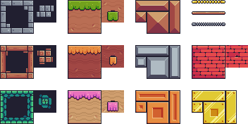**
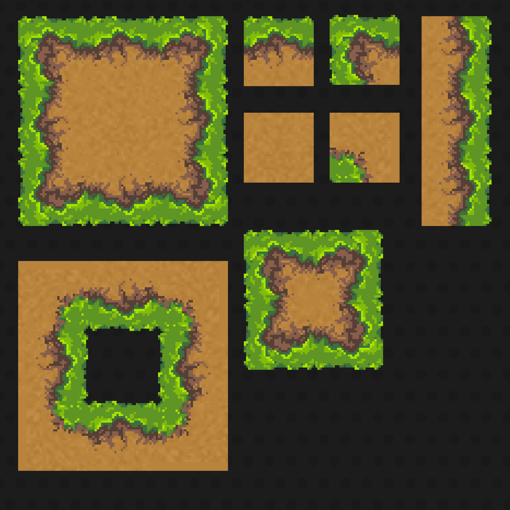

Bayangin kamu lagi main game kayak Super Mario Bros, Stardew Valley, atau Celeste.  
Nah, dunia di game itu nggak digambar satu-satu manual tapi dibangun dari potongan kecil gambar yang disebut tile!

Tile itu kayak potongan puzzle kecil (biasanya 16×16, 32×32, atau 64×64 piksel) yang disusun berulang-ulang untuk bikin dunia game yang luas.  
Kalau semua tile digabungin → jadilah Tilemap!

**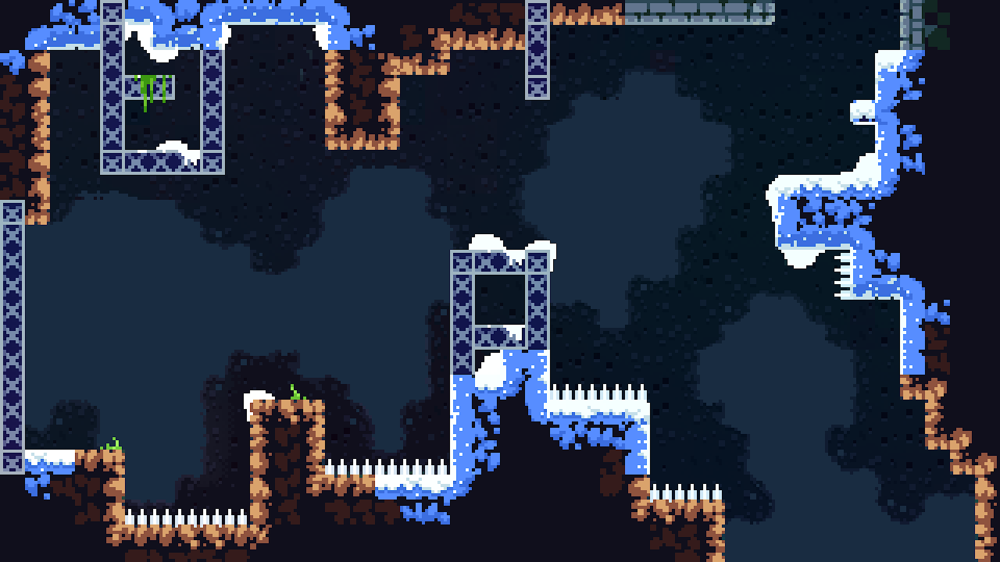**

### 5.2. Kenapa pakai Tilemap?

Karena:
1. Hemat waktu & memori — Cukup satu gambar bisa dipakai berkali-kali.
2. Konsisten — Semua elemen (tanah, rumput, dinding) punya ukuran & gaya yang sama.
3. Mudah editnya — Tinggal hapus, ganti tile, atau tambahkan baru tanpa harus redrawing background.
4. Performa lebih ringan — Engine (seperti Unity atau Godot) bisa optimasi tilemap jadi lebih cepat dirender.

### 5.3. Cara kerjanya

Tilemap itu seperti lembar kertas grid besar.  
Setiap kotak (cell) punya angka indeks tile. Misalnya:
```txt
0 = grass

1 = dirt

2 = stone

3 = water
```
  

Terus, engine bakal baca data grid ini:

```txt
0 0 0 0 0 0

0 1 1 1 0 0

0 1 2 1 0 0

0 1 1 1 0 0
```
  

dan nge-render tile berdasarkan urutan itu.  
Jadi kalau tile “2” berarti batu, engine akan taruh gambar batu di posisi itu.

### 5.4. Komponen penting dalam Tilemap

1. Tileset — Kumpulan semua tile kamu dalam satu gambar (sprite sheet).  
    
    Contohnya: tileset_basic_32.png dengan tile 32×32 px.
    
2. Tile Palette (di Unity) — Tempat kamu “menggambar” tilemap seperti melukis dengan kuas.
       
3. Tilemap Object — Objek di scene yang jadi tempat semua tile tersusun.
    
4. Grid — Struktur tempat tile disusun biar rapi sejajar dan gak tumpang tindih.

### 5.5. Sedikit teknis tapi penting

1. Ukuran tile harus seragam (misalnya semua 32×32).
2. PPU (Pixel Per Unit) diatur biar tile ukurannya konsisten di game world.
3. Pastikan export gambar kamu dalam PNG-24 bit biar warna dan transparansinya sempurna.

## 6. Praktikum: Membuat Tilemap

Bikin map sederhana (10x6 tile) pakai tileset buatan sendiri.

CONTOH:

**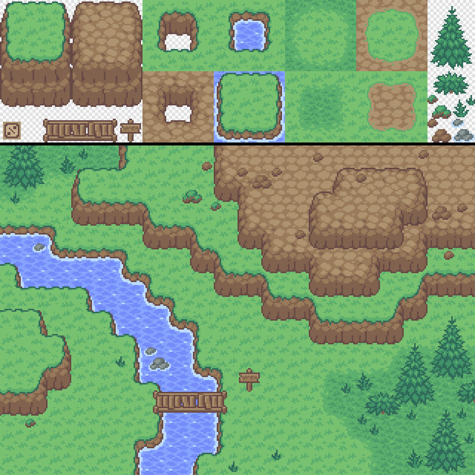**