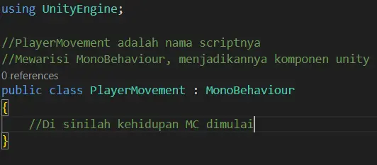
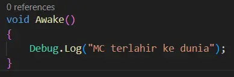
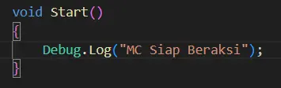
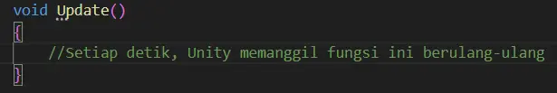
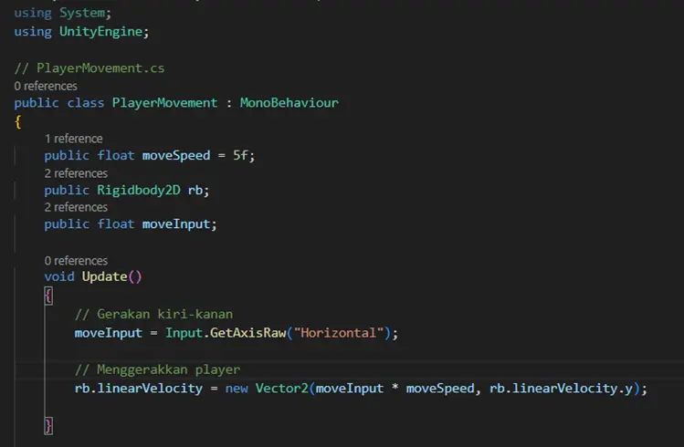
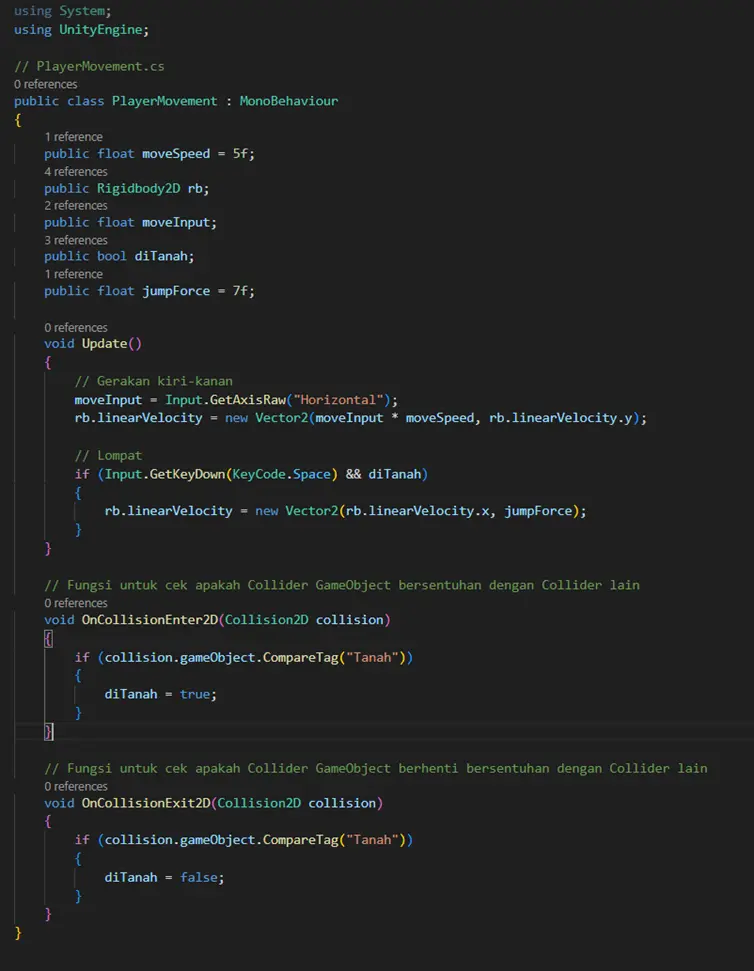
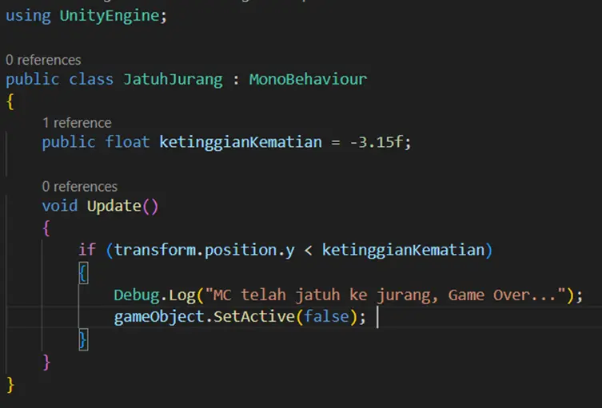

# 🦸 Kode dan Hidup Seorang MC

Dalam dunia game, MC (Main Character) adalah tokoh utama yang kita kendalikan.

Di Unity, “hidup” seorang MC ditentukan oleh kode yang kita tulis menggunakan C#.

Kode ini memberi jiwa pada karakter membuatnya bisa bergerak, melompat, dan bereaksi terhadap dunia di sekitarnya.

## 1. Tulang Belakang MC : MonoBehaviour

MonoBehaviour adalah kelas dasar bawaan Unity yang menjadi fondasi utama bagi setiap script yang ditempelkan pada GameObject. Semua script yang ingin berinteraksi dengan GameObject harus menurunkan (inherit) kelas ini, agar Unity dapat mengenali dan menjalankan berbagai fungsi khusus yang digunakan untuk mengatur serta memanipulasi perilaku GameObject di dalam game.

## 2. Fungsi-Fungsi Utama dalam Hidup Sang MC

Fungsi adalah perilaku atau aksi yang dapat dijalankan oleh sebuah GameObject, sehingga GameObject tersebut mampu berinteraksi dan merespons keberadaan maupun tindakan dari GameObject lainnya.

### 2.1. Awake()

Fungsi Awake() merupakan sebuah fungsi yang dipanggil atau dijalankan pertama kali bahkan sebelum game itu sendiri dimulai, biasanya fungsi awake() digunakan untuk mengambil dan mempersiapkan referensi komponen

### 2.2. Start()

Fungsi start adalah fungsi yang dipanggil satu kali saja tepat setelah game dimulai dan setelah fungsi awake dijalankan tentunya. Biasanya fungsi start digunakan untuk mengatur kondisi awal game seperti posisi mc atau kondisi awal mc

### 2.3. Update()

Fungsi update merupakan fungsi yang akan dijalankan sekali setiap frame. Jika game berjalan pada 60 FPS (Frame per Second), fungsi ini dipanggil 60 kali per detik. Sehingga fungsi ini cocok digunakan untuk input pemain misalnya untuk movement dari sang mc itu sendiri

## 3. Mengatur Pergerakan Karakter

Cara membuat MC kita dapat bergerak ke kiri dan kanan maka kita memerlukan yang namanya sebuah atribut, apa itu Atribut? Atribut merupakan sebuah variabel yang menggambarkan karakteristik yang dimiliki objek. Contoh dalam kasus ini adalah MC kita akan memiliki kecepatan sehingga dia bisa berpindah ke kiri dan kanan

Penjelasan atribut :

1.  Atribut movespeed merupakan kecepatan yang nantinya dimiliki oleh MC untuk menentukan seberapa cepat MC kita dapat berjalan

2. Rb adalah komponen Rigidbody2d yang dimiliki oleh GameObject mc yang nantinya akan kita gunakan untuk memanipulasi kecepatan MC sehingga MC dapat berjalan ke  kiri dan kanan karena hukum fisika terletak pada component Rigidbody2D

3. moveInput digunakan untuk menyimpan input player sehingga apabila player menekan tombol a maka moveInput akan bernilai -1 namun apabila player menekan huruf d maka moveInput akan bernilai 1

Setelah atribut selesai dibuat, kita dapat menentukan apa yang akan dilakukan oleh GameObject di dalam fungsi Update().

1. Memberikan nilai pada variabel moveInput menggunakan perintah Input.GetAxisRaw("Horizontal"). Fungsi ini digunakan untuk membaca input dari pemain pada sumbu horizontal. **"Horizontal"** adalah nama axis bawaan di Unity yang secara default digunakan untuk pergerakan ke kanan dan kiri. Selain itu, Unity juga menyediakan axis **"Vertical"** untuk gerakan atas dan bawah (biasanya tombol W/S)

2. Terakhir, nilai input tersebut digunakan untuk mengubah kecepatan objek pada arah **X** (horizontal), sementara kecepatan arah **Y** (vertical) tetap dipertahankan agar objek tidak bergerak naik-turun.

### 3.1. Menambahkan Aksi Melompat

Untuk membuat MC dapat melompat maka kita perlu menambahkan atribut untuk menentukan kekuatan lompat sang MC dan `boolean` di Tanah untuk melakukan pengecekan apakah MC berada di tanah atau tidak. Disini kita juga ketambahan dua fungsi baru yaitu `OnCollisionEnter2D` dan `OnCollisionExit2D` yang merupakan fungsi bawaan unity, digunakan `OnCollisionEnter2D` untuk cek apakah `GameObject` bersentuhan dengan collider lain sedangkan `OnCollisionExit2D`  untuk cek apakah `GameObject` berhenti bersentuhan dengan *collider* lain. Sehingga kita dapat rubah nilai di Tanah menjadi true or false, yang nantinya digunakan pada fungsi update untuk cek kondisi if, apabila di Tanah true dan player menekan tombol space maka MC bisa lompat namun jika sebaliknya maka MC tidak bisa lompat

## 4. Tragedi MC Jatuh ke Jurang

Pada sesi ini kita akan memahami logika sederhana bagaimana cara kerja sebuah GameObject mengalami “Kematian” apabila sebuah kondisi terpenuhi.

Pada kode diatas apabila MC berada di ketinggian kurang dari -3.15 maka GameObject akan hilang seketika menandakan MC telah mati dan memunculkan pesan seperti di atas. `transform.position.y` adalah cara kita untuk mengakses posisi dari suatu GameObject di sumbu y sehingga dengan kode tersebut kita dapat mengetahui pada ketinggian berapa MC berada