# Selamat Datang di Game Development

**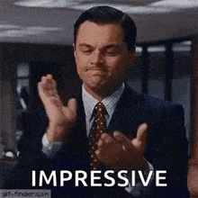**

## Apa Itu Game Development?

Game Development adalah aktivitas pengembangan permainan yang meliputi perencanaan, perancangan, pembuatan, dan perilisan suatu permainan.

Jadi intinya, gamedev adalah kegiatan membuat game dari perencanaan sampai keadaan game dapat dimainkan oleh player.

## Tapi ... Apa Itu Game?

Gak usah panjang lebar, Game adalah **PERMAINAN**.

Game adalah permainan; dan orang yang membuat permainan—apa pun jenisnya—adalah game developer.

### Game Bukan Cuma Digital?

Game juga bisa dibuat dalam media tradisional, seperti kartu atau papan. Bahkan, bisa juga dibuat tanpa media apa pun (misalnya permainan petak umpet).

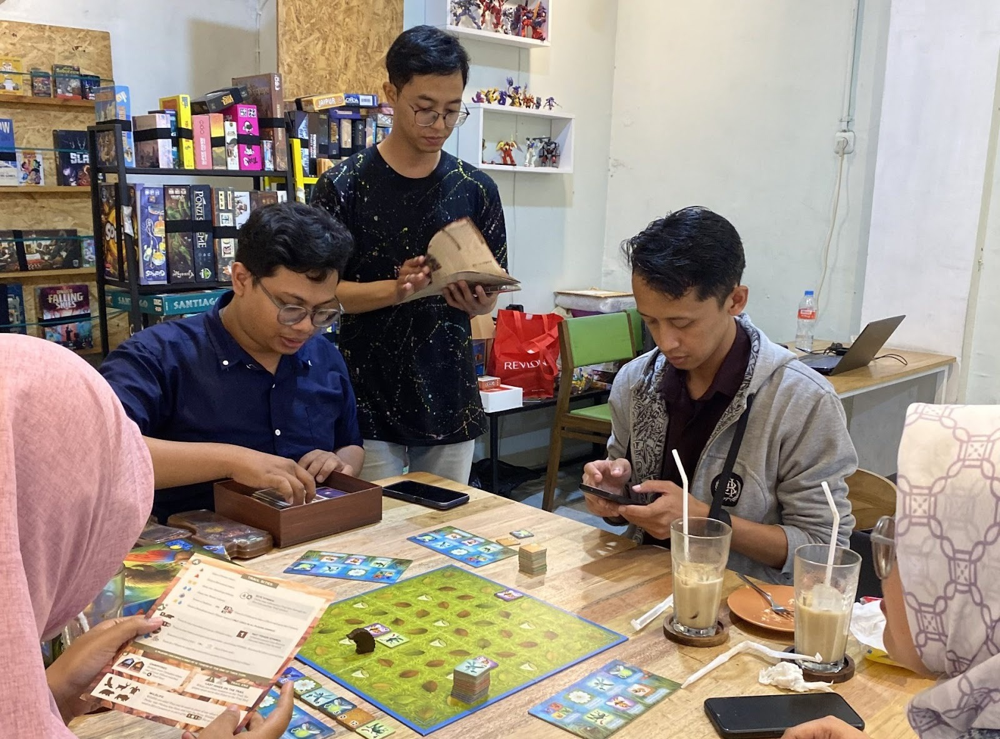

Permainan papan yang terkenal salah satunya adalah Dungeons and Dragons. DnD dimainkan oleh 2–4 pemain dan satu Dungeon Master yang bertindak sebagai wasit. Pemain bertualang dalam dunia DnD dengan skill has RPG dan aksi yang ditentukan dengan dadu 20 sisi (disebut juga D-20).

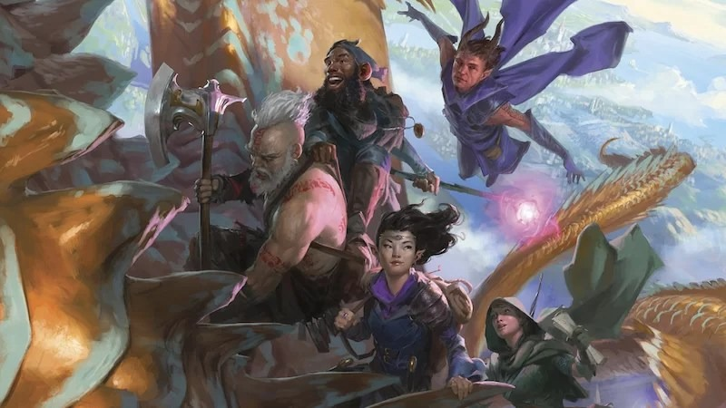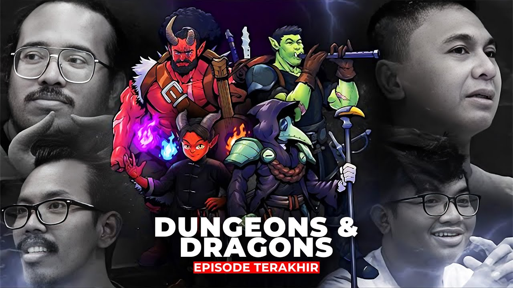

## Game Development di Indonesia

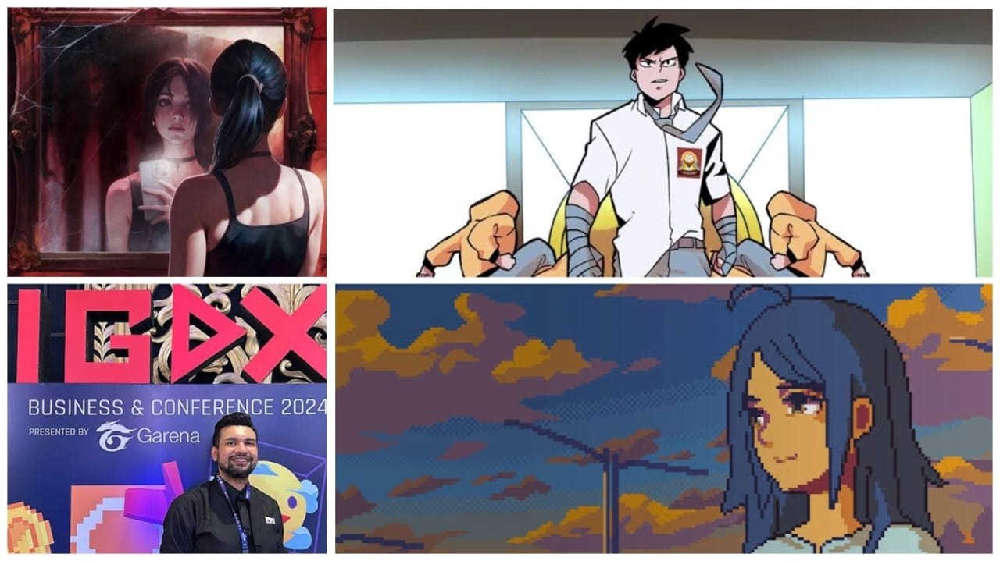
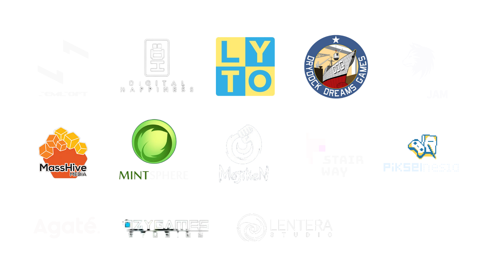

Di Indonesia, industri game menunjukkan peningkatan yang signifikan dalam beberapa tahun terakhir, baik dari sisi pendapatan maupun partisipasi masyarakat. Sebagai contoh, pada tahun 2023 pendapatan industri game dan e-sports di tanah air tercatat lebih dari US$ 1,6 miliar. Jumlah pemain juga besar: data dari Kementerian Komunikasi dan Informatika menyebutkan bahwa lebih dari 170 juta orang di Indonesia aktif bermain game pada 2022 [^1](https://en.antaranews.com/news/329398/ministry-targets-game-industry-to-be-source-of-economic-strength).
  
*In addition to that*, pemerintah mengeluarkan *Perpres Nomor 19 Tahun 2024* yang menunjukkan komitmen pemerintah untuk mendukung percepatan industri game.

Banyak program nasional yang digelar atau didukung oleh pemerintah, di antaranya yakni:
- Talent Scouting Academy: GameFest
- Indonesia Game Developer Exchange: Bootcamp
- GameSeed
- GooglePlay X Unity Game Developer Training
- dan masih banyak lagi

### Indonesia Game Developer Exchange

  **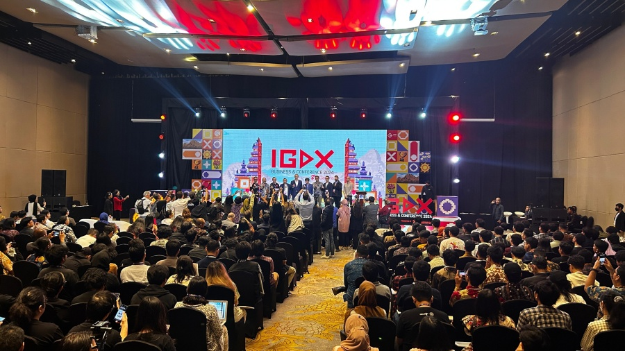**

Udah tau IGDX belum?

Indonesia Game Developer Exchange adalah pameran game developer terbesar di Indonesia yang dikelola oleh Asosiasi Game Indonesia (AGI) dan didukung oleh Kementerian Digital RI. Setiap tahun, para pengembang game Indonesia berbondong-bondong datang untuk memamerkan game mereka kepada banyak orang. Itu jadi kesempatan besar untuk cari publisher atau investor, bahkan dari manca negara.

  

## Game Engine
>Loh heh, memangnya kita anak mesin?

Game engine adalah framework yang menenagai pembuatan game. Dari render grafik sampai simulasi fisika, game engine lah yang mengatur[^2](https://www.arm.com/glossary/gaming-engines#:~:text=A%20gaming%20engine%20is%20a%20software%20development,games%20across%20a%20variety%20of%20programming%20languages.&text=Early%20video%20games%20were%20developed%20with%20their,engines%2C%20each%20specifically%20designed%20for%20one%20game.). Seperti studio film dengan set, lampu, dan kamera yang sudah ada di dalamnya, lalu kita bawakan naskah dan aktor (aset dan logika).

Bikin game sebenarnya tidak perlu game engine, tetapi kita harus menyiapkan banyak pengaturan untuk merender grafik sampai akses storage untuk audio dan gambar.

### Game Engine Ada Banyak

  **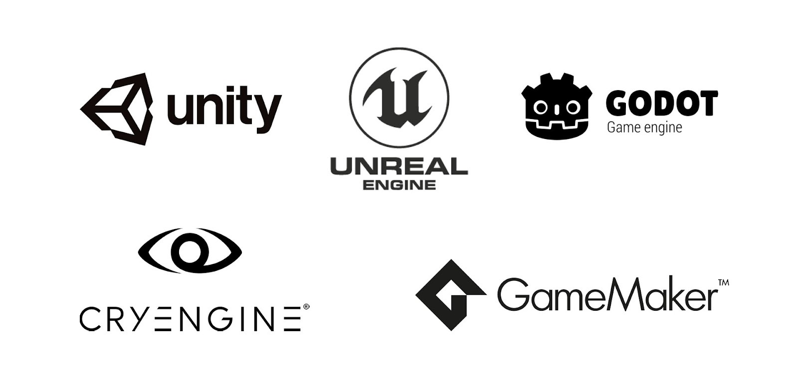**

Dependensi node banyak? Game engine gak kalah banyaknya.
- Godot
- Unity
- Unreal Engine
- Construct
- GameMaker
- Love2D
- Twine
- bikin sendiri

### Harus Pilih yang Mana?

**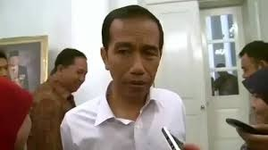**

Jawaban 1:  bebas.

Jawaban 2:  cari yang komunitasnya besar  
agar mudah cari tutorial dan diskusi.
>Unity, Unreal Engine, dan Godot

Jawaban 3:  ngikut kemampuan device
>Godot

## Role dan Talent

Seperti film, game melibatkan banyak ahli lintas bidang.

### Role dalam Game Development

Mirip di web development, game development ada banyak role yang diperlukan.

Dalam game development, kebutuhan skill developer jauh lebih beragam. Ada programmer (teknis), artist (art), producer (manajemen), musik, dst.

Tapi yang paling penting itu ada tiga:
- Designer
- Programmer
- Artist

### Game Designer

Ini beda sama UI/UX atau graphic designer, ya ges ya

Orang yang merancang konsep, mekanisme, dan pengalaman bermain dari sebuah video game. Mereka bertanggung jawab untuk menciptakan struktur, aturan, dan gameplay yang menarik dan menyenangkan bagi pemain[^1](https://www.futurelearn.com/info/courses/how-to-start-your-career-in-games-development/0/steps/57132).

---
**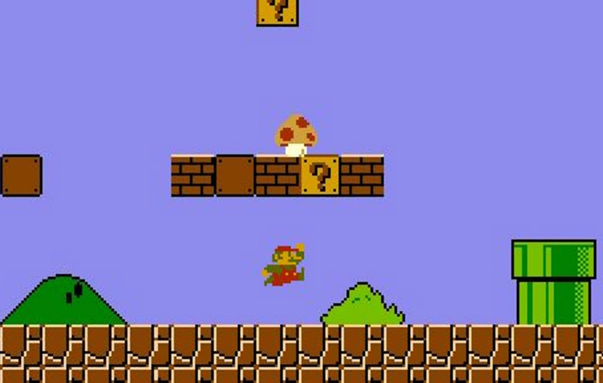**

- Kenapa Mario makan jamur jadi kuat?
- Kenapa Mario menyerang musuh dengan melompat lalu menindih?
- Kenapa Mario jalannya ke kanan-kiri?

Itu semua keputusan *game designer*.

Designer bertanggung jawab membuat game seru dan seimbang dengan menetapkan aturan seperti di atas.

Game Designer merancang aturan main (skill, health, ATK speed, dsb.), mekanisme (bisa lompat, bisa tembak, bisa melee, dst.), genre (RPG, FPS, open-world), dan lain-lain untuk menciptakan rancangan game yang seru bagi target audiensnya.

Rancangan ini ditulis di dalam dokumen bernama *Game Design Document* untuk jadi acuan developer lain saat implementasi.

### Game Programmer
>kalau gak ada ini, game design-nya cuma jadi angan-angan

Orang mengimplementasikan rancangan atau konsep menjadi program yang bisa dimainkan. Mereka membuat ide pada dokumen menjadi kenyataan[^1](https://www.futurelearn.com/info/courses/how-to-start-your-career-in-games-development/0/steps/57132).

Designer bilang akurasi tembakan harus jelek kalau player bergerak? Berarti programmer harus bikin kode if-else yang bisa menerapkan aturan itu.

---
**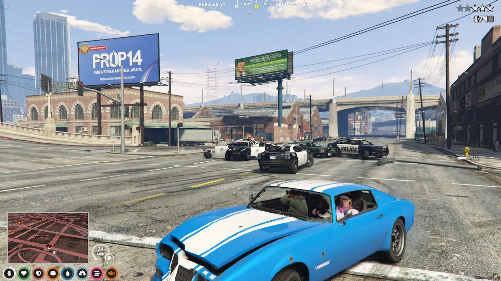**

- Ada sistem wanted? Programmer harus bisa bikin trigger kondisi kapan bintang bisa naik.
- Pada setiap level, berapa kekuatan dan jumlah polisi yang mengejar? Programmer harus bisa bikin konfigurasi ini.

#### Kalau mau jadi ini, jangan malas debugging :)

Sudah jelas, kalau jadi programmer berarti bakal sering ketemu yang namanya bug. So, jangan malas ngoding dan debugging :v

  ****

>“If debugging is the process of removing software bugs, then programming must be the process of putting them in.”  
— Edsger W. Dijkstra

### Game Artist
>kalau gak ada ini, masih bisa bikin game stickman :)

Peran yang menentukan impresi awal game kita.

Orang yang bertanggung jawab atas aspek visual dari video game, seperti desain karakter, lingkungan, skema warna, dan animasi[^1](https://www.futurelearn.com/info/courses/how-to-start-your-career-in-games-development/0/steps/57132).

---
**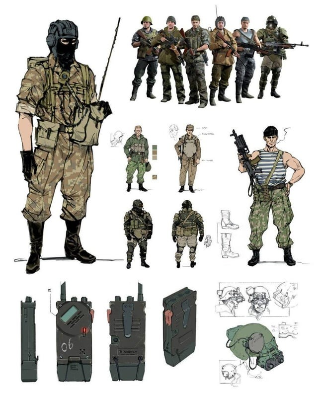**

Seperti game designer, game artist harus mendokumentasikan ketetapan rancangannya dalam dokumen: *Art Design Document*.

Isinya bisa meliputi desain karakter, skema warna, gaya gambar dan animasi, dan sebagainya.

Artist bukan cuma menggambar di bidang dua dimensi. Artis juga membuat model 3D bahkan desain icon sampai UI.

---
**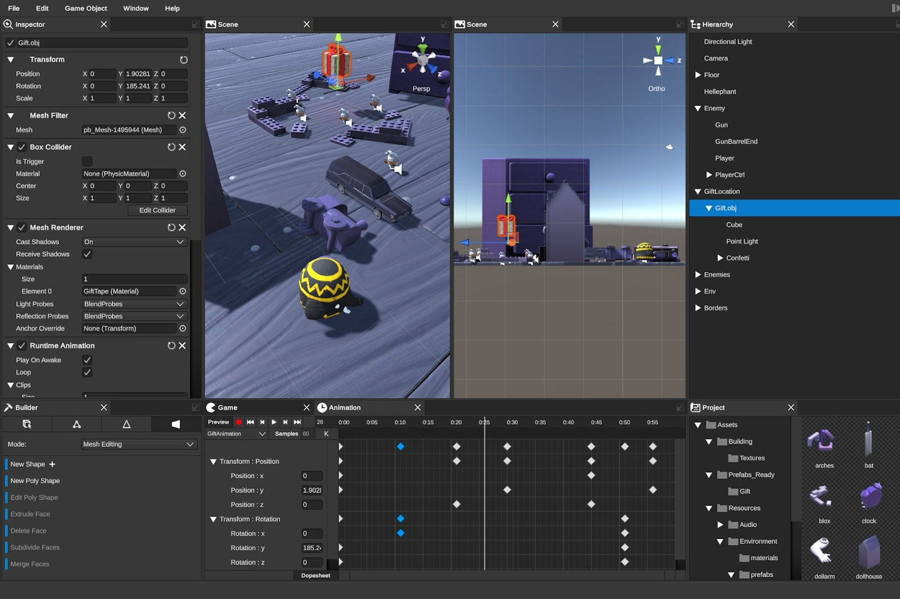**

Artist juga berkoordinasi dengan programmer mengenai import dan layout aset di game engine.

## Kesimpulan

Game development bukan cuma soal bikin game, tapi menciptakan pengalaman bermain yang menyenangkan dan bermakna melalui kolaborasi antara ide, teknologi, dan seni.