# 🎮 Ayo Bermain Game!

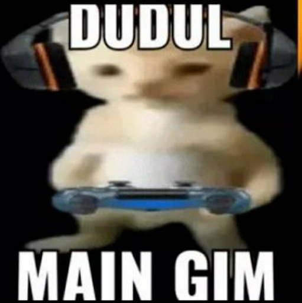

Siapa sih yang nggak suka main game? Dari anak kecil sampai orang dewasa, semua pasti punya game favoritnya.  
Tapi pernah nggak kamu kepikiran, **apa sih yang bikin sebuah game bisa seru, bikin nagih, atau malah cepat membosankan?**

Nah, di sini kita nggak cuma diajak buat main game aja, tapi juga **belajar menganalisis game secara lebih dalam**, kayak seorang *game designer* beneran!  
Kita bakal lihat dari berbagai sisi: mulai dari gameplay-nya, cerita, tampilan visual, sampai gimana komunitas pemainnya terbentuk.

Tujuannya sederhana — supaya kamu bisa memahami **“anatomi” sebuah game**, bukan cuma dari permukaannya, tapi sampai ke bagian yang bikin game itu terasa hidup.

**Let’s dive into the world of games! 🌍**

---

# 🕹️ Hal yang Perlu Diperhatikan Saat Menganalisis Game

Ketika kamu mau ngulik sebuah game, jangan cuma lihat serunya aja.  
Kita juga harus tahu **apa yang bikin game itu “hidup” dan fun dimainkan**.  
Nah, berikut ini panduan lengkapnya biar analisis kamu makin tajam 👇

---

## 🎯 Aspek Gameplay — *“Jantungnya game ada di sini!”*

### 🔁 Core Gameplay Loop
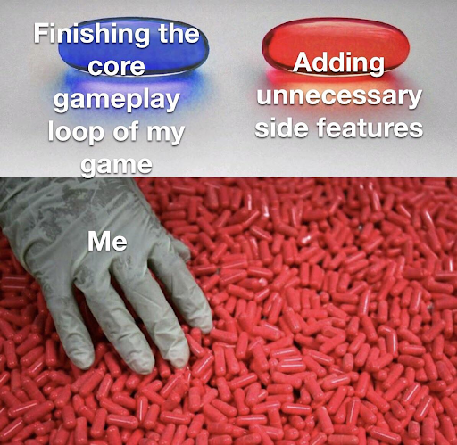

Inti dari apa yang pemain lakukan berulang-ulang.  
Contoh: *explore → fight → loot → upgrade → repeat*  
Kalau loop-nya asik, pemain bisa betah berjam-jam!

---

### ⚙️ Mechanics

Aturan main dan sistem yang bikin gameplay jalan.  
Contoh: sistem pertarungan, kontrol, leveling, crafting, atau puzzle.

---

### 🎮 Dynamics

Efek nyata dari gabungan mekanik saat dimainkan.  
Misalnya, mekanik stamina + musuh cepat = pemain harus mikir strategi.

---

### ⚖️ Balancing
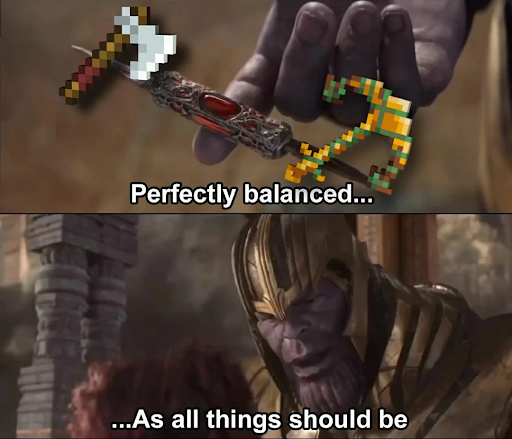

Semua harus seimbang: kesulitan, reward, progress, dan kemampuan karakter.  
Kalau terlalu gampang → bosan.  
Kalau terlalu susah → frustasi.

---

### 🔁 Replayability
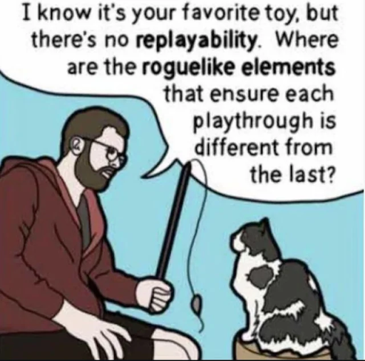

Seberapa besar keinginan pemain buat main lagi?  
Bisa karena banyak pilihan: ending berbeda, karakter unik, atau gameplay fleksibel.

---

## 📖 Aspek Naratif — *“Cerita yang bikin pemain peduli.”*

### 🧩 Cerita / Lore
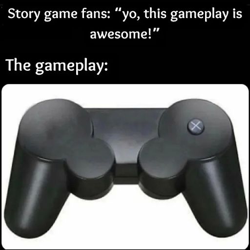

Ceritanya linear (kayak *The Last of Us*) atau bercabang (kayak *Detroit: Become Human*)?

---

### 👤 Karakter

Apakah desain dan kepribadian mereka kuat?  
Pemain harus bisa nyambung sama tokohnya, entah lewat dialog, visual, atau perkembangan karakter.

---

### 🌍 World-Building
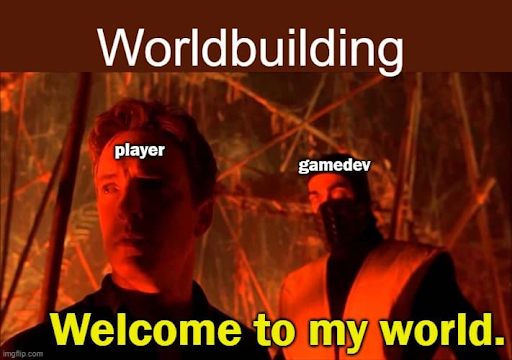

Dunia game-nya hidup nggak?  
Ada sejarah, budaya, atau misteri yang bikin penasaran?  
Perhatikan juga gimana lingkungan merespons aksi pemain.

---

## 🎨 Aspek Visual & Audio — *“Mata dan telinga juga pengen dimanjain dong!”*

### 🖼️ Grafis & Art Style
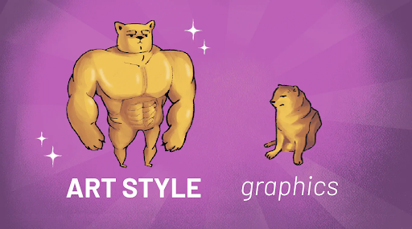

Setiap gaya punya daya tarik sendiri.  
Mau yang realistis kayak *Horizon Zero Dawn*, imut kayak *Animal Crossing*,  
atau anime-style kayak *Genshin Impact* — yang penting **konsisten dan sesuai tema**.

---

### 🧭 UI & Navigasi

Navigasi dan tampilan menu harus intuitif.  
Pemain nggak boleh bingung cuma buat cari tombol *Start*.  
HUD juga jangan terlalu rame.

---

### 🎵 Audio
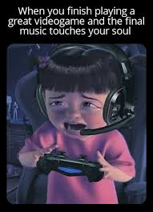

Musik dan efek suara itu pembentuk suasana.  
Bayangin *Undertale* tanpa soundtrack-nya — nggak akan se-ikonik itu!

---

## 🧠 Aspek Teknologi *(Opsional)* — *“Dapur belakang game-nya gimana, nih?”*

### 🧩 Engine yang Dipakai

Unity, Unreal, Godot, atau bahkan engine buatan sendiri.  
Pilihan ini ngaruh ke visual, performa, dan fleksibilitas.

---

### ⚙️ Performa
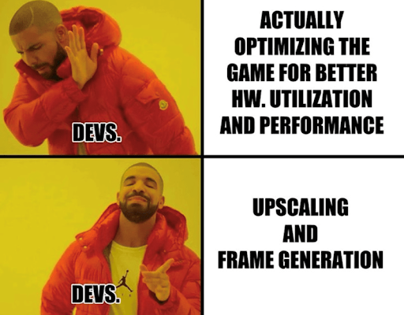

Apakah lancar di berbagai device? FPS stabil? Ada bug atau crash yang ganggu?

---

### 🚀 Inovasi Teknis
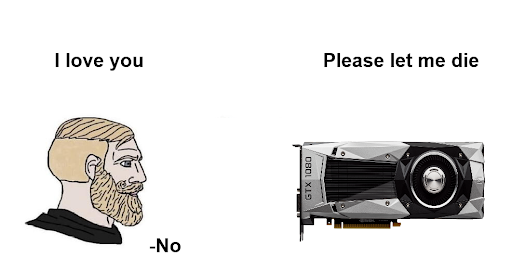

Kadang teknologi jadi daya jual utama — misalnya ray tracing, AI behavior, atau VR experience yang imersif banget.

---

## 💰 Aspek Ekonomi *(Opsional)* — *“Game bagus juga butuh strategi cuan.”*

### 🏷️ Model Bisnis
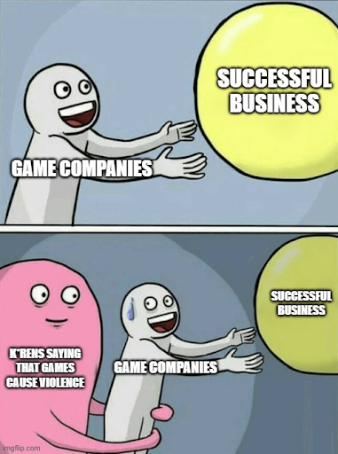

Sekali beli (*premium*), gratis tapi ada iklan (*free-to-play*),  
subscription, atau sistem gacha?

---

### 💵 Monetisasi
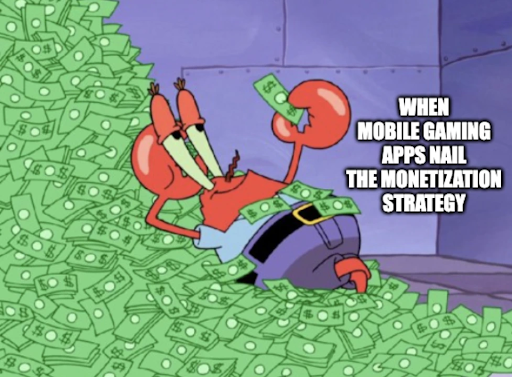

Apakah ada DLC, microtransaction, atau battle pass?  
Yang penting: **jangan pay-to-win terlalu parah!**

---

### 📢 Marketing
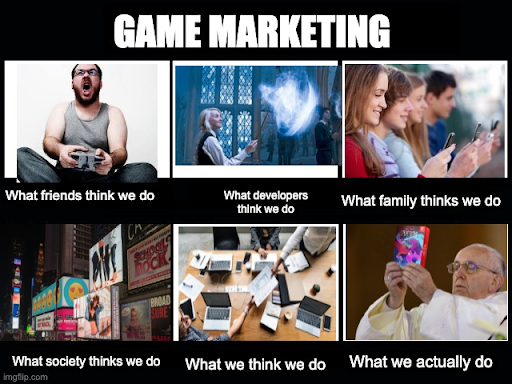

Cara promosi juga penting!  
Kadang hype dari TikTok atau Discord bisa bikin game viral tanpa biaya besar.

---

## 🤝 Aspek Komunitas & Sosial *(Opsional)* — *“Game itu hidup lewat pemainnya.”*

### 👯‍♂️ Fitur Multiplayer

Apakah ada co-op, PvP, atau sistem matchmaking yang adil?

---

### 🌐 Komunitas Pemain

Apakah komunitasnya suportif atau malah toxic?  
Komunitas yang sehat bisa bikin umur game panjang.

---

### 🛠️ Modding & Fanbase
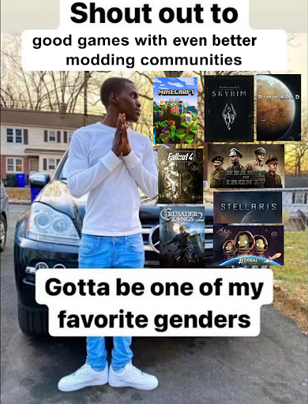

Kalau developer buka ruang untuk mod atau konten buatan fans,  
biasanya game bisa hidup bertahun-tahun — kayak *Skyrim*! 💪
