# Ayo Bermain Game!

Siapa sih yang nggak suka main game? Dari anak kecil sampai orang dewasa, semua pasti punya game favoritnya. Tapi pernah nggak kamu kepikiran,<b> apa sih yang bikin sebuah game bisa seru, bikin nagih, atau malah cepat membosankan?</b>

Nah, disini kita nggak cuma diajak buat main game aja, tapi juga <b>belajar menganalisis game secara lebih dalam</b>, kayak seorang game designer beneran! Kita bakal lihat dari berbagai sisi: mulai dari gameplay-nya, cerita, tampilan visual, sampai gimana komunitas pemainnya terbentuk.

Tujuannya sederhana, supaya kamu bisa memahami <b>“anatomi” sebuah game</b>, bukan cuma dari permukaannya, tapi sampai ke bagian yang bikin game itu terasa hidup.

<b>Let’s dive into the world of games! </b>

## 1. Hal yang Perlu Diperhatikan Saat Menganalisis Game

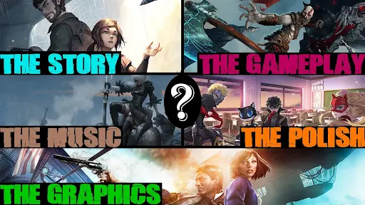

Ketika kamu mau ngulik sebuah game, jangan cuma lihat serunya aja. Kita juga harus tahu <b>apa yang bikin game itu “hidup” dan fun dimainkan</b>. Nah, berikut ini panduan lengkapnya biar analisis kamu makin tajam

## 2. Aspek Gameplay 
>Jantungnya game ada di sini!

### 2.1. Core Gameplay Loop

Inti dari apa yang pemain lakukan berulang-ulang. Misal: *explore → fight → loot → upgrade → repeat*. Kalau loop-nya asik, pemain bisa betah berjam-jam.

---
### 2.2. Mechanics

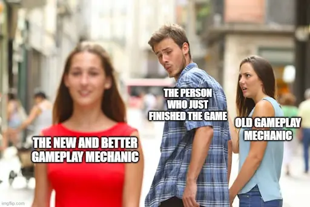

Aturan main dan sistem yang bikin gameplay jalan. Contoh: sistem pertarungan, kontrol, leveling, crafting, atau puzzle.

---
### 2.3. Dynamics

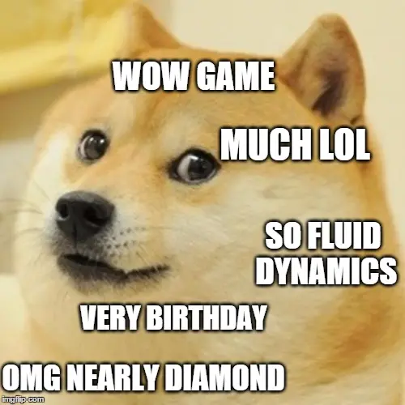

Efek nyata dari gabungan mekanik saat dimainkan. Misalnya, mekanik stamina + musuh cepat = pemain harus mikir strategi.

---
### 2.4. Balancing

Semua harus seimbang: kesulitan, reward, progress, dan kemampuan karakter. Kalau terlalu gampang, bosan; terlalu susah, frustasi.

---
### 2.5. Replayability

Seberapa besar keinginan pemain buat main lagi? Bisa karena banyak pilihan mulai dari ending, karakter berbeda, atau gameplay yang fleksibel.

---
## 3. Aspek Naratif 
> Cerita yang bikin pemain peduli.

### 3.1. Cerita / Lore

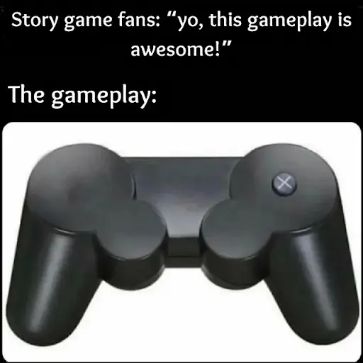

Ceritanya linear (kayak *The Last of Us*), atau bercabang (kayak *Detroit: Become Human*)?

---

### 3.2. Karakter

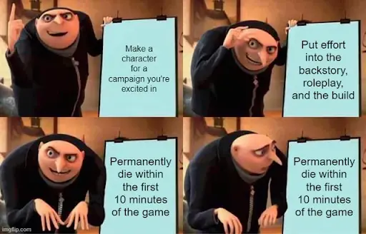

Apakah desain dan kepribadian mereka kuat? Pemain harus bisa nyambung sama tokohnya, entah lewat dialog, visual, atau perkembangan karakternya.

---

### 3.3. World-Building

Dunia game-nya hidup nggak? Ada sejarah, budaya, atau misteri yang bikin penasaran? Lihat juga bagaimana lingkungan merespons aksi pemain.

## 4. Aspek Visual & Audio  
>Mata dan telinga juga pengen dimanjain dong!

### 4.1. Grafis & Art Style

Setiap gaya punya daya tarik. Mau yang realistis kayak *Horizon Zero Dawn*, imut kayak *Animal Crossing*, atau anime-style kayak *Genshin Impact* — yang penting konsisten dan mendukung tema game.

---

### 4.2. UI & UX Design

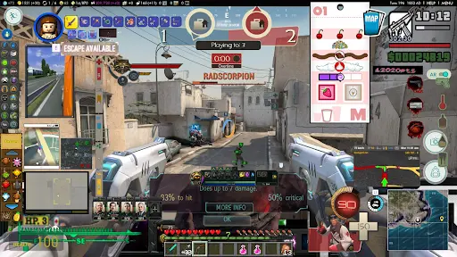

Navigasi dan tampilan menu harus intuitif. Pemain nggak boleh bingung cuma buat cari tombol *Start*. HUD juga jangan terlalu rame.

---

### 4.3. Audio

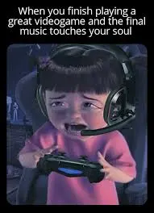

Musik dan efek suara itu pembentuk suasana. Bayangin *Undertale* tanpa soundtrack-nya — nggak akan seikonik itu!

## 5. Aspek Teknologi (Opsional)
>Dapur belakang game-nya gimana, nih?

---

### 5.1. Engine yang Dipakai

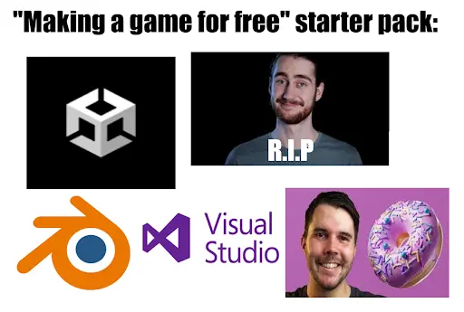

Unity, Unreal, Godot, atau bahkan engine buatan sendiri. Pilihan ini berpengaruh pada visual, performa, dan fleksibilitas.

---

### 5.2. Performa

Apakah lancar di berbagai device? FPS stabil? Ada bug atau crash yang mengganggu?

---

### 5.3. Inovasi Teknis

Kadang teknologi bisa jadi daya jual utama — misalnya *ray tracing*, *AI behavior*, atau *VR experience* yang imersif banget.

## 6. Aspek Ekonomi (Opsional)  
>Game bagus juga butuh strategi cuan.

---

### 6.1. Model Bisnis

Sekali beli (*premium*), gratis tapi ada iklan (*free-to-play*), *subscription*, atau sistem *gacha*?

---

### 6.2. Monetisasi

Apakah ada DLC, *microtransaction*, atau *battle pass*? Yang penting jangan *pay-to-win* terlalu parah.

---

### 6.3. Marketing

Cara promosi juga penting! Kadang *hype* dari TikTok atau Discord bisa bikin game viral tanpa biaya besar.

## 7. Aspek Komunitas & Sosial (Opsional)  
>Game itu hidup lewat pemainnya.

---

### 7.1. Fitur Multiplayer

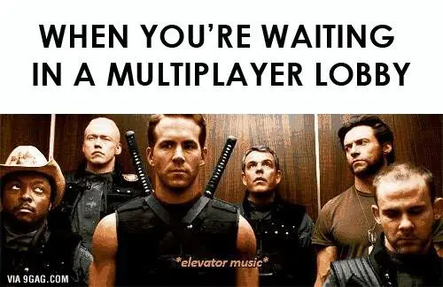

Apakah ada *co-op*, *PvP*, atau sistem *matchmaking* yang adil?

---

### 7.2. Komunitas Pemain

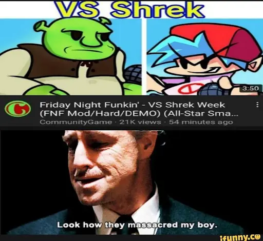

Apakah komunitasnya suportif atau malah toxic? Komunitas yang sehat bisa bikin umur game jauh lebih panjang.

---

### 7.3. Modding & Fanbase

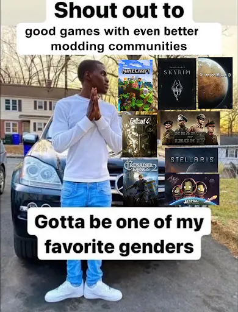

Kalau developer membuka ruang untuk *mod* atau konten buatan fans, biasanya game bisa hidup bertahun-tahun — kayak *Skyrim*.