# 🎮 Petualangan Unity

## Pemaparan Dasar Unity (The Basics)

Selamat datang di dunia Unity! Unity adalah game engine yang sangat populer dan serbaguna, digunakan untuk membuat game 2D, 3D, simulasi, dan bahkan aplikasi interaktif lainnya.

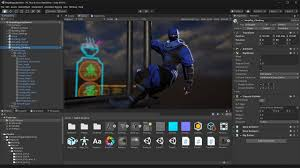

Di lingkungan Unity Editor, Anda akan berinteraksi dengan tiga jendela utama:
**Scene** **View**: Dunia tempat Anda membangun dan menata Game Object kalian. Ini adalah area kerja 3D/2D.

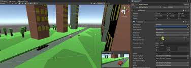

**Hierarchy**: Daftar semua Game Object yang ada di Scene saat ini.

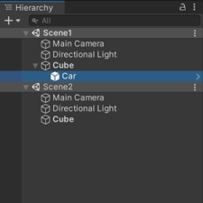

**Inspector**: Jendela di mana Anda melihat dan memodifikasi Component dari Game Object yang sedang Anda pilih.

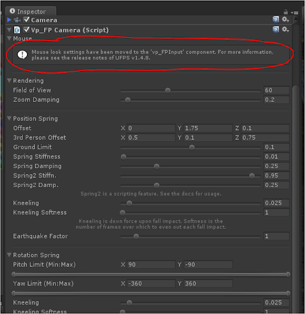

# Fondasi Dasar: Game Object dan Component
## A. Game Object (Objek Game)
Apa Itu Game Object di unity ? 

jadi Game Object adalah **wadah** dasar untuk semua elemen dalam game Anda. Ini seperti sebuah kotak kosong. Sebuah Game Object sendiri tidak melakukan apa-apa kecuali menyimpan dua hal:

    

**Transform**: Setiap Game Object wajib memiliki Component Transform. Component ini mendefinisikan posisi (**Position**), rotasi (**Rotation**), dan skala (**Scale**) objek di dunia game. Tanpa Transform, objek tidak akan tahu di mana ia berada.

    
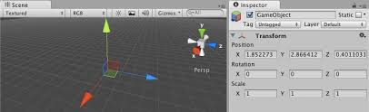

**Components**: Game Object adalah tempat di mana kamu menempelkan Components.

    
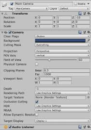

Terus apa itu component ?

## B. Component (Komponen)
Component adalah **modul fungsional** yang memberikan perilaku dan kemampuan pada Game Object. Jika Game Object adalah sebuah kotak, Component adalah isinya (misalnya, mesin, roda, cat, dll.).

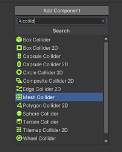

Contoh:
Untuk membuat sebuah Game Object terlihat, Anda perlu Component **Sprite Renderer** (untuk 2D) atau **Mesh Renderer** (untuk 3D).
Untuk membuat objek bergerak, Anda perlu Component **Rigidbody2D** (untuk fisika) dan sebuah Script (untuk logika pergerakan).
## C. Eksplorasi Component Penting
### Camera

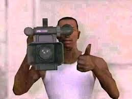

Fungsi Utama
"**Mata**" yang menangkap pemandangan Scene dan menampilkannya di layar game.

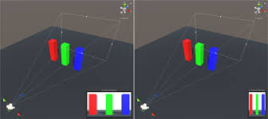

**Properti Kunci**:
**Projection**: Menentukan apakah pandangan itu Perspective (3D) atau Orthographic (2D, tanpa distorsi kedalaman).
**Clear Flags**: Menentukan apa yang harus ditampilkan di area yang tidak dicakup oleh kamera (biasanya warna latar belakang).

### Rigidbody2D

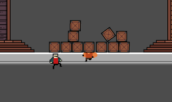

Component ini harus ditambahkan ke Game Object yang ingin Anda kontrol menggunakan sistem fisika Unity (Cannon.js).

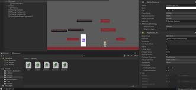

**Properti Kunci**:
**Mass**: Berat objek.
**Gravity Scale**: Seberapa kuat gravitasi memengaruhi objek (1 = normal, 0 = tidak terpengaruh).
**Body Type**: Menentukan bagaimana objek bergerak:
**Dynamic**: Dipengaruhi oleh fisika dan skrip (misalnya, Karakter Pemain).
**Kinematic**: Hanya dipengaruhi oleh skrip (misalnya, Platform Bergerak).

### Collider2D (Tabrakan)

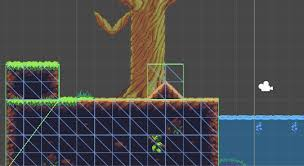

Component ini mendefinisikan bentuk geometris objek untuk tujuan tabrakan. Collider bekerja bersama dengan Rigidbody2D.

Properti Kunci: 

**Is Trigger**: Jika dicentang, Collider tidak akan menyebabkan tabrakan fisik, melainkan hanya mendeteksi sentuhan (trigger) yang dapat diolah oleh skrip (misalnya, area pengambilan koin).
**Material**: Untuk menentukan properti fisik seperti gesekan atau pantulan.

### Sprite Renderer (Visual)

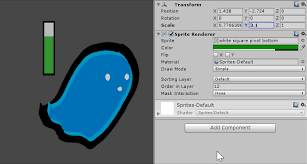

Component yang paling mendasar untuk visualisasi 2D.

Properti Kunci:

**Sprite**: Gambar 2D yang akan ditampilkan.

**Color**: Warna yang diterapkan pada Sprite (untuk pewarnaan atau efek bayangan).

**Sorting Layer & Order in Layer**: Mengontrol urutan objek mana yang akan digambar di atas objek lain (untuk kedalaman 2D).
4. Manajemen Aset dan Dunia

### Prefab (Cetakan/Template)

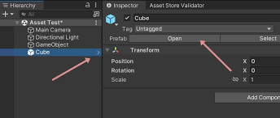

Prefab adalah **cetak biru** (template) dari sebuah Game Object.

**Mengapa Prefab penting?**
Bayangkan Kamu memiliki musuh dengan Component **Rigidbody2D, Box Collider 2D, Sprite Renderer, dan Script Musuh**. Jika Kamu  perlu 100 musuh di game, Anda tidak perlu membuatnya dari awal 100 kali.
Kamu buat satu Game Object Musuh.
Kamu Tinggal seret (drag) Game Object tersebut dari Hierarchy ke folder di Project Window. Ia otomatis menjadi Prefab.  

Kamu  dapat membuat instance (salinan) musuh sebanyak yang Anda mau, dan semua salinan akan terhubung ke Prefab aslinya.
Jika Kamu mengubah properti di Prefab asli (misalnya, mengubah warna musuh), perubahan itu akan diterapkan secara otomatis ke semua 100 instance musuh di Scene Anda!

### Scene (Pemandangan/Level)

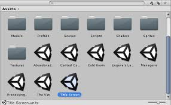

Scene adalah wadah yang menyimpan semua Game Object, Environment, dan pengaturan Anda untuk satu bagian dari game.
#### Contoh Penggunaan Scene:
Scene **MainMenu** (berisi tombol dan UI).  
Scene **Level1** (berisi Game Object Player, musuh, dan platform).  
Scene **GameOver** (berisi UI skor akhir).
Saat pemain beralih dari menu ke level pertama, Unity memuat Scene baru. Hanya Game Objects yang ada di Scene yang sedang dimuat yang akan aktif.

