# Halo Untuk 3D Modelling

Merasa seni 2D membosankan dan anda pingin sebuah tantangan?

Ingin melihat ayang digital anda jadi lebih keren?

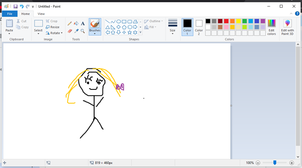

Atau ingin menjadi gamedev handal namun enggan ngoding?

Kagak, cuma bercanda doang, kita tetap harus ngoding kalau mau buat game.

Tetapi memang di dalam pengembangan game tidak semua pihak yang terlibat ikut ngoding, seperti designer (game, level, dan naratif), manajerial, tester, dan art (concept artist, 2D/3D design).

Untuk di kelas ini yang kita pelajari yaitu 3D design.

## 1. Jadi Apa itu 3D Design?

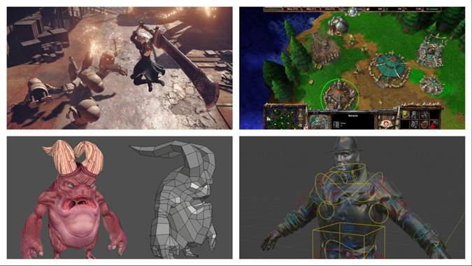

Singkatnya kalau 2D design menggunakan 2 ‘sumbu’ atau ‘arah’, yaitu tinggi dan lebar. Maka 3D design menggunakan 3 sumbu, yaitu tinggi, lebar, dan kedalaman dimana ketiga poros tersebut dilambangkan dengan X, Y, dan Z.

 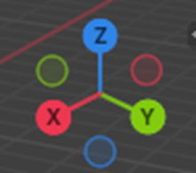

3 sumbu.

## 2. Lalu bagaimana cara kita membuat desain 3D?

Tenang, kita tidak menggunakan palu dan alat pahat untuk membuat sebuah model 3D. Ada beberapa software yang bisa kita gunakan untuk membuat model 3D, yaitu:

Beginner:

●       Tinkercad

●       SketchUp

Advanced:

●       Blender

●       Autodesk Fusion 360

●       SolidWorks

●       AutoCAD

●       Autodesk Maya and 3ds Max

Yang kita akan gunakan kali ini adalah Blender.

**Kenapa Blender?**

“Blender kan untuk advance tuh, kenapa kita belajar pakai itu?” ucap dalam hati sang pembaca. Dan disinilah sang penulis menjawab: 3 alasan kenapa kita menggunakan Blender.

1. **Gratis**
    
    \<Penulis merasa tidak perlu menjelaskan lebih lanjut.>

2. **Fleksibilitas**
    
    Kustomisasi? Yoi, Karena blender bisa dikustomisasi dengan menambahkan add-ons yang sangat amat teramat berguna untuk mengerjakan project.

3. **Komunitas besar**
    
    Karena 2 alasan sebelumnya, forum diskusi dan konten tutorial blender sangat mudah ditemui.
    
    Tapi tetap yang perlu diperhatikan adalah system requirement untuk instalasi blender, di bawah ini adalah system requirement untuk blender:
    
    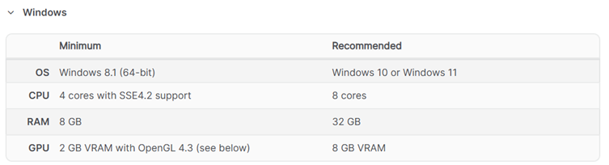

Untuk selengkapnya bisa cek di [sini](https://www.blender.org/download/requirements/)

## 3. Instalasi

Bagaimana cara instalasinya?

Download installernya di website [Blender](https://www.blender.org/download/), untuk tata cara instalasinya bisa cek di [sini](https://www.geeksforgeeks.org/installation-guide/how-to-download-and-install-blender-on-windows-10/).

Untuk memudahkan, pastikan mouse kiri adalah untuk select, dan mouse kanan untuk context menu.

## 4. Blender

### 4.1. Navigasi Blender

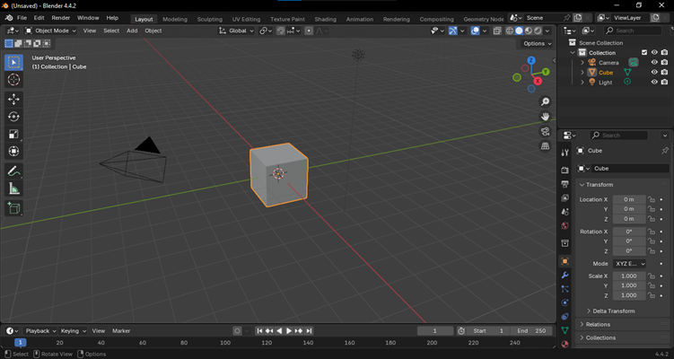

Main Viewport Blender saat pertama kali membuat project baru. Singkatnya Viewport adalah ‘meja kerja’ untuk modelling di blender.

#### 4.1.1. Camera movement

Selanjutnya yaitu pergerakan kamera,

- Zoom in & out
    
    Cukup mudah, gunakan scroll wheel untuk zoom
    
    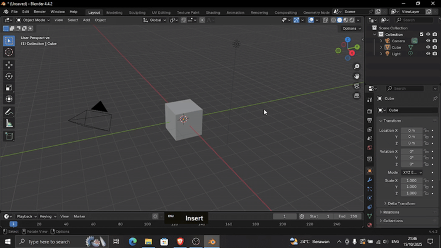

-  Orbit
    
    Selanjutnya mengorbit atau berputar mengelilingi objek, tekan middle mouse (atau  tekan scroll wheel) dan gerakkan mouse
    
    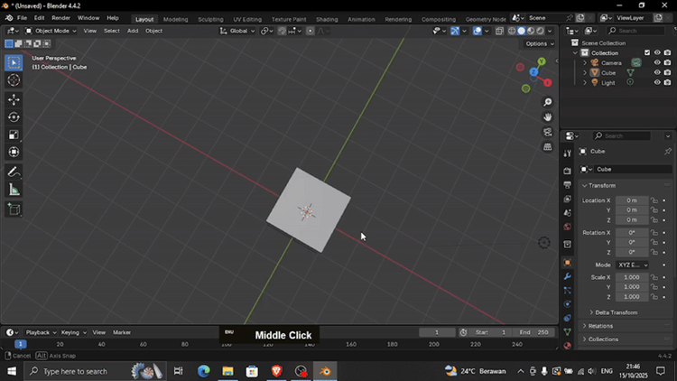
    
- Menggerakkan kamera
    
    Dan selanjutnya menggerakkan kamera, tekan shift + middle mouse dan gerakkan mouse
    
    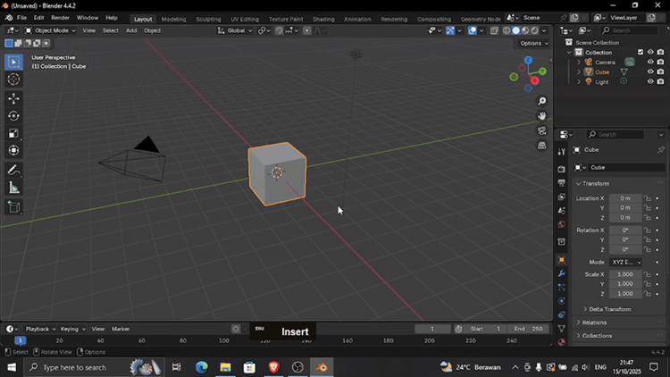

#### 4.1.2. Viewport shading

Adalah bagaimana viewport divisualisasikan.

Viewport secara default menggunakan shading mode solid dimana warna yang digunakan adalah warna yang base yang seragam.

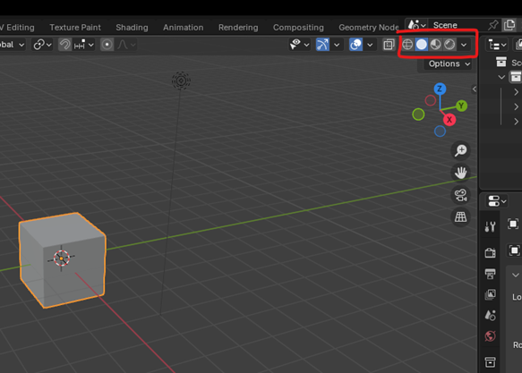

Kemudian, mode shading wireframe yang menampilkan objek dalam bentuk garis

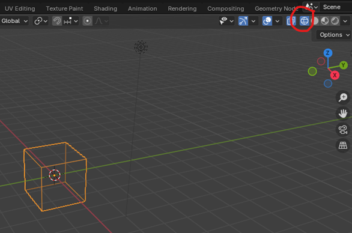

Lalu mode material preview, dimana material seperti warna, gambar, dll. bisa dilihat lebih jelas.

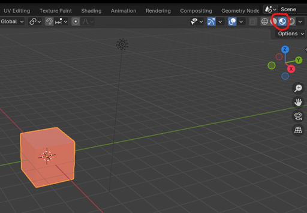

Terakhir yaitu mode rendered, yang mana adalah hasil yang akan kalian lihat melakukan rendering.

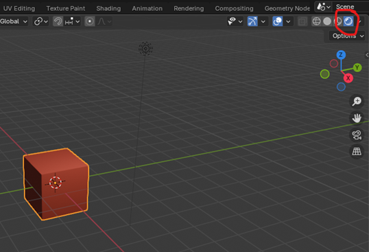

#### 4.1.3. Scene Collections

Untuk memudahkan mengorganisir objek, dibuatlah semacam foldering atau layering di beberapa software (seperti foldering VS Code, atau Layering di Photoshop). Tak terkecuali dengan Blender yang mempunyai ‘Scene Collection’.

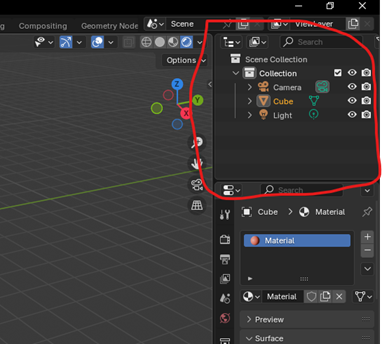

Scene Collection di Blender merupakan campuran dari foldering dan layering dimana kita bisa membuat folder dan mengelompokkan objek tanpa batasan layer seperti Photoshop.

Untuk saat ini yang perlu diperhatikan yaitu:

- icon mata untuk hide/unhide objek di viewport

- icon kamera disable objek dari render.

- icon centang untuk enable/disable collection.

#### 4.1.4. Shortcut

Shortcut di Blender itu sangat banyak, dan itu adalah realita kehidupan yang harus diterima. Tapi untuk saat ini hanya beberapa yang perlu kita ketahui:

- Item Tab (N)
    
    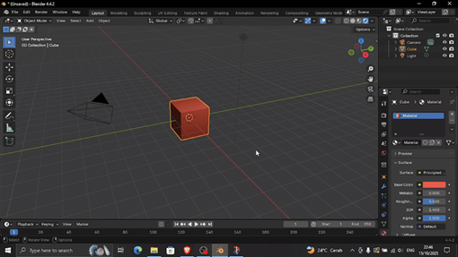
    

- Pie menu view (`)
    
    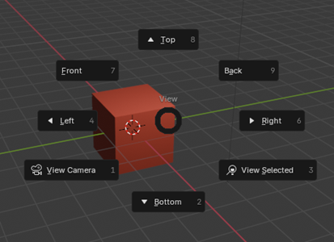
    
    Terkhusus pengguna laptop, ini sangat penting karena untuk memutar view menggunakan numpad.

- Snap object (shift + s)
    
    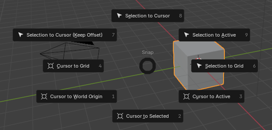
    
    Gunanya untuk ‘snap’ objek ke objek atau lokasi lain sesuai pilihan.

## 5. Bagaimana?

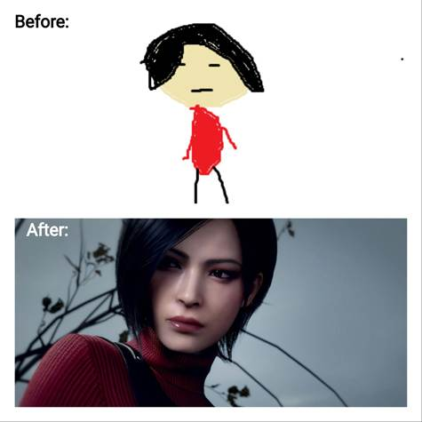

Siap untuk menjadi 3D artist?