# Ayo Kita Buat 3D Model

Selamat datang kembali di subminiclass 3D modelling, penulis merasa berterima kasih untuk pembaca yang sudah datang, meskipun ada yang hanya sempat untuk bisa membaca dalam bentuk teks. Jujurly, hal ini sangat amat membuat penulis merasa bersemangat untuk terus membuat materi.

Anyway…

Hari ini adalah hari yang paling ditunggu, yaitu membuat objek 3D di Blender.

Agak terlalu di dramatisir, tapi gpp.

Nah sebelum kita membuat model karakter cantik/ganteng idaman dengan 400 ribu vertices, ada baiknya kita mempelajari dasar dari model, yaitu **Mesh**.

Jadi……

## 1. Apa Itu Mesh?

Singkatnya mesh adalah objek dasar yang terdiri dari vertices (titik), edges (garis yang menghubungkan vertices), faces (permukaan yang dibatasi edges).

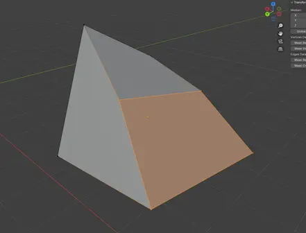

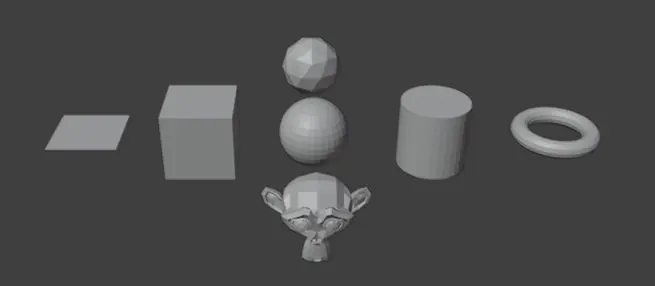
>
>Default mesh Blender

Lalu bagaimana cara menggunakan mesh untuk modelling? Simak berikut ini:

---

### 1.1. Select, add, delete object

Kita mulai dengan project baru, di sini kita akan melihat ada 3 objek di dalam viewport. cube, light, dan kamera.

- ### Select
      
    Dengan klik mouse kiri untuk select salah satu objek, objek yang dipilih akan menjadi aktif (active), dan klik mouse kiri di luar objek aktif untuk deselect.
    
    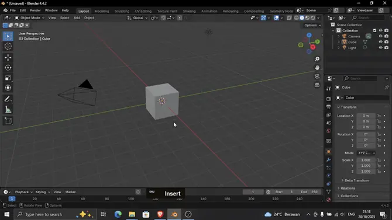

---

- ### Add
    
    Ke navbar dan tekan tombol ‘add’ (shortcut = shift + a), pilih ‘mesh’ dan klik mouse kiri ke salah satu mesh untuk memasukkannya ke dalam viewport.
    
    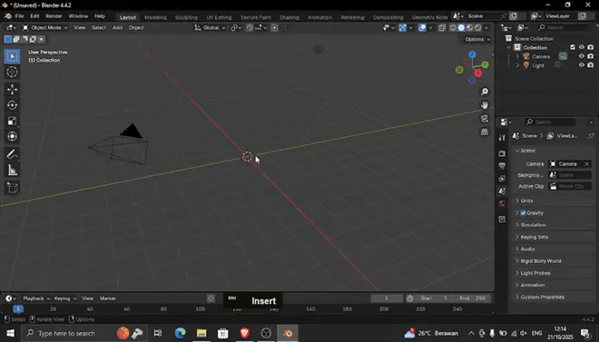

---

- ### Delete
    
    Select salah satu objek, klik mouse kanan untuk membuka context menu, lalu klik ‘delete’ (shortcut = x).
    
    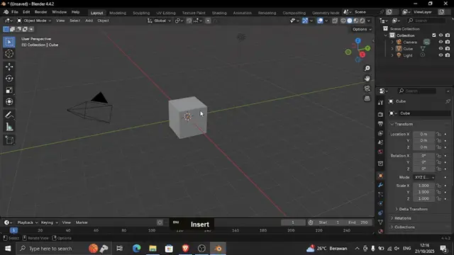

---

### 1.2. Transform location, rotate, scale

Objek sudah ada di dalam viewport dan siap untuk di-transform, tapi apa itu transform objek? Dalam Blender sebagian besar objek bisa dilakukan transformasi atau disebut juga dengan manipulasi dalam konteks lokasi, rotasi, dan skala. Nah, untuk selengkapnya akan kita bahas di bawah ini:

- ### Location
    
    Transform location dimana kita mengubah lokasi objek dalam sumbu X, Y, dan Z. Transform location objek bisa dilakukan dengan menekan shortcut key ‘G’ dan key ‘X’, ‘Y’, ‘Z’ untuk mengikuti sumbu.
    
    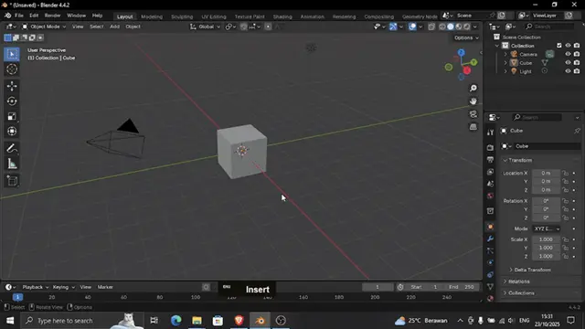

---

- ### Rotate
    
    Transform rotate dimana kita mengubah rotasi objek dalam sumbu X, Y, dan Z. Transform rotate objek bisa dilakukan dengan menekan shortcut key ‘R’ dan key ‘X’, ‘Y’, ‘Z’ untuk mengikuti sumbu.
    
    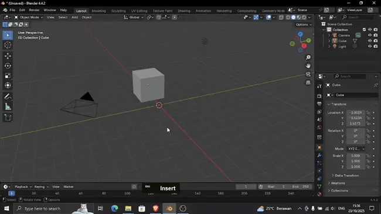
    
    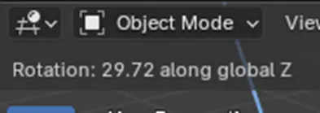

---

- ### Scale
    
    Transform scale dimana kita mengubah rotasi objek dalam sumbu X, Y, dan Z. Transform scale objek bisa dilakukan dengan menekan shortcut key ‘S’ dan key ‘X’, ‘Y’, ‘Z’ untuk mengikuti sumbu.
    
    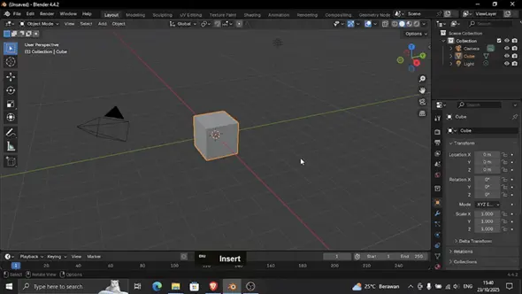

---

### 1.3. Edit mode

Selama ini kita baru membahas objek dalam ‘Object Mode’, karenanya transform atau manipulasi objek hanya sebatas pada objek secara keseluruhan. Lalu bagaimana kita mengubah objek mesh menjadi lebih bagus? Jawabannya dengan menggunakan “Edit Mode”.

Edit mode dapat diakses ketika kita menggunakan shortcut tombol ‘Tab’ pada keyboard di objek yang aktif.

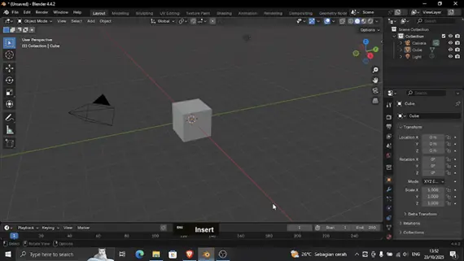

---

Di edit mode, kita bisa melakukan transform lebih detail seperti pada vertices, edges, dan faces.

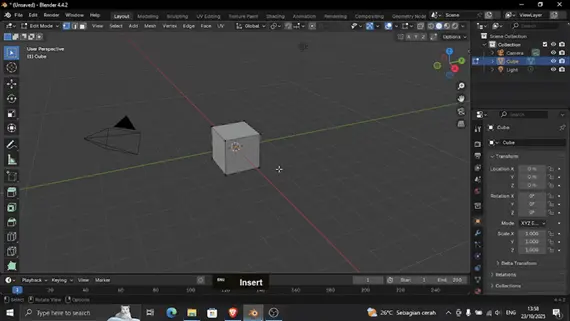

---

Di edit mode kita juga bisa mengubah select mode, yaitu mengganti komponen mesh yang bisa dipilih vertices, edges, dan faces. Shortcutnya adalah key ‘1’, key ‘2’, dan key ‘3’.

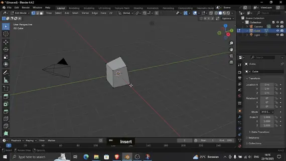

---

Kalau kita perhatikan, tampilan toolbar di bagian kiri viewport berubah karena tambahan fitur seperti Inset, Extrude, Bevel, Loop cut, dan Knife.

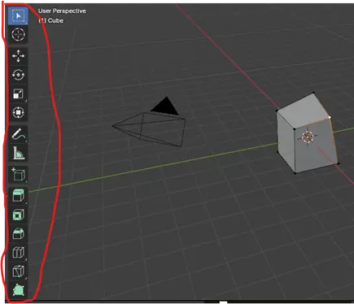

---

Sebenarnya masih banyak fitur dalam toolbar yang belum disebutkan, tetapi setelah beberapa eksperimen yang dilakukan, lima fitur yang disebutkan tadi merupakan tools yang paling sering dipakai.

- ### Inset
    
    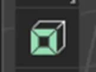
    >
    >Icon Inset.
    
    Inset membuat face baru di dalam face yang aktif, biasanya digunakan untuk penambahan detail. Shortcutnya adalah key ‘I’.
    
    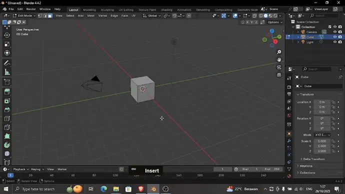

---

- ### Extrude
    
    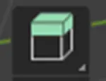
    >
    >Icon Extrude.
    
    Extrude menduplikasi vertice, edge, atau face yang dipilih dan memperluas mesh untuk membuat geometri baru. Shortcutnya adalah key ‘E’.
    
    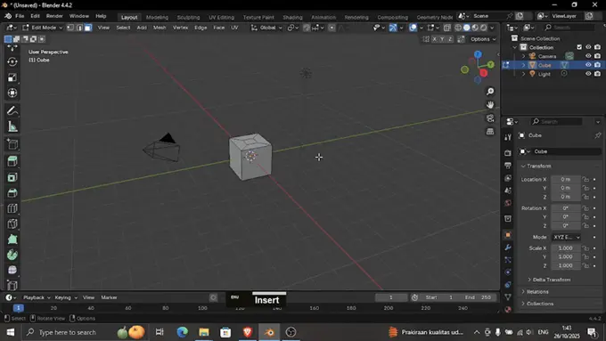

---

- ### Bevel
    
    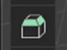
    >
    >Icon Bevel.
    
    Bevel membulatkan atau memotong vertice dan edge pada mesh 3D. Bevel bisa diatur jumlah, ukuran dan komponen mesh (vertice dan edge). **Shortcutnya adalah ‘Ctrl + B’ untuk membuat Bevel**, gerakkan mouse untuk mengatur ukuran, Scroll untuk menambah segment (jumlah), dan ‘V’ untuk mengubah komponen mesh yang akan di-Bevel.
    
    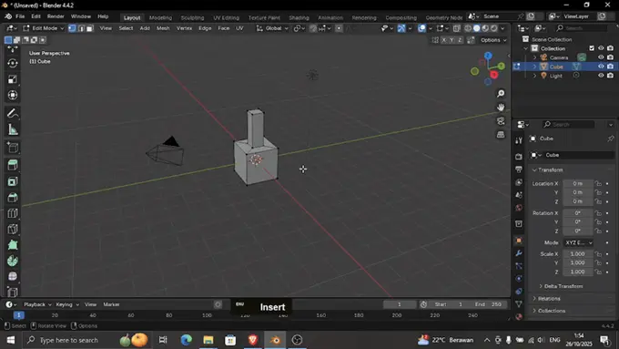

---

- ### Loop cut

    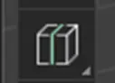
    >
    >Icon Loop Cut.
    
    Loop Cut digunakan untuk membuat edges baru (dengan faces dan vertices) yang melingkari seluruh atau sebagian mesh. Shortcutnya adalah ‘Ctrl + R’ untuk membuat Loop Cut dan scroll untuk menambah jumlah Loop Cut.
    
    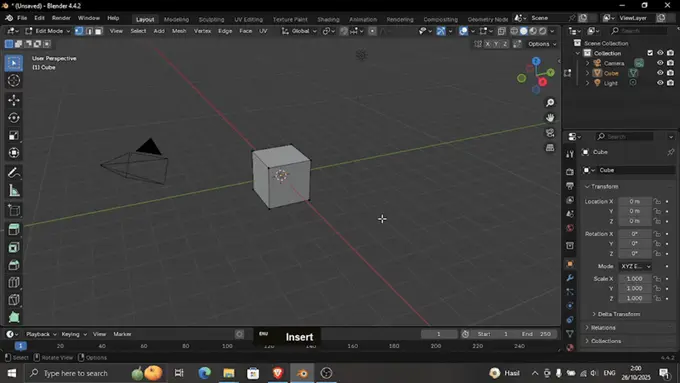

---

- ### Knife
    
    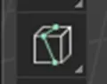
    >
    >Icon Knife.
    
    Knife berfungsi untuk memotong dan membagi mesh dengan menggambar garis dengan kursor. Shortcutnya adalah key ‘K’ dan jika ingin pemotongan menembus mesh maka dilanjutkan dengan key ‘C’.
    
    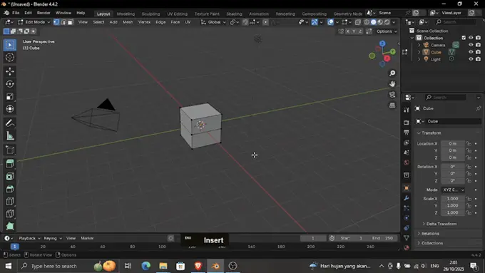

Kelima tools di atas sering dipakai karena mereka bersifat generate atau membuat komponen mesh untuk detailing pada objek.

Dan kalau dipikir-pikir “Wadaw, shortcutnya banyak banget”. Tapi jangan khawatir, jika kita melihat ke bawah viewport saat kita menggunakan tools maka akan muncul list shortcut untuk tools yang dipakai.

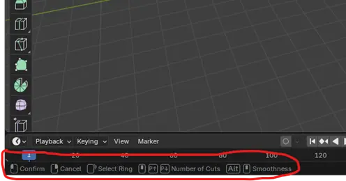

Contoh list shortcut tools.

### 1.4. Context Menu Edit Mode

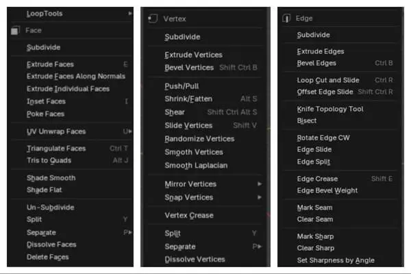

Ketika kita klik kanan di viewport di dalam edit mode maka akan muncul context menu, isi tools dari context menu berbeda-beda tergantung dari select mode yang digunakan (vertice, edge, face). Tetapi kita hanya akan membahas tools yang esensial untuk modelling dasar.

- ### Subdivide
    
    Subdivide adalah fungsi yang menambahkan vertice dan edge baru ke jaring untuk meningkatkan resolusinya.

---

- ### Split
    
    Split akan membelah atau memutus vertice yang aktif tetapi masih dalam satu objek.

---

- ### Separate
    
    Separate akan memisahkan vertice yang aktif dan membuat objek baru berdasarkan vertice yang dipilih

---

## 2. Waktunya Coba-Coba

Setelah mempelajari sedikit tentang Blender, kita akan Explore™ Blender secara individu. Kita akan membuat sebuah 3d model peti harta karun dengan menggunakan informasi yang sudah kita pelajari di minggu ini.

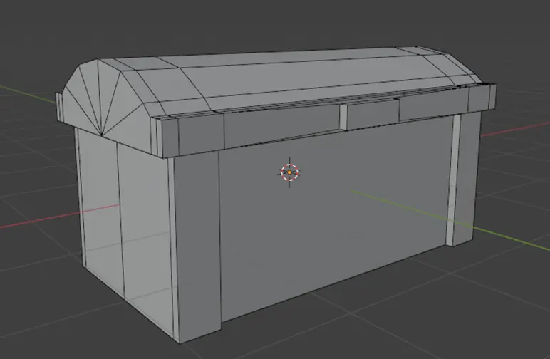

