# 📚 Intermediate 3D Modelling 1

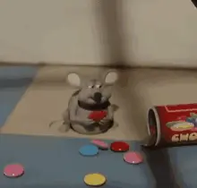
>
>(Bingung pembukaannya dibuat bagaimana, lihat sapi makan aja)

## 1. Topologi

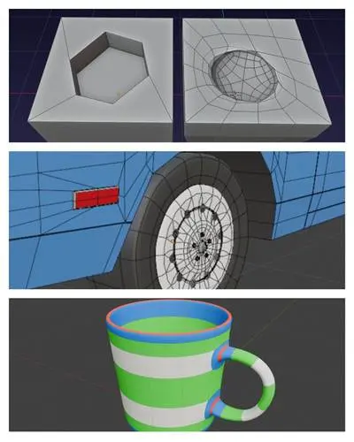

Kalau kita lihat di dalam mesh terdapat vertice, edge, dan face yang penempatan atau bentuknya yang berbeda tergantung dari model yang dibuat. Hal itulah yang dinamakan dengan Topologi dalam Blender 3D. Jadi Topologi adalah karakteristik permukaan geometris model 3D, yang menentukan bagaimana poligon disusun dan saling berhubungan.

Topologi dalam Blender wajib dipelajari karena topologi dari sebuah mesh berpengaruh dengan bagaimana objek berinteraksi dengan environment dalam viewport.

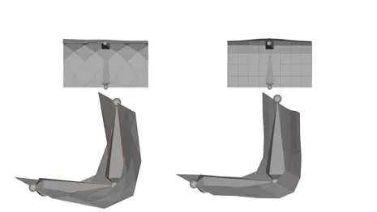

Jadi bagaimana cara membuat topologi yang baik, dan benar?

#### 1.1.1. Quads, Tris, n-gons

Kita awali dengan quads, tris, dan n-gons. Nah mereka itu apa sih? Mereka adalah tipe polygon/geometri (Singkatnya gitu). Tapi lebih jelasnya apakah mereka itu?

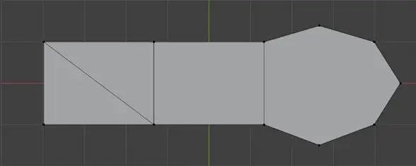
>
>(dari kiri ke kanan) tris, quad, dan n-gons

- Quads adalah polygon yang mempunyai 4 sisi, paling cocok untuk modelling dan animasi.

- Tris mempunyai 3 sisi, paling cocok untuk game asset karena ringan dan stabil.

- N-gons mempunyai lebih dari 4 sisi, jarang digunakan dan sebaiknya jangan dipakai.

Kalau dari penjelasan tipe polygon di atas, apakah artinya quads tidak perlu digunakan? Oh, tentu saja tetap perlu, karena 95% waktu yang akan kita habiskan adalah modelling asset yang memerlukan quads untuk mempermudah proses modelling.

Selengkapnya ada di video ini: [https://youtu.be/Vj6Xkd_EHLE?si=pJFBITe3B8Ev3DgB](https://youtu.be/Vj6Xkd_EHLE?si=pJFBITe3B8Ev3DgB)

#### 1.1.2. Edge Loop Topology

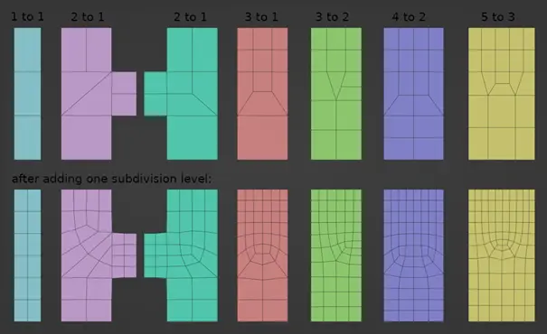

Edge loop adalah rangkaian edge yang saling terhubung dan membentuk jalur melingkar di permukaan mesh. Biasanya edge loop mengikuti aliran bentuk objek seperti kontur wajah, atau bentuk tubuh karakter.

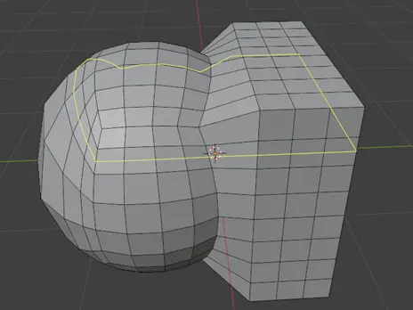

---

Cara mudah untuk mengenali edge loop adalah:

- Edge loop berjalan mengikuti quad (4 sisi poligon)
    
    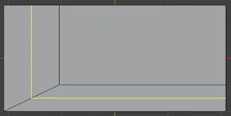

---

- Loop akan berlanjut sampai bertemu dengan pole (titik tempat edge loop berhenti atau bercabang.)
    
    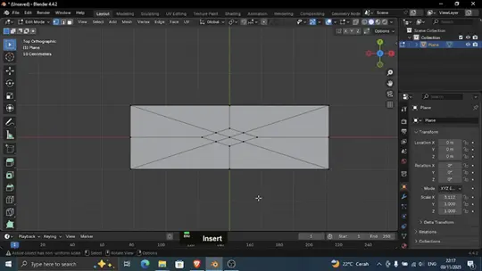

---

- Edge loop bisa digunakan untuk mengontrol aliran permukaan dan menentukan bentuk akhir mesh
    
    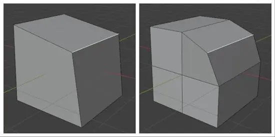

---

Setelah perkenalan singkat dengan edge loop, sekarang saatnya kita bertanya layaknya seorang filsuf, “Kenapa?”

Kenapa edge loop harus dipahami? Karena:

- Membantu deformasi mesh misalnya pada lipatan siku atau ekspresi wajah.

- Merapikan subdivision membantu menjaga bentuk agar tidak rusak

- Untuk mempertajam atau memperhalus bagian tertentu.

- Memudahkan proses loop cut tanpa merusak struktur mesh.

---

Kita sudah mempelajari dasar teori dari edge loop, tapi entah mengapa ada perasaan kalau ada yang kurang.

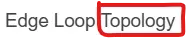
>
>Mana topologi yang kau janjikan itu hah???

Pertama-tama, kita perhatikan mesh di bawah ini:

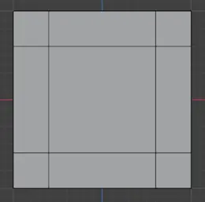
>
>Hmm, sungguh mesh yang sangat ngotak.

Kalau dilihat-lihat tidak ada yang salah, karena memang tidak salah, tapi kurang efisien. Kenapa tidak efisien? Dan bagaimana cara membuatnya menjadi efisien?

Satu hal yang perlu diingat dalam proses modelling, topologi yang efisien adalah setiap quads dan tris mempunyai kegunaan seperti untuk pengembangan atau deformasi di kemudian waktu. Apabila ada polygon yang tidak digunakan maka kita harus “menghapusnya” dengan cara dilebur ke polygon lain untuk dijadikan quads atau tris.

---

Dalam kasus ini, quads di dalam mesh jumlahnya lebih dari yang kita butuhkan.

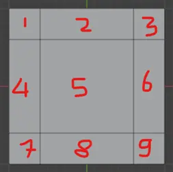

Kita akan menghapus quad yang tidak diperlukan.

1. Untuk mengefisiensi, pertama kita petakan potensi geometri quad yang ada.
    
    Di gambar ini kita mengambil salah satu sisi dari mesh, disini kita mencoba dengan menghubungkan vertice luar ke vertice dalam dengan menggunakan knife tool (K) atau select 2 vertice yang akan dihubungkan dan join (J).
    
    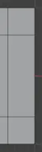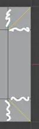

2. Kemudian dissolve edge (X => dissolve edges atau ctrl + X dalam edge select mode) dan cek apakah ada quad yang terbentuk,
    
    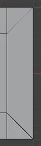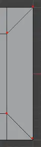
    >
    >Terbentuk quad baru yang ditandai titik merah.
    
    Apabila masih belum ditemukan quad, petakan ulang potensi geometri quad di dalam mesh.

3. Jika sudah ada quad yang terbentuk, dissolve edge yang tidak diperlukan. Maka jadinya akan seperti ini:
    
    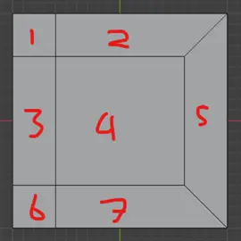
    
    Kita berhasil mengurangi quad di salah satu sisi.

4. Aplikasikan di sisi yang lain, dan voilà! Dari yang semula 9 quad, menjadi 5 quad
    
    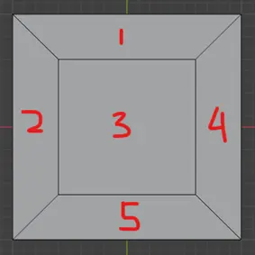

---

Baru saja kita telah mempelajari “corner topology”, yaitu topologi untuk sudut mesh. Sebenarnya jika diperlukan, jumlah quad mesh ini masih bisa dikecilkan lebih lanjut.

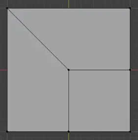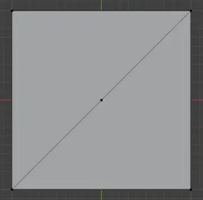

Tetapi kembali lagi, topologi yang efisien bukan berarti harus mengorbankan bentuk dari mesh yang diinginkan, ada kalanya efisiensi harus dikorbankan untuk model yang akan dibuat.

Ingat, topologi yang efisien tidak menyiakan-nyiakan polygon, tetapi topologi yang optimal tidak mengganggu alur proses modelling karena di akhir hari, output adalah yang diinginkan.

#### 1.1.3. Edge Loop Reduction

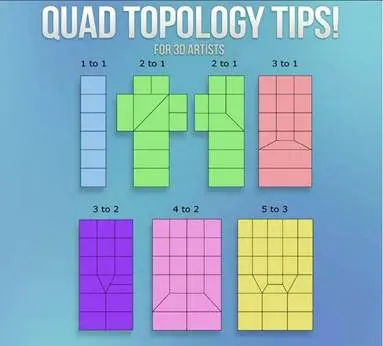

Jika kita mencari keyword “blender topology” di search engine maka gambar yang sering sering keluar adalah gambar semacam yang seperti di atas. Kita akan memanggilnya “Edge Loop Reduction” agar lebih mudah diingat (Karena di silabus sudah terlanjur ditulis begitu, dan konsepnya gak punya nama resmi).

Dalam topologi 3D, ketika kita ingin menggabungkan dua area mesh dengan jumlah edge yang berbeda, kita harus menyesuaikan perbandingan jumlah edge agar tetap bersih dan tidak menghasilkan n-gon atau geometri yang aneh.

*(Penulis materi bingung karena terlalu advance, gini aja dulu)*

## 2. Menggunakan Modifier

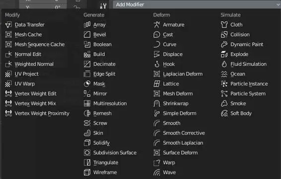

Modifier Blender adalah operasi otomatis non-destruktif (biasanya) untuk mengubah geometri objek tanpa mengubah mesh secara permanen. Modifier dibagi menjadi 4 yaitu:

- **Edit**
    
    Mirip dengan pengubah Deform (lihat di bawah), namun, mereka biasanya tidak secara langsung memengaruhi geometri objek, tetapi beberapa data lain, seperti grup titik sudut.

- **Generate**
    
    Modifier konstruktif/destruktif yang akan memengaruhi keseluruhan topologi mesh. Modifier ini dapat mengubah tampilan umum objek, atau menambahkan geometri baru.

- **Deform**
    
    Tidak seperti Generate di atas, modifier ini hanya mengubah bentuk objek, tanpa mengubah topologinya.

- **Simulate**
    
    Mewakili simulasi fisika.

Penggunaan Modifier bergantung dengan kebutuhan untuk modelling object, karena itu modifier yang digunakan haruslah tepat. Karena itu kita akan berkenalan dengan beberapa modifier yang paling sering digunakan dalam modelling.

#### 2.1.1. Mirror

Mirror modifier mencerminkan mesh di sepanjang sumbu X, Y, dan/atau Z.

Dalam modifier ini juga terdapat clipping yang mana akan mencegah vertice bergerak melalui objek cerminan saat Anda mengubahnya dalam edit mode dengan menggabungkan vertice.

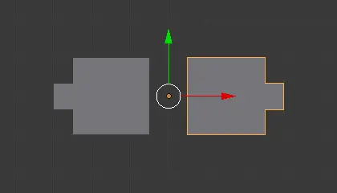

#### 2.1.2. Subdivision Surface

Modifier Subdivision Surface (sering disingkat menjadi “Subdiv”) digunakan untuk membagi permukaan mesh menjadi permukaan yang lebih kecil, sehingga memberikan tampilan yang halus.

Terdapat dua mode Subdiv yaitu Catmull-Clark dan Simple dimana Catmull-Clark akan melakukan subdivisi dan menghaluskan permukaan, sedangkan Simple hanya melakukan subdivisi.

Levels viewport adalah jumlah tingkat subdivisi yang ditampilkan di Viewport 3D atau render akhir (hati-hati akan berat di device).

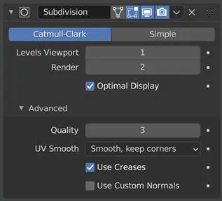

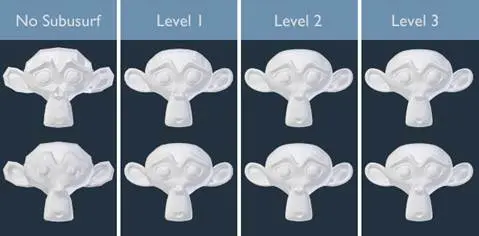

#### 2.1.3. Array

Modifier Array menduplikasi objek secara berurutan (berbaris) dengan pola tertentu. Jumlah salinan objek bergantung dengan fit type yang dipilih

Gunakan relative offset untuk memberi offset atau jarak sesuai sumbu dari salinan ke salinan selanjutnya.

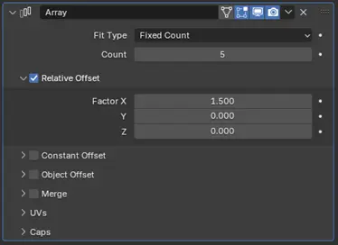

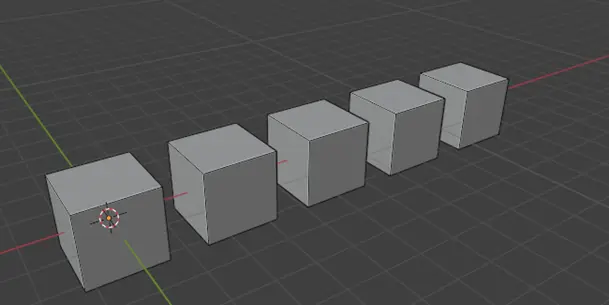

#### 2.1.4. Solidify

Modifier Solidify mengambil permukaan mesh dan menambahkan kedalaman serta ketebalan. Gunakan thickness untuk mengatur kedalamannya.

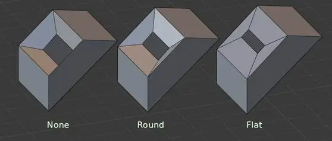

#### 2.1.5. Boolean

#### 2.1.6. 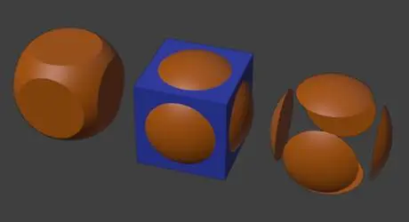

Modifier Boolean menggabungkan beberapa mesh menggunakan operasi Boolean. Berikut adalah operasinya

- Intersect atau operasi gabung

- Union atau operasi potong

- Difference atau operasi irisan

#### 2.1.7. Shrinkwrap

Modifier Shinkwrap “Menempelkan” bentuk objek ke permukaan objek lain.

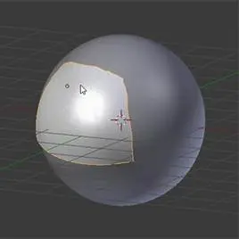

#### 2.1.8. Triangulate

Modifier Triangulate mengubah semua face dalam mesh (quad dan n-gon) menjadi sisi segitiga

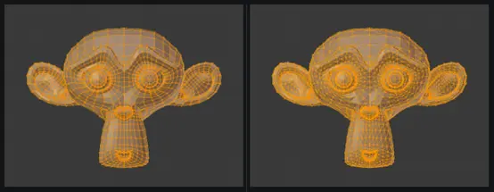

Jika modifier sudah memberikan modifier, kita bisa apply modifiernya.

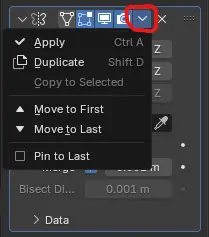

Jika ingin menghapus modifiernya:

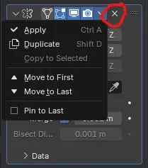

Kita bisa memberikan beberapa modifier kepada sebuah mesh dalam waktu yang bersamaan

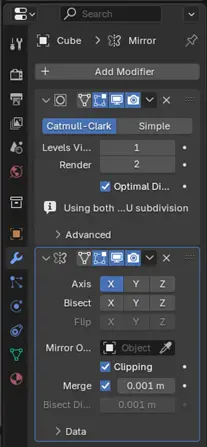

Namun perlu diingat, peletakkan modifier mempengaruhi hasil modifier. Hal ini dikarenakan mereka dihitung secara berurutan dari atas ke bawah dalam stack modifier. Contohnya:

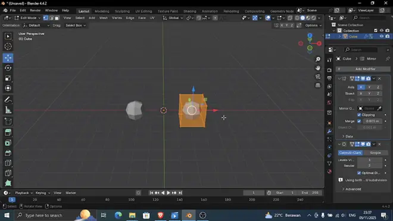

Jika modifier mirror di atas modifier subdiv

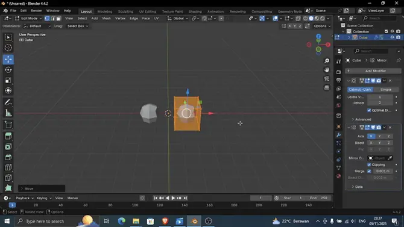

Jika modifier subdiv di atas modifier mirror

## 3. Bonus

Tahukah kalian?

**Snapping** adalah menempelkan objek atau elemen (vertex, edge, face) ke posisi tertentu sesuai mode snapping (increment, grid, vertice dan lain-lain).

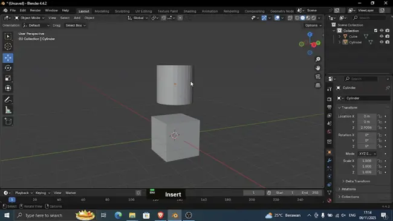

**Proportional editing**. memungkinkan untuk mengubah satu bagian mesh sambil mempengaruhi area di sekitarnya secara halus.

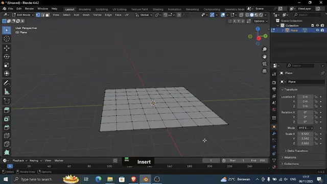

**To Sphere** adalah transformasi di Blender untuk membuat elemen mesh yang dipilih menjadi bulat. Cara menggunakannya dengan memilih mesh dan menekan Shift + Alt + S, lalu gerakkan mouse Anda untuk mengontrol kebulatan.

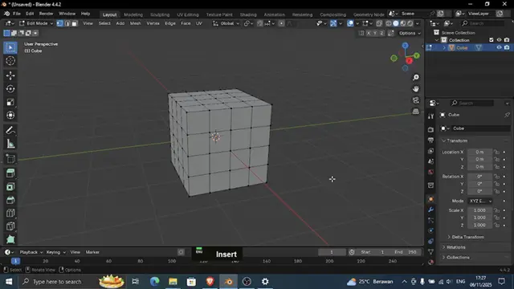

**Spin tool** adalah fitur membuat geometri dengan memutar mesh yang dipilih di sekitar sumbu, dengan kursor 3D bertindak sebagai titik poros.

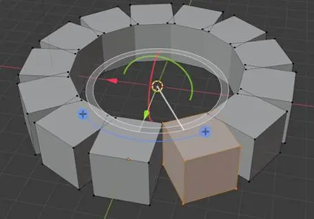

**Add-ons** dapat diinstal untuk memperluas fungsionalitas blender dengan menambahkan alat, atau fitur baru. Centang add-ons yang ingin digunakan.

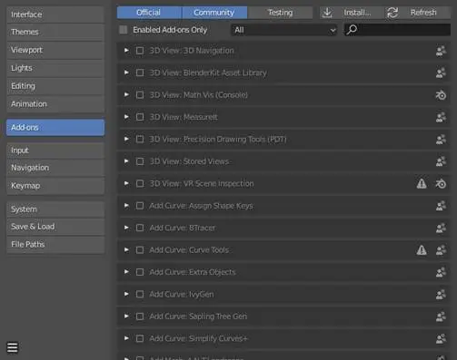

## 4. Waktunya Explore!

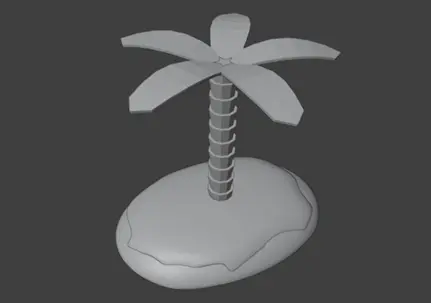

Kita akan membuat sebuah model pulau kecil, dengan persyaratan:

- Menggunakan tools yang sudah dipelajari

- Topology tidak kacau

- Alur pembuatan bebas!!!

Jangan takut salah, di 3D membuat satu object bisa dengan banyak cara dan itu normal.

Tips: gunakan Add-ons Looptools untuk membuat lingkaran.