# 🎭 Moodboard dan Character Concept
>Biar Karakter Kamu Gak Ngasal Stylenya

## 1. Apa itu Mood board ?

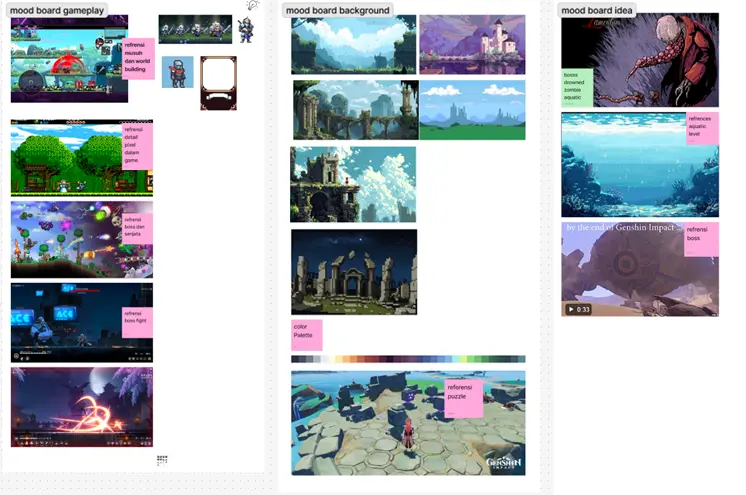

Moodboard itu kayak papan inspirasi estetik yang isinya gambar, warna, font, style atau bahkan vibe yang biasanya diambil dari Pinterest, biar keliatan artsy

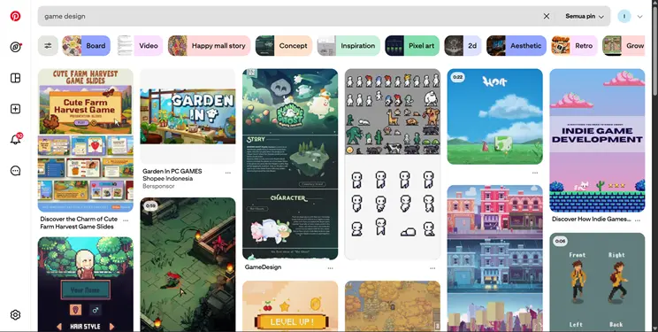

### 1.1. Buat apa Moodboard itu ?

Jadi fungsinya itu untuk menggambarkan nuansa, gaya, dan arah visual dari proyek

1. Menentukan identitas visual biar tau warna, style, atmosfer, dan gak jadi gado-gado campur aduk.
    
    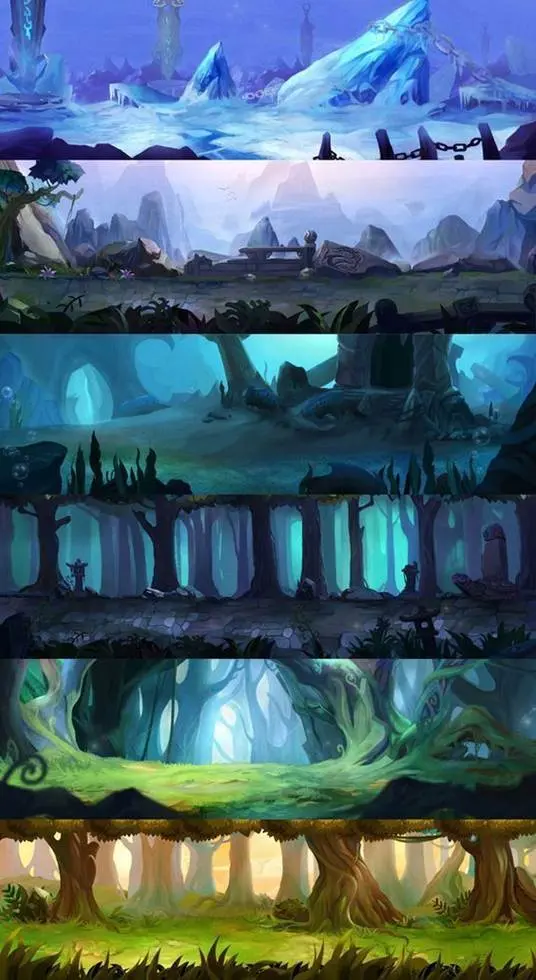

---

1. Komunikasi ide biar ada gambaran visualnya mau kaya gimana, dan ketika ditanya ga cuma bilang “pokoknya vibes-nya cozy aja sih” tapi beneran ada buktinya.

|   |   |
|---|---|
|**Tema Visual**|**Gambaran**|
|Cozy (Hangat & nyaman)|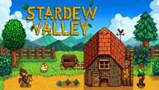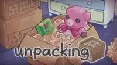|
|Minimalist|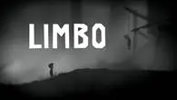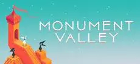|
|Whimsical / Playful|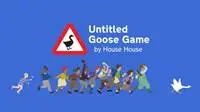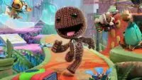|
|Dark / Moody|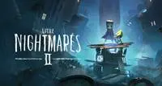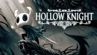|
|Nature / Organic|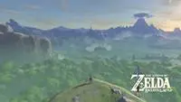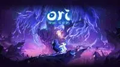|
|Modern / Futuristic|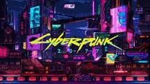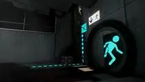|

---

3.     Inspirasi kreatif jadi bahan contekan halal buat desain final.

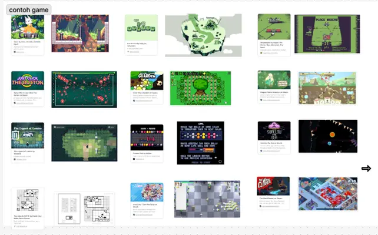

---

4.     Konsistensi : supaya stylenya itu ga melenceng dan konsisten dari awal-akhir.

|   |   |
|---|---|
|**Refrensi**|**Hasil**|
|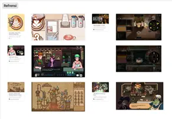|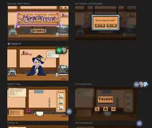|

---

### 1.2. Apa saja isi Moodboard ?

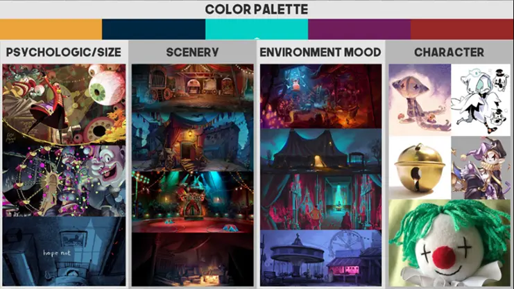

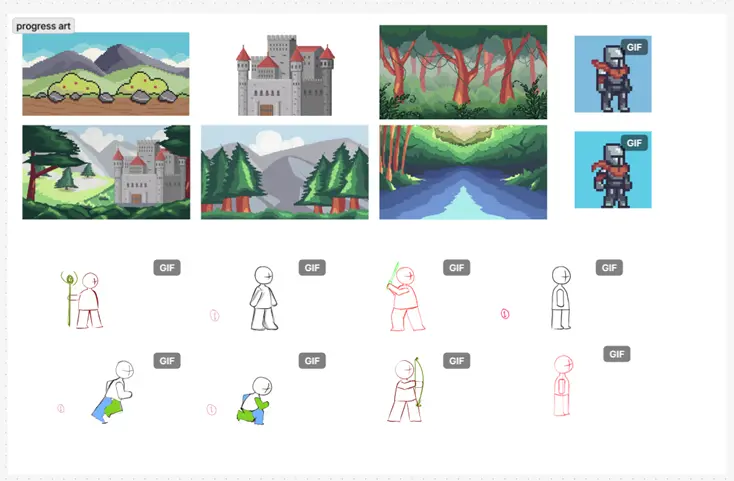

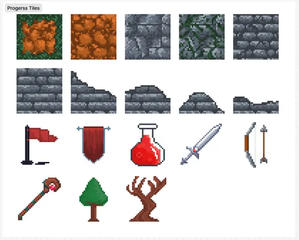

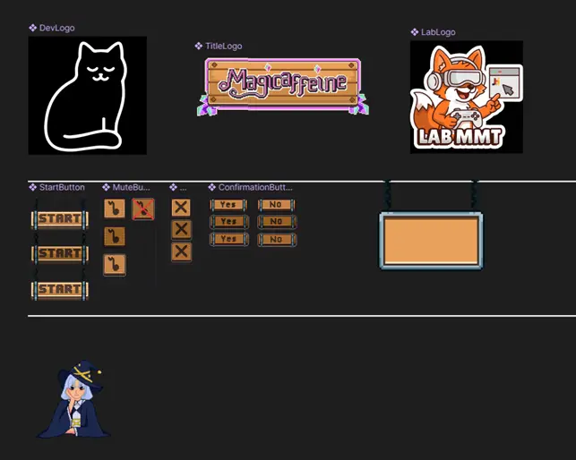

Ada palet warna yang pasti, harus ada referensi stylenya juga, habis itu ada contoh karakternya itu mau di model gimana kaya pose, ekspresi, fashion, siluetnya, lalu ada dunia dimana ada setting tempatnya, atmosfer, dan vibenya mau gimana terus ada ornamen yaitu UI dan logo.

### 1.3. Character concept

Merupakan desain awal karakter yang menggambarkan:

1. Penampilan luar seperti wajah, pakaian, aksesoris, proporsi tubuh
    
    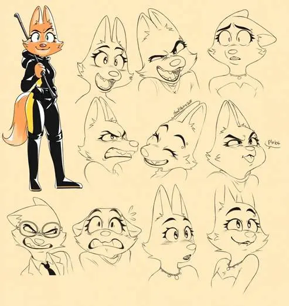
    
    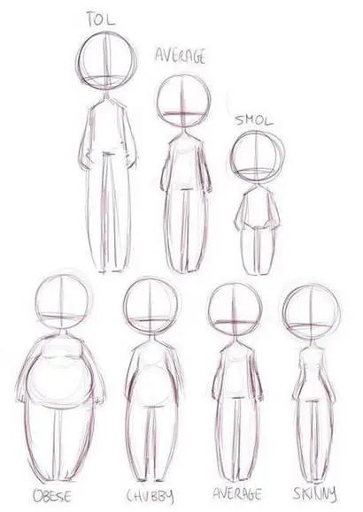
    
    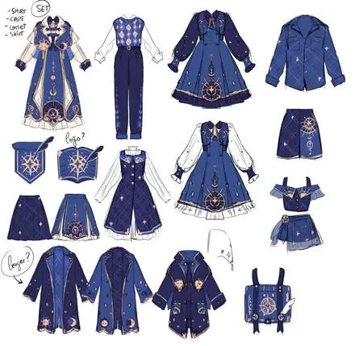

---

2. Kepribadian pemalu, berani, lucu, misterius.
    
    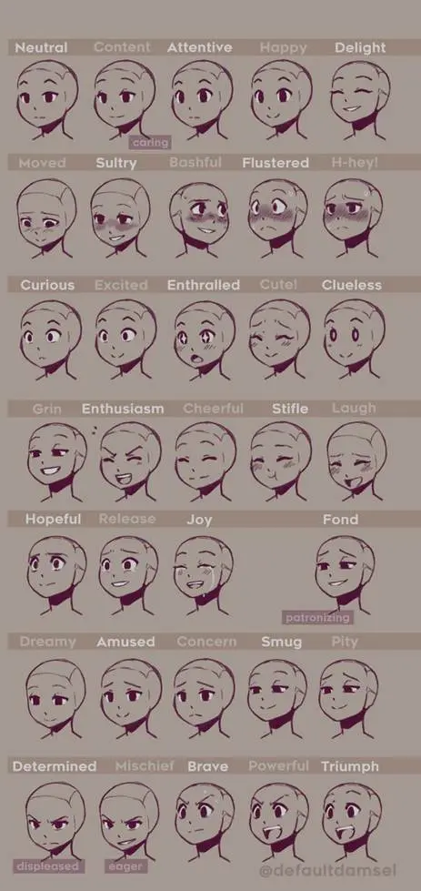

---

3. Latar belakang
    
    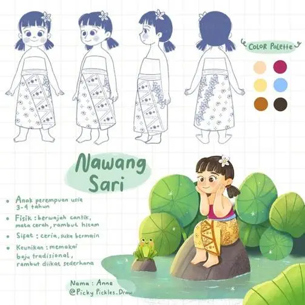

---

4. Gaya Visual kayak chibi, gelap, serius

|   |   |
|---|---|
|**Gaya visual**|**Gambaran**|
|Realistic|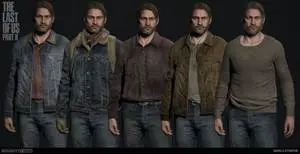|
|Chibi|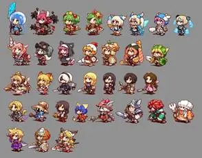|
|Cartoon / Stylized|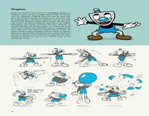|
|Dark / Gothic|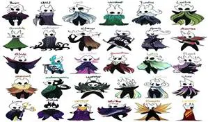|
|Anime / Manga|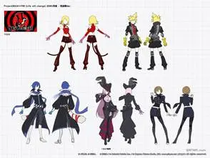|
|Pixel Art|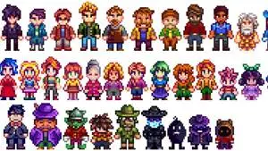|

---

### 1.4. Ada juga elemen dalam character concept

Elemennya itu seperti identitas, ada juga silhouette buat ciri khas karakternya, ekspresi wajah, costume design itu pakaian dll pokonya yang dipake karakter, properti karakternya juga kaya senjata yang dipake, item khas, benda favorit, dan yang terakhir yaitu backstory singkat biar lebih dalam, ga cuma npc lewat

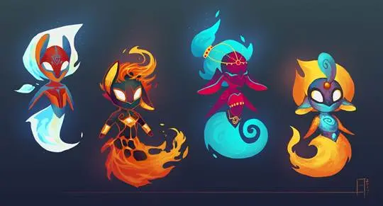

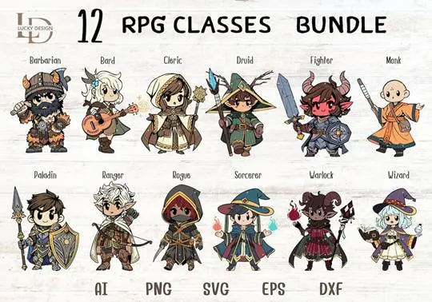

