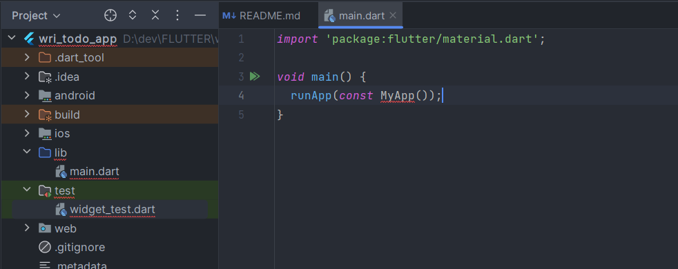
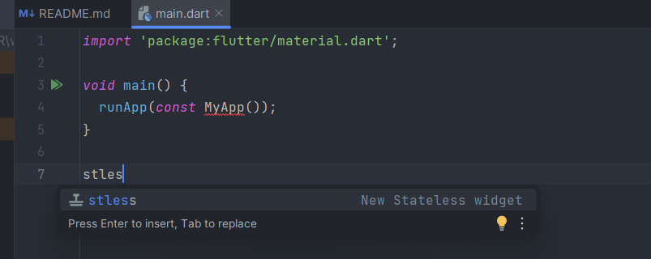

# 👋 Hello World  

Setelah membuat proyek baru, mari kita pahami struktur proyek dan menulis kode pertama kita di Flutter.  

## 📂 Struktur Proyek  

Flutter secara default memiliki banyak folder dan file. Namun, untuk saat ini, kita hanya perlu fokus pada **folder `lib`**, karena di sinilah kode utama aplikasi kita akan ditulis.  

<p align="center">
  
</p>  

Jika ingin memahami lebih dalam tentang struktur proyek, baca artikel ini:  
[Flutter Folder Structure: A Comprehensive Guide](https://shivamkumarnayak.medium.com/flutter-folder-structure-a-comprehensive-guide-13fd9a5ea3e5).  

---

## ✨ Membersihkan `main.dart`  

Secara default, `main.dart` sudah berisi kode aplikasi counter. Untuk memulai dari nol, hapus semua kode dan sisakan fungsi utama seperti ini:  

<p align="center">
  
</p>  

Jika muncul banyak error, tenang saja! Untuk sekarang, hapus folder **`test`**, karena folder ini hanya digunakan untuk testing, yang belum kita butuhkan.  

---

## 🏗️ Menambahkan `StatelessWidget`  

Flutter membutuhkan **widget utama** sebagai pintu masuk aplikasi. Mari kita buat widget dasar menggunakan `StatelessWidget`:  

<p align="center">
  
</p>  

> 💡 **Tips Cepat:**  
> Ketik `stless`, lalu tekan `Ctrl + Space` dan pilih snippet untuk membuat `StatelessWidget` secara otomatis!  

<p align="center">
  
</p>  

Sekarang, kita siap untuk membangun aplikasi Flutter! 🚀  


## 📝 Menampilkan "Hello World"  
Mari tambahkan teks **"Hello World"** di tengah layar menggunakan widget `MaterialApp()` → `Scaffold()` → `Center()` → `Text()` seperti ini:  

```dart 
class MyApp extends StatelessWidget {
  const MyApp({super.key});

  @override
  Widget build(BuildContext context) {
    // `MaterialApp()` > `Scaffold()` > `Center()` > `Text()`
    // ↓ ↓ ↓ ↓ ↓ ↓
    return MaterialApp(
      home: Scaffold(
        body: Center(
          child: Text("Hello World"),
        ),
      ),
    );
    // end
  }
}
```

Jalankan aplikasi, dan tadaa! 🎉 Selamat, kamu telah berhasil membuat aplikasi "Hello World" dengan Flutter!  

<p align="center">
  
</p>