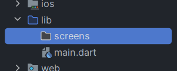

# 🎨 Mendesain Halaman Login  

Pada bagian ini, kita akan mulai menerapkan styling berdasarkan desain UI yang telah disiapkan. Selain itu, kita juga akan merapikan struktur proyek Flutter agar lebih terorganisir dan mudah dikelola.  

---  

## 📂 Merapikan Struktur Direktori  

Sebelum mulai styling, kita perlu menata ulang struktur proyek agar lebih rapi.  

🔹 **Buat folder `screens`** – Folder ini akan digunakan untuk menyimpan semua tampilan halaman dalam aplikasi.  

Setelah menambahkan folder, struktur proyek akan terlihat seperti ini:  

<p align="center">
  
</p>  

Dengan struktur yang lebih terorganisir, kita bisa lebih mudah mengelola berbagai halaman dalam aplikasi. Selanjutnya, kita akan membuat **halaman login** sebagai langkah awal! 🚀  

## 📄 Membuat `login_screen.dart`

Sekarang kita akan membuat halaman login sebagai halaman awal aplikasi.  
Pertama, buat file baru bernama `login_screen.dart` di dalam folder `screens`.  
Lalu, tambahkan kode berikut untuk membuat tampilan login sederhana:

### **login_screen.dart**
```dart
import 'package:flutter/material.dart';

class LoginScreen extends StatelessWidget {
  const LoginScreen({super.key});

  @override
  Widget build(BuildContext context) {
    return Scaffold(
      body: Center(
        child: Text("Ini Login Screen"),
      ),
    );
  }
}
```

### 📌 Menampilkan `LoginScreen` di `main.dart`

Setelah halaman login dibuat, kita perlu mengubah `main.dart` agar langsung menampilkan `LoginScreen` saat aplikasi dijalankan.

### **main.dart**
```dart
import 'package:flutter/material.dart';
// Import file login_screen.dart
import 'package:wri_todo_app/screens/login_screen.dart';

void main() {
  runApp(const MyApp());
}

class MyApp extends StatelessWidget {
  const MyApp({super.key});

  @override
  Widget build(BuildContext context) {
    return MaterialApp(
      // Menampilkan LoginScreen sebagai halaman awal
      home: LoginScreen(),
    );
  }
}
```

### 🚀 Coba Jalankan Aplikasi!

Jalankan aplikasi dan pastikan tidak ada error.  
Jika halaman login berhasil ditampilkan, kita bisa lanjut ke tahap berikutnya! 🎯


## 🧑‍🎨 Styling Login 
### ⬇️ Membuat Susunan Alignment Widget

<p align="center">
  
</p>

Sekarang kita akan mulai menata gaya tampilan `LoginScreen` agar lebih sesuai dengan desain UI.

<p align="center">
  
</p>

Pertama-tama kita analisis terlebih dahulu style dari UI nya. Karena orientasi susunan widget pada desain UI berbentuk kolom (dari atas ke bawah), kita akan menggunakan `Column` untuk menyusun widget secara vertikal. Berikut adalah langkah pertama dalam menyusun struktur widget:

```dart 
@override
Widget build(BuildContext context) {
  return Scaffold(
    body: SizedBox(
      height: MediaQuery.sizeOf(context).height,
      child: Column(
        children: [
          Text("Widget 1"),
          Text("Widget 2"),
          Text("Widget 3"),
        ],
      ),
    ),
  );
}
```


### 📝 Menambahkan Judul ke Halaman Login  

Sekarang kita akan mulai membangun tampilan halaman login kita dengan menambahkan **judul utama**.  

Judul ini akan membantu pengguna memahami tujuan halaman ini. Kita akan menggunakan teks **"Sign in to your Account"** sebagai judul utama.  

💡 **Langkah-langkah:**  
1. Tambahkan widget `Text` untuk menampilkan judul.  
2. Gunakan properti `style` untuk mengatur ukuran dan ketebalan teks.  

Berikut kode yang perlu ditambahkan:  

```dart
@override
Widget build(BuildContext context) {
  return Scaffold(
    body: SizedBox(
      height: MediaQuery.sizeOf(context).height,
      child: Column(
        children: [
          // Widget Text untuk Title
          // ↓ ↓ ↓ ↓ ↓ ↓
          Text(
            "Sign in to your Account",
            style: TextStyle(
              fontSize: 36,
              fontWeight: FontWeight.bold,
            ),
          ),
          Text("Widget 2"),
          Text("Widget 3"),
        ],
      ),
    ),
  );
}
```

✅ **Coba jalankan kode ini!** Jika tidak ada error dan tampilan judul muncul dengan benar, kita bisa lanjut ke langkah berikutnya! 🚀

### 📝 Menambahkan Deskripsi pada Halaman Login  

Setelah menambahkan judul, sekarang kita akan melengkapi halaman login dengan teks deskripsi yang menjelaskan tujuan halaman ini.  

Berikut adalah kode yang perlu ditambahkan:  

```dart
@override
Widget build(BuildContext context) {
  return Scaffold(
    body: Container(
      height: MediaQuery.sizeOf(context).height,
      child: Column(
        children: [
          Text(...), // Text Title
          // Widget Text untuk Deskripsi
          // ↓ ↓ ↓ ↓ ↓ ↓
          Text(
            "Enter your email and password to log in",
            style: TextStyle(
              fontSize: 16,
            ),
          ),
          Text("Widget 3"),
        ],
      ),
    ),
  );
}
```

💡 **Penjelasan:**  
- Teks deskripsi akan membantu pengguna memahami langkah yang harus dilakukan.  
- **Diletakkan di bawah judul**, agar tampilan lebih rapi dan intuitif.  

✅ **Coba jalankan!** Jika tidak ada error dan tampilannya sesuai harapan, kita bisa lanjut ke langkah berikutnya! 🚀  


### 🌟 Menambahkan Custom TextField (Email)

Mari kita tambahkan **TextField** untuk input email! 

1. **Desain**: Tempatkan widget **Text** dan **TextField** di bawah widget **Judul** dan **Deskripsi**.
2. **Label Email**: Gunakan widget **Text** untuk menampilkan label "Email".
3. **Input Email**: Buat **TextField** untuk menerima input email dari pengguna.

Berikut adalah contoh kodenya:

```dart
Column(
  children: [
    // Widget Text Judul 
    // Widget Text Deskripsi
    // .
    // .
    // Widget: label/tulisan Email untuk TextField "Email"
    // ↓ ↓ ↓ ↓ ↓ ↓
    const Padding(
      padding: EdgeInsets.only(top: 33, bottom: 8),
      child: Text(
        "Email",
      ),
    ),
    // Widget: TextField "Email"
    // ↓ ↓ ↓ ↓ ↓ ↓
    TextField(
      decoration: InputDecoration(
        focusedBorder: OutlineInputBorder(
          borderRadius: BorderRadius.circular(15),
          borderSide: const BorderSide(
            color: Colors.black,
          ),
        ),
        border: OutlineInputBorder(
          borderRadius: BorderRadius.circular(15),
        ),
      ),
    ),
  ],
),
```

### 🔒 Menambahkan Custom TextField (Password)

Setelah menambahkan **TextField** untuk email, sekarang kita akan membuat **TextField** untuk password! 

1. **Pengaturan Tambahan**: TextField untuk password memerlukan atribut tambahan seperti `obscureText` untuk menyembunyikan input.
2. **Salin dan Tempel**: Anda bisa menyalin widget **TextField** email yang sudah dibuat sebelumnya atau mengikuti contoh di bawah ini, lalu tempel di bawah widget **TextField** email.

Berikut adalah contoh kodenya:

```dart
Column(
  children: [
    // Widget Text Judul 
    // Widget Text Deskripsi
    // Widget Text "Label Email" 
    // Widget TextField "Email"
    // .
    // .
    // Widget: label/tulisan Password untuk TextField "Password"
    // ↓ ↓ ↓ ↓ ↓ ↓
    const Padding(
      padding: EdgeInsets.only(top: 16, bottom: 8),
      child: Text("Password"),
    ),
    // Widget: TextField "Password"
    // ↓ ↓ ↓ ↓ ↓ ↓
    TextField(
      // Yang berbeda dari password ada disini
      // ↓ ↓ ↓ ↓ ↓ ↓
      obscureText: true,
      obscuringCharacter: '*',
      // dua parameter diatas untuk obscure text password
      decoration: InputDecoration(
        focusedBorder: OutlineInputBorder(
          borderRadius: BorderRadius.circular(15),
          borderSide: const BorderSide(
            color: Colors.black,
          ),
        ),
        border: OutlineInputBorder(
          borderRadius: BorderRadius.circular(15),
        ),
      ),
    ),
  ],
),
```


### ✨ Merapikan Struktur Style

Tampilan widget yang kita susun masih terlihat kurang rapi dan tidak sesuai dengan desain. Mari kita rapikan dengan menambahkan beberapa kode untuk:

- Meratakan widget ke sebelah kiri
- Menambahkan padding/jarak

Berikut adalah contoh kodenya:

```dart
@override
Widget build(BuildContext context) {
  return Scaffold(
    body: Container(
      // Menambahkan padding
      // ↓ ↓ ↓ ↓ ↓ ↓
      padding: const EdgeInsets.only(top: 0, left: 24, right: 24),
      // .
      child: Column(
        // Meratakan widget ke sebelah kiri
        // ↓ ↓ ↓ ↓ ↓ ↓
        crossAxisAlignment: CrossAxisAlignment.start,
        children: [
          // .
          // .
          // .
          // .
          // .
        ],
      ),
    ),
  );
}
```

Dengan langkah-langkah di atas, tampilan styling aplikasi Anda sudah lebih baik! Namun, kita belum selesai. Kita perlu menambahkan widget lainnya untuk melengkapi tampilan.

Jika sudah, mari kita lanjut ke styling berikutnya! 🚀

### 🔑 Menambahkan Text (Forgot Password)

Sekarang kita akan menambahkan teks "Forgot Password?" berwarna biru. Teks ini dapat dibuat dengan cara berikut. 

Tambahkan widget berikut di bawah **TextField** Password:

```dart
Column(
  children: [
    // Widget Text Judul 
    // Widget Text Deskripsi
    // Widget Text "Label Email" 
    // Widget TextField "Email"
    // Widget Text "Label Password"
    // Widget TextField "Password"
    // .
    // .
    // Widget: text/tulisan "Forgot Password?"
    // ↓ ↓ ↓ ↓ ↓ ↓
    const Align(
      alignment: Alignment.centerRight,
      child: Padding(
        padding: EdgeInsets.only(top: 16 + 8),
        child: Text(
          "Forgot Password?",
          textAlign: TextAlign.right,
          style: TextStyle(
              color: Colors.blue, fontWeight: FontWeight.bold),
        ),
      ),
    ),
  ],
),
```

Dengan langkah-langkah di atas, Anda sudah berhasil menambahkan teks "Forgot Password?" yang menarik ke dalam aplikasi Anda!

### 🔵 Membuat Tombol Login

Sekarang kita akan membuat tombol **Login** yang memakan seluruh lebar layar dan berwarna biru! 🚀

Berikut adalah kode untuk tombol login:

```dart
Column(
  children: [
    // Widget Text Judul 
    // Widget Text Deskripsi
    // Widget Text "Label Email" 
    // Widget TextField "Email"
    // Widget Text "Label Password"
    // Widget TextField "Password"
    // Widget: teks "Forgot Password?"
    // .
    // .
    // Widget: untuk membuat tombol Login
    // ↓ ↓ ↓ ↓ ↓ ↓
    Container(
      height: 82,
      width: double.maxFinite,
      padding: const EdgeInsets.only(top: 24),
      child: ElevatedButton(
        style: ElevatedButton.styleFrom(
          foregroundColor: Colors.white,
          shape: RoundedRectangleBorder(
            borderRadius: BorderRadius.circular(15),
          ),
          backgroundColor: Colors.blue,
        ),
        onPressed: () {},
        child: const Text("Login"),
      ),
    ),
  ],
),
```

### ✨ Membuat Tulisan "Or"

Setelah tombol **Login**, kita perlu menambahkan tulisan "Or" yang akan muncul di bawahnya. Berikut adalah cara untuk membuatnya:

```dart
Column(
  children: [
    // Widget Text Judul 
    // Widget Text Deskripsi
    // Widget Text "Label Email" 
    // Widget TextField "Email"
    // Widget Text "Label Password"
    // Widget TextField "Password"
    // Widget: teks "Forgot Password?"
    // Widget: untuk membuat tombol Login
    // .
    // .
    // Widget: teks "Or"
    // ↓ ↓ ↓ ↓ ↓ ↓
    const Padding(
      padding: EdgeInsets.symmetric(vertical: 12),
      child: Align(
        alignment: Alignment.center,
        child: Text(
          "Or",
          style: TextStyle(color: Colors.grey),
        ),
      ),
    ),
  ],
),
```
Setelah menambahkan kode ini, tulisan "Or" akan muncul di bawah tombol login! 🎉

### ☁️ Membuat Tombol "Continue with Google"
Setelah menambahkan tulisan "Or", sekarang kita akan membuat tombol **"Continue with Google"** yang akan muncul di bawahnya. Berikut adalah cara untuk membuatnya:

```dart
Column(
  children: [
    // Widget Text Judul 
    // Widget Text Deskripsi
    // Widget Text "Label Email" 
    // Widget TextField "Email"
    // Widget Text "Label Password"
    // Widget TextField "Password"
    // Widget: teks "Forgot Password?"
    // Widget: untuk membuat tombol Login
    // Widget: teks "Or"
    // .
    // .
    // Widget: untuk membuat tombol "Continue with Google"
    // ↓ ↓ ↓ ↓ ↓ ↓
    SizedBox(
      height: 57,
      width: double.maxFinite,
      child: OutlinedButton.icon(
        style: OutlinedButton.styleFrom(
          side: const BorderSide(
            color: Color.fromARGB(255, 238, 231, 231),
          ),
          foregroundColor: Colors.black,
          shape: RoundedRectangleBorder(
            borderRadius: BorderRadius.circular(15),
          ),
          backgroundColor: Colors.transparent,
        ),
        onPressed: () {},
        icon: Image.asset('assets/icons/google.png'),
        label: const Text("Continue with Google"),
      ),
    ),
  ],
),
```

Setelah menambahkan kode untuk tombol **"Continue with Google"**, Anda mungkin melihat error seperti "Unable to load asset" yang terlihat seperti ini:

<p align="center">
  
</p>

Error ini terjadi karena kita belum memiliki gambar untuk ikon Google di dalam kode:

```dart
Image.asset('assets/icons/google.png'),
```

### ⚠️ Menambahkan Ikon Google ke dalam Assets

Untuk mengatasi error "Unable to load asset", Anda perlu menambahkan gambar **google.png** ke dalam folder **assets/icons/** di proyek Flutter Anda. Pastikan juga untuk memperbarui file `pubspec.yaml` agar Flutter dapat mengenali aset tersebut. 😊

Jika Anda kebingungan, coba ikuti langkah-langkah berikut untuk menambahkan ikon Google:

1. **Siapkan Gambar**: Unduh gambar [Icon Google](/#3%20ui%20styling/assets/google.png) dan simpan dengan nama **google.png**.
2. **Buat Folder**: Jika belum ada, buat folder **assets/icons/** di dalam proyek Flutter Anda.
3. **Pindahkan Gambar**: Pindahkan file **google.png** ke dalam folder **assets/icons/**.
4. **Perbarui pubspec.yaml**: Buka file `pubspec.yaml` dan tambahkan path aset seperti berikut:
```yaml
 flutter:
   assets:
     - assets/icons/google.png
```
5. **Jalankan Ulang Aplikasi**: Setelah menyimpan perubahan, jalankan ulang aplikasi Anda.

Dengan mengikuti langkah-langkah di atas, ikon Google akan muncul dengan baik pada tombol "Continue with Google"! 🎉

### 📄 Menambahkan Tulisan "Don't have an account?"

Selanjutnya, kita akan menambahkan tulisan di bawah yang bertuliskan **"Don't have an account?"**. Berikut adalah kodenya:

```dart
Column(
  children: [
    // Widget Text Judul 
    // Widget Text Deskripsi
    // Widget Text "Label Email" 
    // Widget TextField "Email"
    // Widget Text "Label Password"
    // Widget TextField "Password"
    // Widget: teks "Forgot Password?"
    // Widget: untuk membuat tombol Login
    // Widget: teks "Or"
    // Widget: untuk membuat tombol "Continue with Google"
    // .
    // .
    // Widget: untuk membuat tulisan "Don't have an account?..."
    // ↓ ↓ ↓ ↓ ↓ ↓
    Align(
      alignment: Alignment.center,
      child: RichText(
        textAlign: TextAlign.center,
        text: const TextSpan(
          text: "Don't have an account?",
          style: TextStyle(color: Colors.black),
          children: [
            WidgetSpan(
              child: Padding(
                padding: EdgeInsets.only(left: 5),
              ),
            ),
            TextSpan(
              text: 'Sign Up',
              style: TextStyle(
                fontWeight: FontWeight.bold,
                color: Colors.blue,
              ),
            ),
          ],
        ),
      ),
    ),
  ],
),
```
Dengan menambahkan kode ini, pengguna akan melihat opsi untuk **"Sign Up"** di bawah tulisan tersebut! 🎉


### ✨ Merapikan Tulisan "Sign in to your Account"

Jika kita perhatikan, tulisan **"Sign in to your Account"** tidak memiliki cukup ruang. Mari kita tambahkan ruang atas dan bawah dengan membungkusnya menggunakan widget **Expanded** agar mendapatkan lebih banyak ruang.

```dart
Column(
  crossAxisAlignment: CrossAxisAlignment.start,
  children: [
    // Widget: Expand melebarkan ruang
    // ↓ ↓ ↓ ↓ ↓ ↓
    Expanded(
      child: Text(
        "Sign in to your Account",
        style: TextStyle(
          fontSize: 36,
          fontWeight: FontWeight.bold,
        ),
      ),
    ),
  ],
),
```

Namun, alignment teks masih berada di atas. Mari kita atur agar posisinya berada di bawah kiri dengan membungkus widget **Text** menggunakan **Align**:

```dart
Column(
  crossAxisAlignment: CrossAxisAlignment.start,
  children: [
    Expanded(
      // Widget: Align untuk mengatur alignment widget di dalamnya
      // ↓ ↓ ↓ ↓ ↓ ↓
      child: Align(
        alignment: Alignment.bottomLeft,
        child: Text(
          "Sign in to your Account",
          style: TextStyle(
            fontSize: 36,
            fontWeight: FontWeight.bold,
          ),
        ),
      ),
    ),
  ],
),
```
Dengan perubahan ini, tulisan **"Sign in to your Account"** akan terlihat lebih rapi dan teratur! 🎉

### ✨ Merapikan Tulisan "Don't have an account?..."

Tampilan teks **"Sign in to your Account"** sudah cukup baik, tetapi sekarang perhatikan teks **"Don't have an account?"** yang tampak sempit. Mari kita bungkus widget-nya dengan **Expanded** agar ruang yang digunakan lebih lebar.

```dart
Column(
  crossAxisAlignment: CrossAxisAlignment.start,
  children: [
    // .
    // .
    // .
    // Widget: Expand untuk melebarkan ruang
    // ↓ ↓ ↓ ↓ ↓ ↓
    Expanded(
      child: Align(
        alignment: Alignment.center,
        child: RichText(
          textAlign: TextAlign.center,
          text: const TextSpan(
            text: "Don't have an account?",
            style: TextStyle(color: Colors.black),
            children: [
              WidgetSpan(
                child: Padding(
                  padding: EdgeInsets.only(left: 5),
                ),
              ),
              TextSpan(
                text: 'Sign Up',
                style: TextStyle(
                  fontWeight: FontWeight.bold,
                  color: Colors.blue,
                ),
              ),
            ],
          ),
        ),
      ),
    ),
  ],
),
```

Dengan perubahan ini, tulisan **"Don't have an account?"** kini memiliki ruang yang cukup dan terlihat lebih baik! 🎉

### ✨ Sentuhan Terakhir

Setelah diperhatikan lebih jeli, lebar ruang dari teks **"Sign in to your Account"** dan **"Don't have an account?"** tampak sama. Mari kita berikan perbandingan 4:3 untuk kedua teks tersebut agar lebih sesuai dengan desain, karena proporsi lebar teks **"Sign in to your Account"** lebih besar.

Untuk mengatur perbandingan ini, kita akan menambahkan parameter **flex** di dalam widget **Expanded** seperti berikut:

```dart
Column(
  crossAxisAlignment: CrossAxisAlignment.start,
  children: [
    // Widget: Expand melebarkan ruang
    // ↓ ↓ ↓ ↓ ↓ ↓
    Expanded(
      // Parameter: flex untuk memberikan perbandingan lebar ruang expanded
      // ↓ ↓ ↓ ↓ ↓ ↓
      flex: 4,
      child: Text(
        "Sign in to your Account",
        style: TextStyle(
          fontSize: 36,
          fontWeight: FontWeight.bold,
        ),
      ),
    ),
    // .
    // .
    // .. widget lainnya ..
    // .
    // .
    // Widget: Expand melebarkan ruang
    // ↓ ↓ ↓ ↓ ↓ ↓
    Expanded(
      // Parameter: flex untuk memberikan perbandingan lebar ruang expanded
      // ↓ ↓ ↓ ↓ ↓ ↓
      flex: 3,
      child: Align(
        alignment: Alignment.center,
        child: RichText(
          textAlign: TextAlign.center,
          text: const TextSpan(
            text: "Don't have an account?",
            style: TextStyle(color: Colors.black),
            children: [
              WidgetSpan(
                child: Padding(
                  padding: EdgeInsets.only(left: 5),
                ),
              ),
              TextSpan(
                text: 'Sign Up',
                style: TextStyle(
                  fontWeight: FontWeight.bold,
                  color: Colors.blue,
                ),
              ),
            ],
          ),
        ),
      ),
    ),
  ],
),
```

Dengan penyesuaian ini, styling mobile akan terlihat lebih sesuai dengan desain, dan kita telah selesai mengatur gaya tampilan login! 🎉


<p align="center">
  
</p>