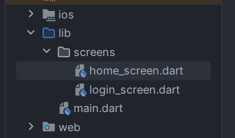
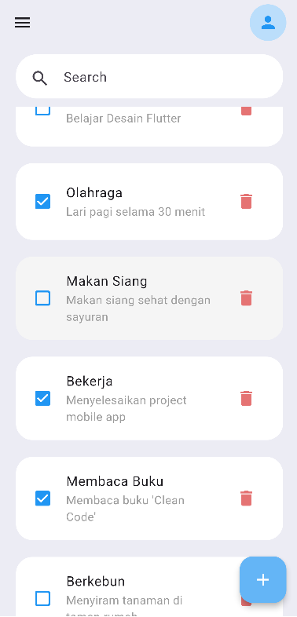
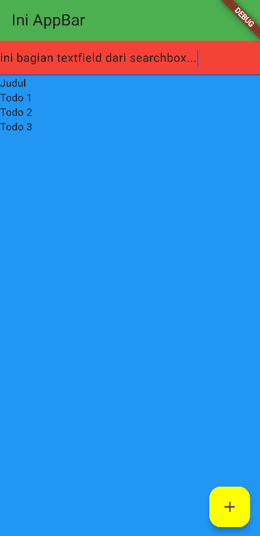

# 🎨 Mendesain Halaman Home  

Pada bagian ini, kita akan melanjutkan penerapan styling berdasarkan desain UI yang telah disiapkan. Fokus kita kali ini adalah pada bagian **Home Screen** dari aplikasi.

---  

## 📄 Membuat `home_screen.dart`

Mari kita mulai dengan membuat file baru bernama `home_screen.dart` di dalam folder **screens**. Berikut adalah tampilan struktur direktori setelah penambahan file:

<p align="center">
  
</p>  

Setelah itu, tambahkan kode sederhana berikut untuk menampilkan pesan bahwa ini adalah halaman home:

### **home_screen.dart**
```dart
import 'package:flutter/material.dart';

class HomeScreen extends StatelessWidget {
  const HomeScreen({super.key});

  @override
  Widget build(BuildContext context) {
    return Scaffold(
      body: Center(
        child: Text("Ini Home Screen"),
      ),
    );
  }
}
```

Sekarang, coba jalankan kode Anda dan periksa apakah tampilan halaman home berhasil ditampilkan! 🚀

### 🔴 Aksi `onPressed` pada Tombol

Setelah kita membuat kode untuk **Home Screen**, tampilan tersebut tidak muncul saat aplikasi dijalankan. Untuk melihat perubahan tampilan di **Home Screen**, kita perlu menambahkan kode untuk membuka halaman tersebut.

Misalkan kita ingin membuka **Home Screen** setelah menekan **tombol "Login"** di **Login Screen**. Kita akan menambahkan aksi `onPressed` pada tombol "Login" seperti berikut:

```dart
// Import: HomeScreen
// ↓ ↓ ↓ ↓ ↓ ↓
import 'home_screen.dart';
// . 
// . ~ kode lainnya ~
// .

// Widget: untuk membuat tombol Login
// ↓ ↓ ↓ ↓ ↓ ↓
Container(
  height: 82,
  width: double.maxFinite,
  padding: const EdgeInsets.only(top: 24),
  child: ElevatedButton(
    style: ElevatedButton.styleFrom(
      foregroundColor: Colors.white,
      shape: RoundedRectangleBorder(
        borderRadius: BorderRadius.circular(15),
      ),
      backgroundColor: Colors.blue,
    ),
    // Fungsi: aksi dari tombol yang telah dipencet
    // ↓ ↓ ↓ ↓ ↓ ↓
    onPressed: () {
      Navigator.pushReplacement(
        context,
        MaterialPageRoute(
          builder: (context) => const HomeScreen(),
        ),
      );
    },
    child: const Text("Login"),
  ),
),
```
Dengan menambahkan kode di atas, saat tombol "Login" ditekan, aplikasi akan beralih ke **Home Screen**! 🚀


### 🚀 Coba Jalankan Aplikasi!

Jalankan aplikasi dan pastikan tidak ada error.  
Jika halaman home berhasil ditampilkan, kita bisa lanjut ke tahap berikutnya! 🎯


## Styling Dasar HomeScreen
<p align="center">
  
  
</p>

### 🏗️ Membuat Tampilan Dasar HomeScreen
Sekarang kita akan mulai menata gaya tampilan **HomeScreen** agar lebih sesuai dengan desain UI.

<p align="center">
  
</p>

Pertama-tama, mari kita analisis terlebih dahulu gaya dari UI-nya. Kita dapat mengidentifikasi beberapa komponen yang perlu kita buat, yaitu:
- **AppBar** (warna hijau)
- **Search Box** (warna merah)
- **List Todo** dengan judul "All ToDo's" (warna biru)
- **Floating Add Button** (warna kuning)

Dengan demikian, kita akan membuat struktur dasar dari tampilan ini terlebih dahulu! 🚀

### ⚙️ Membuat AppBar Dasar
Mari kita mulai dengan membuat **AppBar**. Anda bisa menggunakan kode berikut untuk menambahkan AppBar ke dalam tampilan:

```dart
@override
Widget build(BuildContext context) {
  return Scaffold(
    backgroundColor: const Color(0xFFececf4), // jangan lupa background colornya
    // Widget: AppBar untuk menampilkan ikon menu dan profil
    // ↓ ↓ ↓ ↓ ↓ ↓
    appBar: AppBar(
      title: Text("Ini AppBar"),
      backgroundColor: Colors.green,
    ),
    body: Center(
      child: Text("Ini Home Screen"),
    ),
  );
}
```
Dengan kode di atas, kita telah berhasil menambahkan **AppBar** dasar yang berwarna hijau dan menampilkan judul "Ini AppBar"

### 🔎 Menyusun Search Box dan ListView Dasar

Selanjutnya, mari kita buat **Search Box**. Karena **Search Box** dan **List Todo** akan disusun secara vertikal, kita akan menggunakan `Column` untuk menata widget-nya.

```dart
@override
Widget build(BuildContext context) {
  return Scaffold(
    backgroundColor: const Color(0xFFececf4),
    // Widget: AppBar untuk menampilkan ikon menu dan profil
    // .
    // .
    // .
    // Widget: isi dari halaman seperti search box dan list todo,
    // ↓ ↓ ↓ ↓ ↓ ↓
    body: SizedBox(
      width: MediaQuery.sizeOf(context).width,
      height: MediaQuery.sizeOf(context).height,
      child: Column(
        children: [
          // Widget: untuk bagian search box
          // ↓ ↓ ↓ ↓ ↓ ↓
          Container(
            color: Colors.red,
            child: TextField(),
          ),
          // Widget: list dari todo
          // ↓ ↓ ↓ ↓ ↓ ↓
          Expanded(
            child: Container(
              color: Colors.blue,
              child: ListView(
                children: [
                  Text("Judul"),
                  Text("Todo 1"),
                  Text("Todo 2"),
                  Text("Todo 3"),
                ],
              ),
            ),
          ),
        ],
      ),
    ),
  );
}
```
Dengan kode di atas, kita telah berhasil menyusun **Search Box** dan **ListView** dasar dalam tampilan **Home Screen**

### ➕ Menambahkan Floating Action Button
Selanjutnya, kita akan menambahkan **Floating Action Button** di pojok kanan bawah. Tombol ini akan digunakan untuk menambahkan todo baru. Berikut adalah kode untuk menambahkan **Floating Action Button**:

```dart
@override
Widget build(BuildContext context) {
  return Scaffold(
    // Widget: AppBar untuk menampilkan ikon menu dan profil
    // .
    // . ~ widget AppBar ~
    // .
    // Widget: isi dari halaman seperti search box dan list todo,
    // .
    // . ~ widget search dan list todo ~
    // .
    // Widget: floating button/tombol "tambah" di pojok kanan bawah
    // ↓ ↓ ↓ ↓ ↓ ↓
    floatingActionButton: FloatingActionButton(
      backgroundColor: Colors.yellowAccent,
      onPressed: () {
        // Tambahkan aksi untuk menambahkan todo baru di sini
      },
      child: Icon(Icons.add),
    ),
  );
}
```
Dengan kode di atas, kita telah berhasil menambahkan **Floating Action Button** yang berfungsi untuk menambahkan todo baru


### 🚀 Coba Jalankan Aplikasi!

Jalankan aplikasi dan pastikan tidak ada error. Tampilannya akan menjadi seperti berikut:

<p align="center">
  
</p>

Jika halaman **Home** berhasil ditampilkan, kita bisa melanjutkan ke tahap berikutnya! 🎯


## Styling Lanjutan HomeScreen

<p align="center">
  
  
</p>

### 🏗️ Memperbaiki Tampilan AppBar

<p align="center">
  
</p>  
Setelah sebelumnya kita membuat dasar dari **AppBar**, sekarang mari kita sesuaikan kembali agar sesuai dengan desain UI yang telah ditentukan.

```dart
@override
Widget build(BuildContext context) {
  return Scaffold(
    backgroundColor: const Color(0xFFececf4), 
    // Widget: AppBar untuk menampilkan ikon menu dan profil
    // ↓ ↓ ↓ ↓ ↓ ↓
    appBar: AppBar(
      backgroundColor: const Color(0xFFececf4),
      scrolledUnderElevation: 0,
      leading: const Icon(Icons.menu),
      actions: [
        Container(
          decoration: BoxDecoration(
            color: Colors.blue[100],
            borderRadius: BorderRadius.circular(30),
          ),
          padding: const EdgeInsets.all(10),
          child: const Icon(
            Icons.person,
            color: Colors.blue,
          ),
        ),
      ],
      actionsPadding: const EdgeInsets.only(right: 20),
    ),
    // Widget: isi dari halaman seperti search box dan list todo,
    // .
    // . ~ widget search dan list todo ~
    // .
    // Widget: floating button/tombol "tambah" di pojok kanan bawah
    // .
    // . ~ widget floating button ~
    // .
  );
}
```
Dengan kode di atas, kita telah berhasil memperbaiki tampilan **AppBar** agar lebih sesuai dengan desain UI.


### 🔎 Memperbaiki Tampilan Search Box dan ListView

**Tampilan Search Box**

<p align="center">
  
</p>

Karena sebelumnya kita telah membuat **Search Box** dasar, sekarang kita akan memperbaiki tampilan **Search Box** agar sesuai dengan desain UI-nya.

```dart
@override
Widget build(BuildContext context) {
  return Scaffold(
    backgroundColor: const Color(0xFFececf4),
    // Widget: AppBar untuk menampilkan ikon menu dan profil
    // .
    // . ~ widget AppBar ~
    // .
    // Widget: isi dari halaman seperti search box dan list todo,
    // ↓ ↓ ↓ ↓ ↓ ↓
    body: SizedBox(
      width: MediaQuery.sizeOf(context).width,
      height: MediaQuery.sizeOf(context).height,
      child: Column(
        children: [
          // Widget: untuk bagian search box
          // ↓ ↓ ↓ ↓ ↓ ↓
          Container(
            decoration: BoxDecoration(
              borderRadius: BorderRadius.circular(25),
              color: Colors.white,
            ),
            margin: const EdgeInsets.symmetric(horizontal: 20, vertical: 10),
            padding: const EdgeInsets.only(top: 5, left: 5, right: 5),
            child: const TextField(
              decoration: InputDecoration(
                contentPadding: EdgeInsets.only(top: 12, right: 20),
                prefixIcon: Icon(Icons.search),
                border: InputBorder.none,
                hintText: "Search",
              ),
            ),
          ),
          // Widget: list dari todo
          // 
          // ~ list todo ~
          // 
        ],
      ),
    ),
    // Widget: floating button/tombol "tambah" di pojok kanan bawah
    // .
    // . ~ widget floating button ~
    // .
  );
}
```
Dengan kode di atas, kita telah berhasil memperbaiki tampilan **Search Box** agar lebih sesuai dengan desain UI! 🎨

**Title dari ListView**

<p align="center">
  
</p>

Setelah **Search Box** sudah sesuai, sekarang kita lanjutkan untuk **Judul/Title** dari list todo-nya. Di sini kita akan membuatnya menggunakan `ListView.builder()`.

Pendekatan kita kali ini agak berbeda; kita akan mencoba untuk membuat Widget baru yang bisa dipakai berulang-ulang dan nantinya akan terlihat seperti berikut:

```dart
// Fungsi: untuk menampilkan tulisan/judul "All ToDo's"
// ↓ ↓ ↓ ↓ ↓ ↓
Widget listViewTitle() {
  return Text(
    "Judul ListView Builder",
    style: TextStyle(fontSize: 24),
  );
}

@override
Widget build(BuildContext context) {
  return Scaffold(
    backgroundColor: const Color(0xFFececf4),
    // Widget: AppBar untuk menampilkan ikon menu dan profil
    // .
    // . ~ widget AppBar ~
    // .
    // Widget: isi dari halaman seperti search box dan list todo,
    // ↓ ↓ ↓ ↓ ↓ ↓
    body: SizedBox(
      width: MediaQuery.sizeOf(context).width,
      height: MediaQuery.sizeOf(context).height,
      child: Column(
        children: [
          // Widget: untuk bagian search box
          // . 
          // . ~ widget search box ~
          // .
          // Widget: list dari todo
          // ↓ ↓ ↓ ↓ ↓ ↓
          Expanded(
            child: SizedBox(
              child: ListView.builder(
                itemCount: 5,
                itemBuilder: (context, index) {
                  if (index == 0) {
                    return listViewTitle();
                  } else {
                    return Text("Todo $index");
                  }
                },
              ),
            ),
          ),
        ],
      ),
    ),
    // Widget: floating button/tombol "tambah" di pojok kanan bawah
    // .
    // . ~ widget floating button ~
    // .
  );
}
```

Kira-kira seperti itu gambaran ketika kita membuat Widget baru secara terpisah sehingga kita tinggal memanggil Widget tersebut. Selanjutnya, kita akan memodifikasi lagi style dari judul tadi agar sesuai dengan UI-nya.

```dart
// Fungsi: untuk menampilkan tulisan/judul "All ToDo's"
// ↓ ↓ ↓ ↓ ↓ ↓
Widget listViewTitle() {
  return Container(
    margin: const EdgeInsets.only(bottom: 20),
    width: double.maxFinite,
    child: const Text(
      "All ToDo's",
      style: TextStyle(
        fontSize: 30,
        fontWeight: FontWeight.bold,
      ),
      textAlign: TextAlign.left,
    ),
  );
}
```

**Card dari ListView**

<p align="center">
  
</p>

Setelah itu, kita akan memperbaiki style dari list di **ListView** agar sesuai dengan UI, yaitu berbentuk card.

Kita akan melakukan ini dengan pendekatan yang sama, yaitu dengan cara membuat widget baru sehingga kita bisa memanggilnya berulang-ulang.

```dart
// Fungsi: untuk menampilkan tulisan/judul "All ToDo's"
Widget listViewTitle() {
  // .
  // . ~ judul dari listview ~
  // .
}

// Fungsi: untuk menampilkan satu buah todo
// ↓ ↓ ↓ ↓ ↓ ↓
Widget cardItem(int todoIndex) {
  return ListTile(
    onTap: () {},
    onLongPress: () {},
    tileColor: Colors.white,
    leading: Icon(Icons.check_box_rounded),
    title: Text("Judul Todo ke $todoIndex"),
    subtitle: Text("Deskripsi Todo ke $todoIndex"),
    trailing: IconButton(
      onPressed: () {},
      icon: Icon(
        Icons.delete,
        color: Colors.red[300],
      ),
    ),
  );
}

@override
Widget build(BuildContext context) {
  return Scaffold(
    backgroundColor: const Color(0xFFececf4),
    // Widget: AppBar untuk menampilkan ikon menu dan profil
    // .
    // . ~ widget appbar ~
    // .
    // Widget: isi dari halaman seperti search box dan list todo,
    // ↓ ↓ ↓ ↓ ↓ ↓
    body: SizedBox(
      width: MediaQuery.sizeOf(context).width,
      height: MediaQuery.sizeOf(context).height,
      child: Column(
        children: [
          // Widget: untuk bagian search box
          // . 
          // . ~ widget search box ~
          // .
          // Widget: list dari todo
          // ↓ ↓ ↓ ↓ ↓ ↓
          Expanded(
            child: SizedBox(
              child: ListView.builder(
                itemCount: 5,
                itemBuilder: (context, index) {
                  if (index == 0) {
                    return listViewTitle();
                  } else {
                    return cardItem(index);
                  }
                },
              ),
            ),
          ),
        ],
      ),
    ),
    // Widget: floating button/tombol "tambah" di pojok kanan bawah
    // .
    // . ~ widget floating button ~
    // .
  );
}
```

Kira-kira seperti itu bentuknya untuk membuat widget baru menggunakan fungsi, sehingga kita bisa tinggal memanggilnya. Lalu, karena kurang sesuai dengan desain UI, kita akan memperbagus lagi seperti ini:

```dart 
// Fungsi: untuk menampilkan tulisan/judul "All ToDo's"
Widget listViewTitle() {
  // .
  // . ~ judul dari listview ~
  // .
}

// Fungsi: untuk menampilkan satu buah todo
// ↓ ↓ ↓ ↓ ↓ ↓
Widget cardItem(int todoIndex) {
  return Padding(
    padding: const EdgeInsets.only(bottom: 20),
    child: ListTile(
      shape: RoundedRectangleBorder(
        borderRadius: BorderRadius.circular(20),
      ),
      contentPadding:
          const EdgeInsets.symmetric(vertical: 10, horizontal: 20),
      onTap: () {
        // perintah checklist/uncheck
      },
      onLongPress: () {
        // perintah untuk update
      },
      tileColor: Colors.white,
      leading: Icon(
        Icons.check_box_rounded,
        color: Colors.blue,
      ),
      title: Text("Judul Todo ke $todoIndex"),
      subtitle: Text(
        "Deskripsi Todo ke $todoIndex",
        style: const TextStyle(color: Colors.grey),
      ),
      trailing: IconButton(
        onPressed: () {
          // perintah hapus
        },
        icon: Icon(
          Icons.delete,
          color: Colors.red[300],
        ),
      ),
    ),
  );
}

@override
Widget build(BuildContext context) {
  return Scaffold(
    backgroundColor: const Color(0xFFececf4),
    // Widget: AppBar untuk menampilkan ikon menu dan profil
    // .
    // . ~ widget appbar ~
    // .
    // Widget: isi dari halaman seperti search box dan list todo,
    // ↓ ↓ ↓ ↓ ↓ ↓
    body: SizedBox(
      width: MediaQuery.sizeOf(context).width,
      height: MediaQuery.sizeOf(context).height,
      child: Column(
        children: [
          // Widget: untuk bagian search box
          // . 
          // . ~ widget search box ~
          // .
          // Widget: list dari todo
          // ↓ ↓ ↓ ↓ ↓ ↓
          Expanded(
            child: SizedBox(
              child: ListView.builder(
                // Menambahkan padding
                // ↓ ↓ ↓ ↓ ↓ ↓
                padding: const EdgeInsets.only(top: 20, left: 20, right: 20, bottom: 50),
                itemCount: 5,
                itemBuilder: (context, index) {
                  if (index == 0) {
                    return listViewTitle();
                  } else {
                    return cardItem(index);
                  }
                },
              ),
            ),
          ),
        ],
      ),
    ),
    // Widget: floating button/tombol "tambah" di pojok kanan bawah
    // .
    // . ~ widget floating button ~
    // .
  );
}
```
Dengan modifikasi di atas, kita telah berhasil membuat tampilan **ListView** yang lebih menarik dengan card untuk setiap todo. Setiap card memiliki judul, deskripsi, dan ikon untuk menghapus todo, serta dapat di-tap untuk menandai sebagai selesai atau melakukan aksi lainnya.

### ➕ Memperbaiki Floating Action Button

<p align="center">
  
</p>

Setelah kita membuat dasar dari **Floating Action Button**, sekarang kita akan memperbaiki sedikit floating action button-nya agar sesuai dengan desain UI yang ada.

```dart
// Fungsi: untuk menampilkan tulisan/judul "All ToDo's"
Widget listViewTitle() {
  // .
  // . ~ judul dari listview ~
  // .
}

// Fungsi: untuk menampilkan satu buah todo
Widget cardItem(int todoIndex) {
  // .
  // . ~ card dari item ~
  // .
}

@override
Widget build(BuildContext context) {
  return Scaffold(
    backgroundColor: const Color(0xFFececf4),
    // Widget: AppBar untuk menampilkan ikon menu dan profil
    // .
    // . ~ widget AppBar ~
    // .
    // Widget: isi dari halaman seperti search box dan list todo,
    // .
    // . ~ widget list dari todo ~
    // .
    // Widget: floating button/tombol "tambah" di pojok kanan bawah
    // ↓ ↓ ↓ ↓ ↓ ↓
    floatingActionButton: FloatingActionButton(
      backgroundColor: Colors.blue[300],
      onPressed: () {
        // perintah untuk membuat todo baru
      },
      child: Icon(
        Icons.add,
        color: Colors.white,
      ),
    ),
  );
}
```

Dengan modifikasi di atas, kita telah berhasil memperbaiki tampilan **Floating Action Button** agar lebih sesuai dengan desain UI yang diinginkan. Tombol ini akan berfungsi untuk menambahkan todo baru ketika ditekan.

### 🔴 CASE - BAD DISPLAY

Apakah Anda melihat kejanggalan/tampilan yang kurang tepat pada styling code yang telah kita lakukan?

Hal itu ada pada bagian ini. Ini adalah stylingan kita saat ini:

<p align="center">
  
</p>

Lalu ini adalah yang diminta oleh desain UI kita:

<p align="center">
  
</p>

Bagaimana cara memperbaikinya? Cara memperbaikinya adalah dengan cara membungkus `ListTile` dengan `Material` agar dia menjadi widget yang solid.

```dart
// Fungsi: untuk menampilkan satu buah todo
// ↓ ↓ ↓ ↓ ↓ ↓
Widget cardItem(int todoIndex) {
  return Padding(
    padding: const EdgeInsets.only(bottom: 20),
    // Membungkus dengan Material dan membuatnya transparan 
    // ↓ ↓ ↓ ↓ ↓ ↓
    child: Material(
      color: Colors.transparent,
      child: ListTile(
        shape: RoundedRectangleBorder(
          borderRadius: BorderRadius.circular(20),
        ),
        contentPadding: const EdgeInsets.symmetric(vertical: 10, horizontal: 20),
        onTap: () {
          // perintah checklist/uncheck
        },
        onLongPress: () {
          // perintah untuk update
        },
        tileColor: Colors.white,
        leading: Icon(
          Icons.check_box_rounded,
          color: Colors.blue,
        ),
        title: Text("Judul Todo ke $todoIndex"),
        subtitle: Text(
          "Deskripsi Todo ke $todoIndex",
          style: const TextStyle(color: Colors.grey),
        ),
        trailing: IconButton(
          onPressed: () {
            // perintah hapus
          },
          icon: Icon(
            Icons.delete,
            color: Colors.red[300],
          ),
        ),
      ),
    ),
  );
}
```

Dari ketidaksesuaian tampilan itu, kita belajar untuk selalu mengecek/mengetest UI yang telah kita bangun apakah sudah sesuai atau masih ada kekurangan.

## 🚪 Penutup dari Styling

Mungkin dapat dicukupkan untuk styling dari aplikasi yang telah kita buat. Namun, aplikasi ini masih dalam tahap styling sesuai desain saja; untuk fungsionalitas masih belum selesai. 

Jika Anda berminat, kita bisa lanjutkan ke section **App Functionality**! Di sana kita akan belajar mengenai menambahkan, menghapus, mengubah, dan menampilkan data dari sebuah daftar todo! 

Kita juga bisa menampilkan bottom sheet sebagai pop-up untuk menambahkan data baru tanpa berpindah halaman! Selain itu, kita akan mempelajari mengenai state management, sehingga aplikasi kita langsung memperbarui tampilannya setelah kita melakukan perubahan pada data. Keren, bukan?