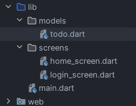
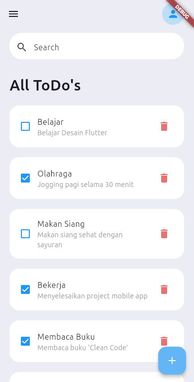
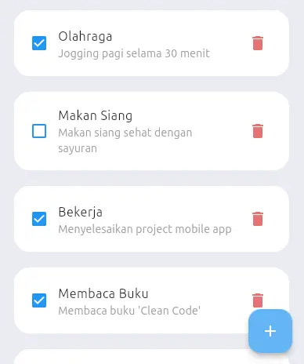
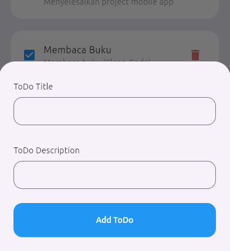
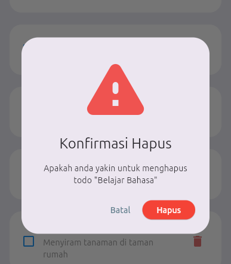
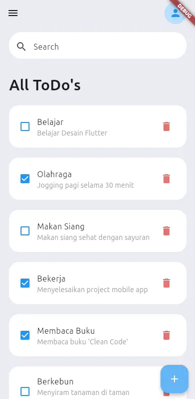

# 🔧 Fungsionalitas Aplikasi 📲

Karena kita sebelumnya sudah selesai membuat styling dari aplikasi mobile kita, sekarang kita akan membuat fungsionalitas dari aplikasinya.

## 📝 Membuat Create, Read, Update, and Delete

Di sini kita akan berfokus pada fitur seperti menambahkan todo baru, menghapus todo yang sudah ada, dan mengubah todo yang sudah ada menggunakan state management.

### 🗃️ Menyiapkan Daftar/List Data dari Todo

Karena bentuk dari satu data Todo adalah seperti ini:
> **judul**: "Judul Todo" *<---- string* \
> **deskripsi**: "Deskripsi Todo" *<---- string* \
> **selesai**: false  *<---- boolean*

Maka kita bisa membuat sebuah object/class Todo, yang strukturnya seperti ini:

```dart
class Todo {
    String judul;
    String deskripsi;
    bool selesai;
}
```

Maka setelah itu kita lengkapi class tersebut dengan konstruktor-nya agar kita dapat memasukkan data ke dalam class tersebut pada saat instansiasi.

```dart
class Todo {
    String judul;
    String deskripsi;
    bool selesai;

    Todo({
        required this.judul, 
        required this.deskripsi,
        this.selesai = false,
    });
}
```

Setelah tahu jika kita memerlukan class Todo, maka kita akan membuat folder baru bernama `models`, dan di dalamnya ada file baru bernama `todo.dart`, dan letakkan kode class Todo tadi di dalam file `todo.dart`. Hasilnya akan sebagai berikut `lib/models/todo.dart`:

<p align="center">
  
</p>

Lalu di sini kita akan mencoba membuat list data todo-nya menggunakan `List` dalam Dart collection.

> [!INFO]
> Untuk penjelasan lebih lanjut mengenai *Dart collections* (termasuk cara membuat `List`), silakan kunjungi dokumentasi resmi melalui tautan berikut:  
> [Dart Collections – dart.dev](https://dart.dev/language/collections)

```dart
// List: sekumpulan todo yang akan ditampilkan
List<Todo> todoList = [
  Todo(
    judul: "Belajar",
    deskripsi: "Belajar Desain Flutter",
    selesai: false,
  ),
  Todo(
    judul: "Olahraga",
    deskripsi: "Jogging pagi selama 30 menit",
    selesai: true,
  ),
  // dan seterusnya...
];
```

Dari list tersebut, kita akan meletakkannya di kode `HomeScreen` tempat kita menampilkan list dari todo:

```dart
class HomeScreen extends StatelessWidget {
  HomeScreen({super.key});

  // List: sekumpulan todo yang akan ditampilkan
  final List<Todo> todoList = [
    Todo(
      judul: "Belajar",
      deskripsi: "Belajar Desain Flutter",
      selesai: false,
    ),
    Todo(
      judul: "Olahraga",
      deskripsi: "Jogging pagi selama 30 menit",
      selesai: true,
    ),
    Todo(
      judul: "Makan Siang",
      deskripsi: "Makan siang sehat dengan sayuran",
      selesai: false,
    ),
    Todo(
      judul: "Bekerja",
      deskripsi: "Menyelesaikan project mobile app",
      selesai: true,
    ),
    Todo(
      judul: "Membaca Buku",
      deskripsi: "Membaca buku 'Clean Code'",
      selesai: true,
    ),
    Todo(
      judul: "Berkebun",
      deskripsi: "Menyiram tanaman di taman rumah",
      selesai: false,
    ),
    Todo(
      judul: "Belajar Bahasa",
      deskripsi: "Latihan percakapan bahasa Inggris",
      selesai: true,
    ),
  ];

  // kode-kode widget lain di bawahnya ~
}
```

Jika sudah, kita siap untuk menggunakan List dari Todo tersebut untuk dimanipulasi datanya (diubah, ditambah, ataupun dihapus).

🤓 **Kesimpulan:**  
- Kita **menggunakan List untuk menyimpan** data-data Todo yang akan kita kelola.
- Data yang disimpan **bersifat sementara**, yang artinya setelah menutup dan membuka aplikasi kembali, datanya akan **direset**.

Selanjutnya, kita akan membuat fungsionalitas dari aplikasi Todo list kita dengan menambahkan fitur Create, Read, Update, dan Delete.

### 📖 Read Todo List

Sekarang kita akan menampilkan data Todo yang sudah kita siapkan ke dalam UI aplikasi kita. Mari kita ubah kode kita agar bisa menampilkan data dari todoList yang sudah kita buat!

#### 1️⃣ Tampilkan Data dari List

Kita perlu mengubah kode `cardItem` agar bisa menampilkan data sesuai dengan item Todo yang ada di dalam list:


```dart
  // Fungsi: untuk menampilkan satu buah todo
  Widget cardItem(int todoIndex) {
    return Padding(
      padding: const EdgeInsets.only(bottom: 20),
      child: Material(
        color: Colors.transparent,
        child: ListTile(
          // Tampilkan icon sesuai status 'selesai'
          leading: Icon(
            // Gunakan icon berbeda berdasarkan status todo
            todoList[todoIndex].selesai
                ? Icons.check_box_rounded  // ✅ Jika sudah selesai
                : Icons.check_box_outline_blank,  // ⬜ Jika belum selesai
            color: Colors.blue,
          ),
          // Tampilkan judul dari data Todo
          title: Text(todoList[todoIndex].judul),
          // Tampilkan deskripsi dari data Todo
          subtitle: Text(
            todoList[todoIndex].deskripsi,
            style: const TextStyle(color: Colors.grey),
          ),
          // Kode lainnya tidak berubah...
        ),
      ),
    );
  }
```

#### 2️⃣ Sesuaikan Jumlah Item di ListView
Selanjutnya, kita perlu memastikan `ListView.builder` menampilkan sejumlah item sesuai dengan panjang `todoList`:


```dart
  @override
  Widget build(BuildContext context) {
    return Scaffold(
      backgroundColor: const Color(0xFFececf4),
      // Widget: App bar untuk menampilkan ikon menu dan profil
      // ~ kode appbar ~
      // Widget: isi dari halaman seperti search, dan list todo,
      body: SizedBox(
        // ~ kode sizedbox ~
        child: Column(
          children: [
            // Widget: untuk bagian search box
            // ~ kode search box ~
            // Widget: list dari todo
            // ↓ ↓ ↓ ↓ ↓ ↓
            Expanded(
              child: SizedBox(
                child: ListView.builder(
                  padding: const EdgeInsets.only(
                      top: 20, left: 20, right: 20, bottom: 50),
                  // Sesuaikan jumlah item dengan data yang ada
                  itemCount: todoList.length + 1, // +1 untuk header "All ToDo's"
                  itemBuilder: (context, index) {
                    if (index == 0) {
                      return listViewTitle(); // Tampilkan header
                    } else {
                      // Index dikurangi 1 karena index 0 digunakan untuk header
                      return cardItem(index - 1); 
                    }
                  },
                ),
              ),
            ),
          ],
        ),
      ),
      // Widget: floating button/tombol "tambah" di pojok kanan bawah
      // ~ kode floating button ~
    );
  }
```

> 💡 Tips: Kita menambahkan +1 pada itemCount karena index 0 digunakan untuk menampilkan judul "All ToDo's". Kemudian pada cardItem kita menggunakan index - 1 untuk mengakses data Todo yang sesuai.

#### 3️⃣ Lihat Hasil!
Setelah menerapkan perubahan di atas, jalankan aplikasi dan lihat hasilnya. Sekarang semua Todo dari list kita akan tampil dengan:

- Judul dan deskripsi sesuai data
- Icon checkbox yang sesuai dengan status "selesai"
- Jumlah item yang sesuai dengan data di list

<p align="center">
  
</p>

Selamat! Kamu berhasil menampilkan data To-Do List secara dinamis! 🎉 \
Selanjutnya kita akan belajar cara menambahkan Todo baru dengan fitur Create...

### ✍️ Create New Todo

Sekarang kita akan membuat fitur untuk menambahkan Todo baru melalui floating button di pojok kanan bawah layar.

#### 1️⃣ Menambahkan Aksi pada Floating Button

Pertama, kita akan membuat tombol floating button menampilkan modal bottom sheet saat ditekan:

```dart
// Widget: floating button/tombol "tambah" di pojok kanan bawah
floatingActionButton: FloatingActionButton(
  backgroundColor: Colors.blue[300],
  onPressed: () {
    // Pada saat ditekan, memanggil modalBottomSheet()
    // ↓ ↓ ↓ ↓ ↓ ↓
    showModalBottomSheet(
      context: context, 
      builder: (context) {
        return Center(child: Text("Hello World"));
      }
    );
  },
  child: Icon(
    Icons.add,
    color: Colors.white,
  ),
),
```

Jika kode di atas diterapkan, saat tombol + ditekan, akan muncul bottom sheet sederhana seperti ini:

<p align="center">
  
  
</p>

#### 2️⃣ Membuat Fungsi Terpisah untuk Modal

Agar kode kita lebih rapi, kita akan memindahkan logika showModalBottomSheet ke dalam fungsi terpisah:

```dart
// Widget: floating button/tombol "tambah" di pojok kanan bawah
floatingActionButton: FloatingActionButton(
  backgroundColor: Colors.blue[300],
  onPressed: () {
    // Pada saat ditekan, memanggil showModal()
    // ↓ ↓ ↓ ↓ ↓ ↓
    showModal(context);
  },
  child: Icon(
    Icons.add,
    color: Colors.white,
  ),
),
```

Lalu kita buat fungsi `showModal()` di bawah method build:

```dart
@override
Widget build(BuildContext context) {
  // ~ kode di build method ~ 
}

// Fungsi: untuk menampilkan modal bottom
// ↓ ↓ ↓ ↓ ↓ ↓
void showModal(BuildContext context){
  showModalBottomSheet(
      context: context,
      builder: (context) {
        return Center(child: Text("Hello World"));
      }
  );
}
```

Pastikan kode berjalan tanpa error sebelum melanjutkan ke langkah berikutnya.

#### 3️⃣ Membuat Form Input Todo

Target kita adalah untuk styling menyerupai 

<p align="center">
  
</p>

Sekarang kita akan meningkatkan tampilan modal bottom sheet dengan form input untuk Todo baru:

```dart
// Fungsi: untuk menampilkan modal bottom
// ↓↓↓↓↓↓
void showModal(BuildContext context){
  showModalBottomSheet(
      context: context,
      isScrollControlled: true, // Agar bottom sheet menyesuaikan dengan keyboard
      builder: (context) {
        final keyboardBottomPadding = MediaQuery.of(context).viewInsets.bottom;

        return Padding(
          padding: EdgeInsets.only(left: 25, right: 25, bottom: 25 + keyboardBottomPadding),
          child: SingleChildScrollView(
            child: Column(
              crossAxisAlignment: CrossAxisAlignment.start,
              children: [
                // Widget: label/tulisan "Todo Title" 
                // ↓ ↓ ↓ ↓ ↓ ↓
                const Padding(
                  padding: EdgeInsets.only(top: 33, bottom: 8),
                  child: Text(
                    "ToDo Title",
                  ),
                ),
                // Widget: TextField untuk judul Todo
                // ↓ ↓ ↓ ↓ ↓ ↓
                TextField(
                  decoration: InputDecoration(
                    focusedBorder: OutlineInputBorder(
                      borderRadius: BorderRadius.circular(15),
                      borderSide: const BorderSide(
                        color: Colors.black,
                      ),
                    ),
                    border: OutlineInputBorder(
                      borderRadius: BorderRadius.circular(15),
                    ),
                  ),
                ),
                // Widget: label/tulisan "ToDo Description" 
                // ↓ ↓ ↓ ↓ ↓ ↓
                const Padding(
                  padding: EdgeInsets.only(top: 33, bottom: 8),
                  child: Text(
                    "ToDo Description",
                  ),
                ),
                // Widget: TextField untuk deskripsi Todo
                // ↓ ↓ ↓ ↓ ↓ ↓
                TextField(
                  decoration: InputDecoration(
                    focusedBorder: OutlineInputBorder(
                      borderRadius: BorderRadius.circular(15),
                      borderSide: const BorderSide(
                        color: Colors.black,
                      ),
                    ),
                    border: OutlineInputBorder(
                      borderRadius: BorderRadius.circular(15),
                    ),
                  ),
                ),
                // Widget: tombol "Add Todo"
                // ↓ ↓ ↓ ↓ ↓ ↓
                Container(
                  height: 82,
                  width: double.maxFinite,
                  padding: const EdgeInsets.only(top: 24),
                  child: ElevatedButton(
                    style: ElevatedButton.styleFrom(
                      foregroundColor: Colors.white,
                      shape: RoundedRectangleBorder(
                        borderRadius: BorderRadius.circular(15),
                      ),
                      backgroundColor: Colors.blue,
                    ),
                    onPressed: () {
                      // action pada saat tombol add todo ditekan
                    },
                    child: const Text("Add ToDo"),
                  ),
                ),
              ],
            ),
          ),
        );
      }
  );
}
```

Hasilnya akan terlihat seperti ini:

<p align="center">
  
</p>

#### 4️⃣ Menambahkan TextController

Untuk mengambil nilai dari TextField, kita perlu menambahkan TextEditingController:

```dart
// Class HomeScreen
class HomeScreen extends StatelessWidget {
  HomeScreen({super.key});

  // List: sekumpulan todo yang akan ditampilkan
  final List<Todo> todoList = [
    // ~ isi kode todo list ~
  ];
  
  // Kita tambahkan controller untuk textfield title dan descriptionnya 
  // ↓ ↓ ↓ ↓ ↓ ↓
  final TextEditingController titleController = TextEditingController();
  final TextEditingController descriptionController = TextEditingController();

  // Fungsi-fungsi lainnya...
}
```

Lalu terapkan controller ke masing-masing TextField:

```dart
// Widget: TextField untuk judul Todo
TextField(
  // Menambahkan controller
  // ↓ ↓ ↓ ↓ ↓ ↓
  controller: titleController,
  decoration: InputDecoration(
    // ~ kode dekorasi ~
  ),
),
// Widget: TextField untuk deskripsi Todo
TextField(
  // Menambahkan controller
  // ↓ ↓ ↓ ↓ ↓ ↓
  controller: descriptionController,
  decoration: InputDecoration(
    // ~ kode dekorasi ~
  ),
),
```

#### 5️⃣ Konversi ke StatefulWidget

Karena kita perlu memperbarui tampilan setelah menambah Todo, kita harus mengubah StatelessWidget menjadi StatefulWidget:
1. Klik kanan pada `StatelessWidget`
2. Pilih "Show Context Actions"
3. Pilih "Convert to StatefulWidget"

<p align="center">
  
  
</p>


#### 6️⃣ Membuat Fungsi Tambah Todo

Buat fungsi untuk menambahkan Todo baru ke dalam list:

```dart
final List<Todo> todoList = [
  // ~ kode todo list ~
];

final TextEditingController titleController = TextEditingController();
final TextEditingController descriptionController = TextEditingController();

// Menambahkan controller
// ↓ ↓ ↓ ↓ ↓ ↓
void tambahTodo(Todo todo){
  setState(() {
    todoList.add(todo);
  });
}
```

#### 7️⃣ Menghubungkan Tombol dengan Fungsi

Terakhir, hubungkan tombol "Add ToDo" dengan fungsi `tambahTodo()`:

```dart
// Widget: untuk membuat button "Add Todo"
Container(
  height: 82,
  width: double.maxFinite,
  padding: const EdgeInsets.only(top: 24),
  child: ElevatedButton(
    style: ElevatedButton.styleFrom(
      // ~ kode style ~
    ),
    onPressed: () {
      // Menambahkan Todo baru dari input form
      // ↓ ↓ ↓ ↓ ↓ ↓
      tambahTodo(
        Todo(
          judul: titleController.text,
          deskripsi: descriptionController.text,
        ),
      );

      // Bersihkan field input
      // ↓↓↓↓↓↓
      titleController.clear();
      descriptionController.clear();
      
      // Tutup modal bottom sheet
      // ↓↓↓↓↓↓
      Navigator.pop(context);
    },
    child: const Text("Add ToDo"),
  ),
),
```

#### ✨ Hasil Akhir

Setelah menerapkan semua langkah di atas, kamu bisa menambahkan Todo baru dengan mudah:

1. Tap tombol + di pojok kanan bawah
2. Isi judul dan deskripsi Todo
3. Tap "Add ToDo"
4. Todo baru akan langsung muncul di daftar

<p align="center">
  
</p>

Selamat! 🎉 Kamu telah berhasil menambahkan fitur Create pada aplikasi Todo List!

### 📝 Update Todo

Setelah berhasil membuat fitur Create, sekarang kita akan menambahkan fitur Update yang memungkinkan pengguna mengubah Todo yang sudah ada. Fitur ini akan dijalankan saat pengguna menekan lama (long press) pada item Todo di dalam daftar.

#### 1️⃣ Menyesuaikan Fungsi showModal()

Pertama, kita perlu menyesuaikan fungsi `showModal()` agar bisa menerima data Todo yang akan diupdate. Karena sekarang aplikasi kita menggunakan StatefulWidget, kita tidak perlu lagi menerima context sebagai parameter:

```dart 
// Fungsi: untuk menampilkan modal bottom
void showModal([Todo? todo]) {
  // Jika data Todo tidak kosong, isi TextField dengan data yang ada
  // Jika kosong, kosongkan TextField
  // ↓ ↓ ↓ ↓ ↓ ↓
  if (todo != null) {
    titleController.text = todo.judul;
    descriptionController.text = todo.deskripsi;
  } else {
    titleController.clear();
    descriptionController.clear();
  }

  showModalBottomSheet(
    context: context,
    isScrollControlled: true,
    builder: (context) {
      // Kode modal bottom sheet...
    }
  );
}
```

> 💡 Tips: Parameter `[Todo? todo]` artinya parameter opsional dengan tipe `Todo?` (nullable). Jika tidak ada data yang dikirim saat memanggil fungsi, nilainya akan `null`.

#### 2️⃣ Membuat Fungsi untuk Update Todo

Sekarang kita buat fungsi untuk memperbarui data Todo yang ada di dalam list:

```dart
// List: sekumpulan todo yang akan ditampilkan
final List<Todo> todoList = [
  // ~ kode list todo ~ 
];

final TextEditingController titleController = TextEditingController();
final TextEditingController descriptionController = TextEditingController();

void tambahTodo(Todo todo) {
   // ~ kode di fungsi tambah ~
}

// Fungsi: aksi untuk memperbarui todo dari list
// ↓ ↓ ↓ ↓ ↓ ↓
void perbaruiTodo(Todo currentTodo, Todo updatedTodo) {
  // Cari index Todo yang akan diupdate
  int indexTodo = todoList.indexOf(currentTodo);

  // Perbarui data Todo dengan setState agar UI terupdate
  setState(() {
    todoList[indexTodo].judul = updatedTodo.judul;
    todoList[indexTodo].deskripsi = updatedTodo.deskripsi;
  });
}
```

Fungsi ini akan mencari posisi Todo yang akan diupdate dalam list, kemudian mengubah judul dan deskripsi sesuai data baru yang diberikan.

#### 3️⃣ Menambahkan Event onLongPress pada ListTile

Selanjutnya, kita tambahkan event `onLongPress` pada ListTile untuk membuka modal update saat pengguna menekan lama pada item Todo:

```dart
// Fungsi: untuk menampilkan satu buah todo
Widget cardItem(int todoIndex) {
  return Padding(
    padding: const EdgeInsets.only(bottom: 20),
    child: Material(
      color: Colors.transparent,
      child: ListTile(
        // Kode lain tetap sama...
        
        // Tambahkan event saat ListTile ditekan lama
        onLongPress: () {
          // Panggil showModal dengan mengirim data Todo yang akan diupdate
          showModal(todoList[todoIndex]);
        },
        
        // Kode lain tetap sama...
      ),
    ),
  );
}
```

Sekarang, ketika pengguna menekan lama pada sebuah Todo, modal bottom sheet akan muncul dengan data Todo yang sudah terisi:

<p align="center">
  
</p>

#### 4️⃣ Menyesuaikan Pemanggilan showModal() dari Floating Button

Karena fungsi `showModal()` sekarang menerima parameter Todo, kita perlu menyesuaikan cara pemanggilan fungsi dari floating button:

```dart
// Widget: floating button/tombol "tambah" di pojok kanan bawah
floatingActionButton: FloatingActionButton(
  backgroundColor: Colors.blue[300],
  onPressed: () {
    // Panggil showModal() tanpa parameter untuk membuat Todo baru
    // ↓ ↓ ↓ ↓ ↓ ↓
    showModal();
  },
  child: Icon(
    Icons.add,
    color: Colors.white,
  ),
),
```

#### 5️⃣ Menyesuaikan Aksi Tombol di Modal Bottom Sheet

Terakhir, kita perlu memodifikasi aksi tombol pada modal bottom sheet untuk menangani dua kondisi: Create dan Update:

```dart
// Widget: tombol Add/Update Todo
Container(
  height: 82,
  width: double.maxFinite,
  padding: const EdgeInsets.only(top: 24),
  child: ElevatedButton(
    style: ElevatedButton.styleFrom(
      foregroundColor: Colors.white,
      shape: RoundedRectangleBorder(
        borderRadius: BorderRadius.circular(15),
      ),
      backgroundColor: Colors.blue,
    ),
    onPressed: () {
      // Kondisi berbeda untuk Create dan Update
      // ↓ ↓ ↓ ↓ ↓ ↓
      if (todo != null) {
        // Update Todo yang sudah ada
        perbaruiTodo(
          todo,
          Todo(
            judul: titleController.text,
            deskripsi: descriptionController.text,
          ),
        );
      } else {
        // Tambah Todo baru
        tambahTodo(
          Todo(
            judul: titleController.text,
            deskripsi: descriptionController.text,
          ),
        );
      }

      // Bersihkan field dan tutup modal
      titleController.clear();
      descriptionController.clear();
      // Tutup modalBottomDialog()
      Navigator.pop(context);
    },
    // Ubah teks tombol sesuai kondisi
    // ↓ ↓ ↓ ↓ ↓ ↓
    child: Text(todo == null ? "Add ToDo" : "Update ToDo"),
  ),
),
```

Dengan memodifikasi tombol ini, kita bisa menggunakan form yang sama untuk dua tujuan berbeda: membuat Todo baru dan memperbarui Todo yang sudah ada.

#### ✨ Hasil Akhir

Setelah menerapkan semua langkah di atas, pengguna sekarang dapat:
1. Menekan lama (long press) pada item Todo untuk mengedit
2. Form akan muncul dengan data Todo yang sudah terisi
3. Setelah mengubah data dan menekan "Update ToDo", perubahan akan langsung terlihat 

<p align="center">
  
</p>

Selamat! 🎉 Kamu telah berhasil menambahkan fitur Update pada aplikasi Todo List! Selanjutnya kita akan belajar cara menghapus Todo dengan fitur Delete.

### 🗑️ Delete Todo

Sekarang kita akan membuat fitur terakhir yaitu Delete untuk menghapus todo yang sudah tidak diperlukan. Kita akan implementasikan langkah demi langkah agar mudah dipahami.

#### 1️⃣ Membuat Fungsi Dialog Sederhana

Pertama, mari kita buat fungsi untuk menampilkan dialog konfirmasi sederhana:

```dart
// Fungsi: aksi untuk menghapus todo dari list
// ↓ ↓ ↓ ↓ ↓ ↓
void hapusTodo() {
  showDialog(
    context: context,
    builder: (context) {
      return AlertDialog(
        title: const Text("Judul"),
        icon: Icon(
          Icons.warning_rounded,
          color: Colors.red[400],
          size: 120,
        ),
        content: Text(
          "Deskripsi akan diletakkan disini",
          textAlign: TextAlign.center,
        ),
        actions: [
          TextButton(onPressed: (){}, child: Text("Batal")),
          ElevatedButton(onPressed: (){}, child: Text("Hapus"))
        ],
      );
    },
  );
}
```

#### 2️⃣ Menghubungkan Tombol Delete

Selanjutnya, kita akan menghubungkan fungsi ini ke tombol delete pada setiap item Todo:

```dart
// Fungsi: untuk menampilkan satu buah todo
Widget cardItem(int todoIndex) {
  return Padding(
    padding: const EdgeInsets.only(bottom: 20),
    child: Material(
      color: Colors.transparent,
      child: ListTile(
        // Kode lain tetap sama...
        
        // Tombol delete di ujung kanan ListTile
        trailing: IconButton(
          onPressed: () {
            // Panggil fungsi hapus
            // ↓ ↓ ↓ ↓ ↓ ↓
            hapusTodo();
          },
          icon: Icon(
            Icons.delete,
            color: Colors.red[300],
          ),
        ),
      ),
    ),
  );
}
```

Setelah menambahkan kode ini, kita dapat melihat dialog muncul saat tombol delete ditekan:

<p align="center"> 
   
</p>

#### 3️⃣ Meningkatkan Dialog dengan Data Todo

Sekarang kita tingkatkan fungsi hapusTodo() agar bisa menerima data Todo yang akan dihapus:

```dart
// Fungsi: aksi untuk menghapus todo dari list
// ↓ ↓ ↓ ↓ ↓ ↓
void hapusTodo(Todo todo) {
  showDialog(
    context: context,
    builder: (context) {
      return AlertDialog(
        // Judul dialog
        // ↓ ↓ ↓ ↓ ↓ ↓
        title: const Text("Konfirmasi Hapus"),
        icon: Icon(
          Icons.warning_rounded,
          color: Colors.red[400],
          size: 120,
        ),
        // Deskripsi dialog dengan nama Todo
        // ↓ ↓ ↓ ↓ ↓ ↓
        content: Text(
          "Apakah anda yakin untuk menghapus todo \"${todo.judul}\"?",
          textAlign: TextAlign.center,
        ),
        actions: [
          TextButton(
            onPressed: () {
              // Aksi tombol batal akan ditambahkan nanti
            },
            child: const Text(
              "Batal",
              style: TextStyle(color: Colors.blueGrey),
            ),
          ),
          ElevatedButton(
            onPressed: () {
              // Aksi tombol hapus akan ditambahkan nanti
            },
            style: ElevatedButton.styleFrom(
              backgroundColor: Colors.red,
            ),
            child: const Text(
              "Hapus",
              style: TextStyle(color: Colors.white),
            ),
          ),
        ],
      );
    },
  );
}
```

Jangan lupa untuk mengubah cara memanggil fungsinya di IconButton:

```dart
trailing: IconButton(
  onPressed: () {
    // Panggil fungsi hapus dengan parameter Todo
    // ↓ ↓ ↓ ↓ ↓ ↓
    hapusTodo(todoList[todoIndex]);
  },
  icon: Icon(
    Icons.delete,
    color: Colors.red[300],
  ),
),
```

Hasilnya seperti ini:

<p align="center"> 
   
</p>

#### 4️⃣ Menambahkan Aksi Batal pada Tombol

Sekarang, tambahkan aksi untuk menutup dialog saat tombol "Batal" ditekan:

```dart
TextButton(
  onPressed: () {
    // Tutup dialog tanpa menghapus
    // ↓ ↓ ↓ ↓ ↓ ↓
    Navigator.pop(context);
  },
  child: const Text(
    "Batal",
    style: TextStyle(color: Colors.blueGrey),
  ),
),
```

#### 5️⃣ Menambahkan Aksi Hapus pada Tombol

Terakhir, tambahkan aksi untuk menghapus Todo saat tombol "Hapus" ditekan:

```dart
ElevatedButton(
  onPressed: () {
    // Hapus Todo dari list
    // ↓ ↓ ↓ ↓ ↓ ↓
    setState(() {
      todoList.remove(todo);
    });
    // Tutup dialog
    Navigator.pop(context);
  },
  style: ElevatedButton.styleFrom(
    backgroundColor: Colors.red,
  ),
  child: const Text(
    "Hapus",
    style: TextStyle(color: Colors.white),
  ),
),
```

#### ✨ Hasil Akhir

Setelah mengimplementasikan semua langkah di atas, fitur Delete Todo sudah berfungsi dengan baik:

<p align="center"> 
   
</p>

Sekarang pengguna dapat:
1. Tap ikon tong sampah untuk menghapus Todo
2. Dialog konfirmasi akan muncul dengan judul Todo yang akan dihapus
3. Pilih "Hapus" untuk menghapus Todo atau "Batal" untuk membatalkan

### ✅ Menambahkan Fitur Checklist Todo

Setelah berhasil mengimplementasikan fitur Delete, kita akan menambahkan satu fitur terakhir yang penting untuk aplikasi Todo List: menandai todo sebagai selesai atau belum selesai dengan tap pada item.

#### 1️⃣ Membuat Fungsi checklisTodo

Pertama, kita akan membuat fungsi untuk mengubah status `selesai` pada todo:

```dart
// Fungsi: aksi untuk mengubah status checklist dari todo
// ↓ ↓ ↓ ↓ ↓ ↓
void checklisTodo(Todo todo) {
  // Buat todo baru dengan status 'selesai' yang dibalik
  Todo todoBaru = Todo(
    judul: todo.judul,
    deskripsi: todo.deskripsi,
    selesai: !todo.selesai,  // Membalikkan nilai boolean
  );

  // Cari index todo yang akan diubah
  int indexTodo = todoList.indexOf(todo);

  // Update todo dengan setState agar UI terupdate
  setState(() {
    todoList[indexTodo] = todoBaru;
  });
}
```
> 💡 Tips: Operator `!` digunakan untuk membalikkan nilai boolean. Jika `todo.selesai` bernilai `true`, maka `!todo.selesai` akan bernilai `false`, dan sebaliknya.

#### 2️⃣ Menambahkan Event onTap pada ListTile

Selanjutnya, kita perlu menambahkan event onTap pada ListTile untuk menjalankan fungsi checklist saat pengguna menekan item todo:

```dart
// Fungsi: untuk menampilkan satu buah todo
Widget cardItem(int todoIndex) {
  return Padding(
    padding: const EdgeInsets.only(bottom: 20),
    child: Material(
      color: Colors.transparent,
      child: ListTile(
        shape: RoundedRectangleBorder(
          borderRadius: BorderRadius.circular(20),
        ),
        contentPadding:
            const EdgeInsets.symmetric(vertical: 10, horizontal: 20),
        // Tambahkan event onTap untuk checklist todo
        // ↓ ↓ ↓ ↓ ↓ ↓
        onTap: () {
          checklisTodo(todoList[todoIndex]);
        },
        // Event onLongPress untuk update
        onLongPress: () {
          showModal(todoList[todoIndex]);
        },
        tileColor: Colors.white,
        leading: Icon(
          todoList[todoIndex].selesai
              ? Icons.check_box_rounded
              : Icons.check_box_outline_blank,
          color: Colors.blue,
        ),
        title: Text(todoList[todoIndex].judul),
        subtitle: Text(
          todoList[todoIndex].deskripsi,
          style: const TextStyle(color: Colors.grey),
        ),
        trailing: IconButton(
          onPressed: () {
            hapusTodo(todoList[todoIndex]);
          },
          icon: Icon(
            Icons.delete,
            color: Colors.red[300],
          ),
        ),
      ),
    ),
  );
}
```

#### ✨ Hasil Akhir

Dengan implementasi ini, pengguna sekarang dapat:
1. Tap pada item todo untuk menandai sebagai selesai atau belum selesai
2. Icon checkbox akan berubah secara otomatis sesuai status todo

<p align="center"> 
   
</p>


## 🎯 Rangkuman Fitur Lengkap

Selamat! 🎉 Kamu telah berhasil mengimplementasikan aplikasi Todo List yang lengkap dengan fitur-fitur berikut:
- Create - Menambah Todo baru melalui floating action button
- Read - Menampilkan daftar Todo yang tersimpan
- Update - Mengubah Todo yang sudah ada dengan long press
- Delete - Menghapus Todo yang tidak diperlukan lagi
- Checklist - Menandai Todo sebagai selesai/belum selesai dengan tap

Dengan semua fitur di atas, aplikasi Todo List kamu sudah sangat fungsional dan siap digunakan untuk mengelola kegiatan sehari-hari!

> 🚀 Pengembangan Lebih Lanjut: Untuk pengembangan selanjutnya, kamu bisa menambahkan fitur penyimpanan permanen menggunakan SharedPreferences, Hive, atau SQLite agar data Todo tidak hilang saat aplikasi ditutup.

> 💡 Tips: Implementasi CRUD dan interaksi pengguna yang baik adalah dasar dari hampir semua aplikasi manajemen data. Pemahaman konsep ini akan sangat membantu dalam pengembangan aplikasi mobile lainnya.