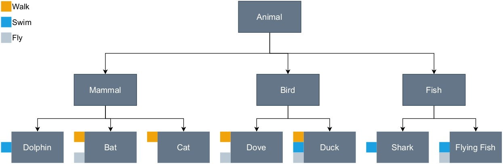

# 📍 Mixins

Mixin adalah cara menggunakan kembali kode kelas dalam banyak hirarki kelas. Konsep mixin mungkin adalah konsep yang baru bagi Anda karena konsep ini tidak ada pada bahasa C# atau Java. Jadi kenapa dan kapan kita perlu menggunakan mixin?

Kita kembali pada contoh hewan. Perhatikan diagram berikut:



Kita memiliki superclass `Animal` dengan tiga subclass. Di bawahnya ada beberapa kelas turunan yang memiliki perilaku berbeda-beda. Beberapa hewan memiliki perilaku yang sama, seperti Cat dan Duck sama-sama bisa berjalan. Kita bisa saja membuat kelas seperti `Walkable`, `Swimmable`, dan `Flyable`. Sayangnya, Dart tidak mendukung multiple inheritance, sehingga sebuah kelas hanya bisa mewarisi (inherit) satu kelas induk. Kita bisa saja membuat interface lalu mengimplementasikannya ke ke kelas `Cat` atau `Duck`. Namun, implementasi interface mengharuskan kita untuk meng-override method dan membuat implementasi fungsi di masing-masing kelas.

```dart
mixin Flyable {
  void fly() {
    print("I'm flying");
  }
}
 
mixin Walkable {
  void walk() {
    print("I'm walking");
  }
}
 
mixin Swimmable {
  void swim() {
    print("I'm swimming");
  }
}
```

Kelas mixin dapat didefinisikan dengan keyword `class` seperti kelas pada umumnya. Jika Anda tidak ingin kelasnya bertindak seperti kelas biasa misalnya seperti bisa diinstansiasi menjadi objek, gunakan saja keyword `mixin`. Setelah membuat kelas seperti di atas kita bisa menambahkan sebagai mixin dengan keyword `with` dan diikuti dengan satu atau beberapa kelas mixin.

```dart
class Cat extends Mammal with Walkable { }
 
class Duck extends Bird with Walkable, Flyable, Swimmable { }
```

Dengan mixin ini memungkinkan objek `cat` untuk memanggil metode `walk()`. Sementara objek `duck` bisa memanggil metode `walk()`, `fly()`, dan `swim()`.

```dart
void main() {
  var donald = Duck();
  var garfield = Cat();
 
  garfield.walk();
 
  donald.walk();
  donald.swim();
}
```

Jika diperhatikan mixin ini memang mirip dengan multiple inheritance. Namun kelas mixin ini tidak termasuk ke dalam hirarki parent-child atau inheritance. Oleh sebab itu mixin memungkinkan kita terhindar dari masalah yang sering terjadi pada multiple inheritance yang dikenal dengan [diamond problem](https://en.wikipedia.org/wiki/Multiple_inheritance#The_diamond_problem), yaitu ada dua parent class yang memiliki method dengan nama yang sama sehingga child class-nya ambigu dalam menjalankan method yang mana.

Sebagai contoh kita punya kelas bernama `Performer`.

```dart
abstract class Performer {
  void perform();
}
```
Lalu kita punya dua kelas turunan dari `Performer`.

```dart
class Dancer extends Performer {
  @override
  void perform() {
    print('Dancing');
  }
}
 
class Singer extends Performer {
  @override
  void perform() {
    print('Singing');
  }
}
```

Kita asumsikan Dart memiliki dukungan terhadap multiple inheritance sehingga kita punya 1 kelas lagi seperti berikut:

```dart
class Musician extends Dancer, Singer {
  void showTime() {
    perform();
  }
}
```

Kira-kira method `perform()` mana yang akan dijalankan? Beruntung dengan Dart kita bisa menghindari situasi seperti ini dengan `mixin`.

Ketika mencampur (mixing) kelas, kelas yang digunakan sebagai mixin tidak paralel namun saling bertumpuk. Itulah mengapa kelas atau method pada mixin tidak ambigu satu sama lain. Karena itu jugalah, urutan menjadi hal yang penting dalam menerapkan mixin. Misalnya kita telah menerapkan mixin pada kelas  `Musician`.

```dart
mixin Dancer implements Performer {
  @override
  void perform() {
    print('Dancing');
  }
}
 
mixin Singer implements Performer {
  @override
  void perform() {
    print('Singing');
  }
}
 
class Musician extends Performer with Dancer, Singer {
  void showTime() {
    perform();
  }
}
```

Lalu buatlah objek yang akan menjalankan method `perform()`.

main.dart

```dart
void main() {
  var arielNoah = Musician();
  arielNoah.perform();
}

abstract class Performer {
  void perform();
}

mixin Dancer implements Performer {
  @override
  void perform() {
    print('Dancing');
  }
}

mixin Singer implements Performer {
  @override
  void perform() {
    print('Singing');
  }
}

class Musician extends Performer with Dancer, Singer {
  void showTime() {
    perform();
  }
}
```

Coba jalankan fungsi main di atas, apakah yang akan tampil pada konsol? Mengapa demikian? Seperti yang telah dijelaskan, kelas mixin bersifat stack atau bertumpuk. Kelas-kelas ini berurutan dari yang paling umum hingga paling spesifik. Sehingga sesuai urutan mixin di atas kelas `Musician` akan menampilkan method dari `Singer` karena berada di urutan terakhir atau paling spesifik.


Apabila ingin eksplorasi lebih lanjut terkait materi Mixins, kunjungilah beberapa tautan berikut.

* [Introduction - Mixins](https://dart.dev/language#mixins)
* [Mixins](https://dart.dev/language/mixins)
