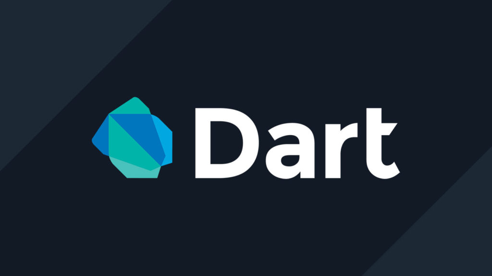

# 📍 Pengenalan Dart

Pernahkah kamu mendengar Flutter? Kerangka kerja populer untuk membuat aplikasi mobile multiplatform ini ternyata menggunakan bahasa pemrograman Dart. Bagi yang belum familiar, mari kita selami lebih dalam tentang Dart!

## Apa itu Dart?

Dart adalah bahasa pemrograman yang open source dan general purpose. Dart dikembangkan oleh Google dan ditujukan untuk membuat aplikasi multiplatform seperti mobile, desktop, dan web.

## Sejarah Singkat Dart

Diperkenalkan pada tahun 2011, Dart awalnya diciptakan untuk menggantikan JavaScript dalam pengembangan web Google. Seiring waktu, Dart terus berkembang dan pada tahun 2018, Dart 2.0 diluncurkan dengan membawa perubahan signifikan pada sistem tipenya.

## Momentum Baru dengan Flutter

Rilisnya Flutter SDK pada tahun 2018 menjadi titik balik bagi Dart. Flutter memungkinkan para pengembang untuk membuat aplikasi mobile native untuk iOS dan Android dengan menggunakan satu codebase. Hal ini menarik perhatian banyak developer dan meningkatkan popularitas Dart secara signifikan.

## Kenapa Dart?
* Dart adalah bahasa pemrograman yang fleksibel. Dart bisa berjalan di mana pun baik itu Android, iOS, maupun web.
* Dart adalah project open-source. Dart dibuat oleh Google, lalu bersama dengan komunitas developer Dart mengembangkan teknologi dan fitur-fitur menarik yang bisa ditambahkan pada Dart.
* Dart digunakan oleh Flutter. Sejak kemunculan Flutter, Dart kembali menjadi perhatian. Saat ini ada banyak perusahaan yang menggunakan Flutter pada aplikasinya. Flutter bisa dibilang merupakan proyek yang revolusioner dari Google untuk mengembangkan aplikasi multiplatform dengan tampilan UI yang menarik.
* Dart memiliki dukungan tools yang lengkap. Hampir setiap teks editor atau IDE memiliki dukungan besar untuk Dart.
* Dart mudah dipelajari dan bagus sebagai first language. Anda akan bisa memahami Dart dengan cepat khususnya jika sudah familiar dengan bahasa pemrograman populer lain seperti Java, Python, JavaScript, dll. Bahkan jika Anda baru memulai pemrograman, Dart adalah bahasa yang bagus.

## Sumber Materi
* [Basic Programming with Dart](https://youtube.com/playlist?list=PLZQbl9Jhl-VDFhaoVFTGb1efSX0VZLk-h&si=Ff7XyfPwJdxqVnrX)
* [medium](https://medium.com/)
