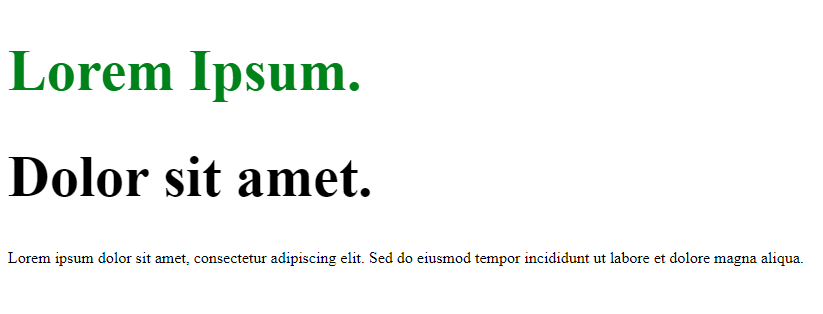
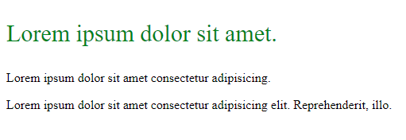

# CSS Selector

## Pengertian
CSS Selector digunakan untuk memilih tag HTML yang ingin kita styling.

Sebagai contoh kita punya tag ``<p>`` yang ingin kita ganti warna fontnya.

```html
<p>Lorem ipsum dolor sit amet.</p>

```

```css
p {
    color: red;
}
```
Selain diatas, CSS mempunyai berbagai macam tipe selector untuk styling HTML. 

## Element Selector
Element Selector memilih tag atau elemen HTML seperti tag ``<div>``, ``<p>``, ``<h1>``, dll.

```html
<h1>Hello World</h1>
```

```css
h1 {
    color: red;
    font-size: 24px;
}
```
Permasalahan dengan Element Selector adalah ketika kita mempunyai tag ``<h1>`` lebih dari satu, tetapi yang ingin kita style hanya tag tertentu saja cara ini tidak cocok karena Element Selector akan memilih semua tag ``<h1>`` yang ada di file HTML kita, maka dari itu kita perlu menspesifikasikan tag yang akan kita style.

## Id Selector
ID Selector dapat menspesifikasikan tag HTML yang akan kita styling jika kita mempunyai lebih dari satu dengan menambahkan attribut ``id`` di tag HTML.

```html
<h1 id="nama-id">konten</h1>
```

```css
#nama-id {
    /* style */
}
```
Untuk tag yang lebih dari satu.

```html
<p id="paragraph-1">Lorem ipsum dolor sit amet.</p>
<p id="paragraph-2">Amet sit dolor ipsum lorem.</p>
```

```css
#paragraph-1 {
    font-size: 56px;
}

#paragraph-2 {
    font-size: 18px;
    color: blue; 
}
```

Behaviour dari ID Selector akan sama seperti Element Selector jika memiliki id yang sama, CSS akan memilih semua tag jika memiliki id yang sama.

## Class Selector
Sama seperti ID Selector kita hanya perlu menambahkan attribute ``class`` ke tag HTML.

```html
<p class="nama-class">konten</p>
```

```css
.nama-class {
    /* style */
}
```

Untuk tag yang lebih dari satu.

```html
<p class="paragraph-1">Lorem ipsum dolor sit amet.</p>
<p class="paragraph-2">Amet sit dolor ipsum lorem.</p>
```

```css
.paragraph-1 {
    font-size: 56px;
}

.paragraph-2 {
    font-size: 18px;
    color: blue; 
}
```
Class Selector juga akan memilih semua tag yang mempunyai nama class yang sama.

Kita juga bisa memakai id dan class secara bersamaan di satu tag HTML.

```html
<p id="base" class="heading">Lorem ipsum dolor sit amet.</p>
```
```css
#base {
    background-color: #333;
}

.heading {
    font-size: 24px;
    color: white;
}

```
Perlu diketahui jika tag HTML terdapat ``id`` dan ``class`` yang memiliki nama yang sama sebenarnya ini diperbolehkan, tetapi itu bisa menimbulkan keambiguan.

ID Selector memiliki spesifisitas lebih tinggi, jika suatu tag memiliki id dan class yang sama, maka selector id akan menggantikan atau menimpa selector class karena selector id memiliki prioritas lebih tinggi. 


```html
<div id="box" class="box">konten</div>

```

```css
.box {
    color: blue;
}

#box {
    color: red;
}
```

Di case tersebut ``#box`` akan menimpa ``.box`` karena memiliki prioritas lebih tinggi, maka dari itu output warna teks dari ``div`` tersebut akan menjadi warna merah.


## Grouping
Jika kita memiliki kasus dimana kita ingin styling tag, id, atau class yang lebih dari satu, mungkin cara yang terpikirkan adalah seperti yang dibawah ini


### Grouping by tag
```html
<h1>Heading</h1>
<p>Lorem ipsum dolor sit amet.</p>
<h2>Sub heading</h2>
```

```css
h1 {
    color: black;
}

p {
    color: black;
}

h2 {
    color: black;
}
```
Cara diatas memang diperbolehkan, tetapi tidak efisien karena kita bisa grouping tag-tag tersebut menjadi seperti dibawah ini

```css
h1, p, h2 {
    color : black;
}
```
Output yang dihasilkan akan sama dengan yang diatas.

### Grouping by id
```html
<h1 id="heading">Heading</h1>
<p id="paragraph">Lorem ipsum dolor sit amet.</p>
<h2 id="sub-heading">Sub heading</h2>
```

```css
#heading, #paragraph, #sub-heading {
    color: black;
}
```
### Grouping by class
```html
<h1 class="heading">Heading</h1>
<p class="paragraph">Lorem ipsum dolor sit amet.</p>
<h2 class="sub-heading">Sub heading</h2>
```

```css
.heading, .paragraph, .sub-heading {
    color: black;
}
```
### Grouping mixed
```html
<h1>Heading</h1>
<p id="paragraph">Lorem ipsum dolor sit amet.</p>
<h2 class="sub-heading">Sub heading</h2>
```
```css
h1, #paragraph, .sub-heading {
    color: black;
}
```
## Descendant Selector
Descendant Selector digunakan untuk memilih semua children, grandchildren, dan semua nested tag dari parent tagnya.


```html
<!-- parent tag -->
<div>
    <!-- children -->
    <h1 class="heading-1">Lorem Ipsum.</h1>
    
    <!-- children -->
    <div>
        <!-- grandchildren -->
        <h1 class="heading-2">Dolor sit amet.</h1>
    </div>
</div>

<p>
    Lorem ipsum dolor sit amet, consectetur adipiscing elit. 
    Sed do eiusmod tempor incididunt ut labore et dolore magna aliqua.
</p>
```
```css
 .heading-1 {
    color: green;
}

div h1 {
    font-size: 58px;
}
```
Berikut adalah outputnya.



## Child Selector
Child Selector digunakan untuk memilih tag yang merupakan keturunan langsung dari tag parent. Selector ini hanya menargetkan tag yang berada tepat satu tingkat di bawah tag parent.

```html
<div class="container">
    <p>Lorem ipsum dolor sit amet.</p>

    <div>
        <p>Lorem ipsum dolor sit amet consectetur adipisicing.</p>
    </div>
</div>

<p>Lorem ipsum dolor sit amet consectetur adipisicing elit.</p>
```
```css
.container > p {
  font-size: 30px;
  color: green;
}
```
Output.

